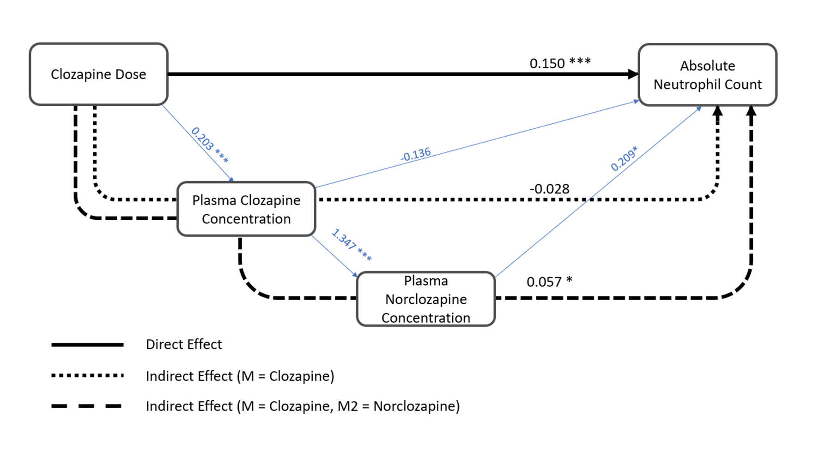
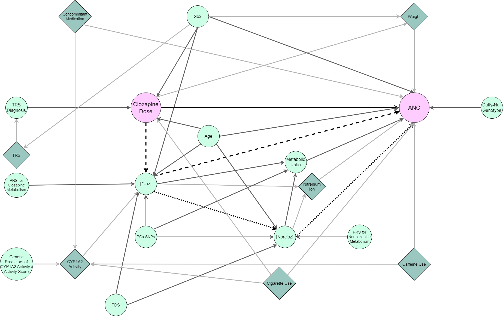
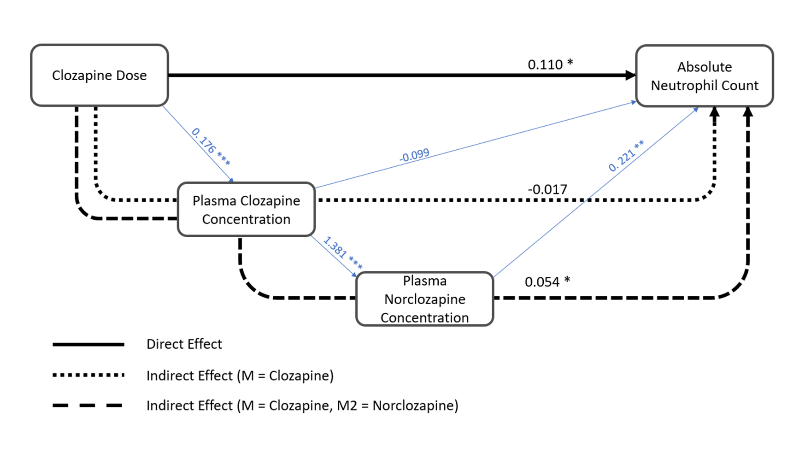

<style> 


body {
  max-width: 1920px;
  margin-left: 0;
  margin-right: 0;
}


#header { 
  /* Permalink - use to edit and share this gradient: https://colorzilla.com/gradient-editor/#e3adff+0,2a9bd8+48,0d705e+90 */
  background: #e3adff; /* Old browsers */
  background: -moz-linear-gradient(left,  #e3adff 0%, #2a9bd8 48%, #0d705e 90%); /* FF3.6-15 */
  background: -webkit-linear-gradient(left,  #e3adff 0%,#2a9bd8 48%,#0d705e 90%); /* Chrome10-25,Safari5.1-6 */
  background: linear-gradient(to right,  #e3adff 0%,#2a9bd8 48%,#0d705e 90%); /* W3C, IE10+, FF16+, Chrome26+, Opera12+, Safari7+ */
  filter: progid:DXImageTransform.Microsoft.gradient( startColorstr='#e3adff', endColorstr='#0d705e',GradientType=1 ); /* IE6-9 */
  color: #EFEFEF;
  height: 200px;
  padding: 15px;
  }

.main-container {
  max-width: 1200px;
  margin-left: auto;
  margin-right: auto;
  }

div.blue { background-color:#EFEFEF; border-radius: 20px; padding: 20px;}

</style>


```{r set up, echo = F, warning= FALSE}

knitr::opts_chunk$set(warning = FALSE, message = FALSE, echo = TRUE, fig.align = "center", dev = "png", dev.args=list(bg="transparent")) 
options(knitr.kable.NA = '')

library(beepr)

options(error = function(){    # Beep on error
  beepr::beep(sound = 10)
  Sys.sleep(time = 1)
  }
 )

.Last <- function() {          # Beep on exiting session
  beepr::beep(sound = 5)
  Sys.sleep(time = 1)
}


detach_package <- function(pkg, character.only = FALSE)
{
  if(!character.only)
  {
    pkg <- deparse(substitute(pkg))
  }
  search_item <- paste("package", pkg, sep = ":")
  while(search_item %in% search())
  {
    detach(search_item, unload = TRUE, character.only = TRUE)
  }
}

set.seed(666)
```

<br>
<br>

```{r load packages, include=FALSE}
library(readr)
library(tidyverse)
library(dplyr)
library(lubridate)
library(kableExtra)
library(psych)
library(lme4)
library(sjPlot)
library(lmerTest)
library(readxl)
library(mediation)
library(lavaan)
library(broom.mixed)
library(jtools)


#library(bslib)
#library(EnvStats)
#library(fitdistrplus)
#library(ggforce)
#library(ggplot2)
#library(ggpubr)
#library(httr)
#library(jsonlite)
#library(purrr)
#library(scales)
#library(stringr)
#library(sjmisc)
#library(vtable)
#library(mediation)
#library(performance)
#library(formattable)
#library(cleanrmd)
#library(rcartocolor)
#library(fastman)
```


```{r get data - FBC, include = FALSE}

setwd(dir = "D:/siobh/Documents/Uni/PhD/Y1/Clozapine Project/Git/clozapine-project/")

# load in fbc data
CLOZUK3.fbc <- read_delim("FBC/CLOZUK3_FBCdata_140721.txt",delim="\t")

# deal w/ dates 
CLOZUK3.fbc <- CLOZUK3.fbc %>% mutate(CLOZUK3.fbc,
                                      sampledate=dmy(sampledate),
                                      sampletime=hms(sampletime),
                                      sampleyear=year(sampledate))
# take a look at the data
glimpse(CLOZUK3.fbc)
CLOZUK3.fbc %>% group_by(SEX) %>% summarise("Sample Size"=n_distinct(LUIN))

CLOZUK3.fbc <- subset(CLOZUK3.fbc, LUIN !='30276595' ) # ID present in CLOZUK2

# calculate age at assay
CLOZUK3.fbc$age_at_assay <- CLOZUK3.fbc$sampleyear - CLOZUK3.fbc$YOB

# Are there any individuals below 18 years of age?
u18 <- unique(CLOZUK3.fbc$LUIN[CLOZUK3.fbc$age_at_assay < 18]) # 6 I think, 1 16 yo and 5 17 yo.

# remove them from analysis
CLOZUK3.fbc <- filter(CLOZUK3.fbc, !(LUIN %in% u18))

# Is any individual listed as having multiple ages or sexes?
check_sex <- CLOZUK3.fbc%>%group_by(LUIN)%>%summarise(sexes=length(unique(SEX)))
mismatch_sex <- check_sex$LUIN[check_sex$sexes >= 2]
CLOZUK3.fbc%>%group_by(LUIN)%>%summarise(sexes=length(unique(SEX)))%>%filter(sexes==2)
summary(check_sex)

# everyone's sex matches
check_yob <- CLOZUK3.fbc%>%group_by(LUIN)%>%summarise(yobs=length(unique(YOB)))
mismatch_yob <- check_yob$LUIN[check_yob$yobs >= 2] 
CLOZUK3.fbc%>%group_by(LUIN)%>%summarise(yobs=length(unique(YOB)))%>%filter(yobs==2)
summary(check_yob)
# everyone's age also seems to match

# does anyone have multiple assays on same day
check <- CLOZUK3.fbc[c(1,4)]
only_once <- check[!(duplicated(check) | duplicated(check, fromLast = TRUE)), ]

# remove these individuals
CLOZUK3.nodup <- left_join(only_once, CLOZUK3.fbc, by = c("LUIN" = "LUIN", "sampledate" = "sampledate"))

# How many assays are missing fundamental variables? (LUIN, sampledate, sampletime)
colSums(is.na(CLOZUK3.fbc))

# everyone has an ID (LUIN)
# 760 instances of missing sample date
# 4383 instances of missing time

# drop rows with missing date and time information
CLOZUK3.nona <- CLOZUK3.nodup[complete.cases(CLOZUK3.nodup[,c("sampledate","sampletime")]),]

```

```{r get data - PK, include = FALSE}
setwd(dir = "D:/siobh/Documents/Uni/PhD/Y1/Clozapine Project/Git/clozapine-project/")


# load in PK data (.Rdata file produce by D. Kappel for the Kappel et al., 2023 paper)
load("PK/CLOZUK3_PKdata_clean_03.11.2022.Rdata")

CLOZUK3.PK <- CLOZUK3_cleanup

CLOZUK3.PK <- subset(CLOZUK3.PK, LUIN !='30276595' ) # ID present in CLOZUK2 so removed. 

CLOZUK3.PK <- CLOZUK3.PK %>% mutate(CLOZUK3.PK, # remformat dates
                                      sampledate=ymd(sampledate),
                                      sampletime=hms(sampletime),
                                      sampleyear=year(sampledate),
                                      dosedate=dmy(dosedate),
                                      dosetime=hms(dosetime))

# take a look at the data
glimpse(CLOZUK3.PK)
CLOZUK3.PK %>% group_by(SEX) %>% summarise("Sample Size"=n_distinct(LUIN))

# Are there any individuals below 18 years of age? no!
unique(CLOZUK3.PK$LUIN[CLOZUK3.PK$YOS < 18]) 

# Is any individual listed as having multiple ages or sexes?
check_sex <- CLOZUK3.PK%>%group_by(LUIN)%>%summarise(sexes=length(unique(SEX)))
mismatch_sex <- check_sex$LUIN[check_sex$sexes >= 2]
CLOZUK3.PK%>%group_by(LUIN)%>%summarise(sexes=length(unique(SEX)))%>%filter(sexes==2)
summary(check_sex)

# everyone's sex matches
check_yob <- CLOZUK3.PK%>%group_by(LUIN)%>%summarise(yobs=length(unique(YOB)))
mismatch_yob <- check_yob$LUIN[check_yob$yobs >= 2] 
CLOZUK3.PK%>%group_by(LUIN)%>%summarise(yobs=length(unique(YOB)))%>%filter(yobs==2)
summary(check_yob)

# How many assays are missing fundamental variables? (LUIN, sampledate, sampletime)
colSums(is.na(CLOZUK3.PK))
# no missing data :-)

table(CLOZUK3.PK$high_clozapine_level)
table(CLOZUK3.PK$low_daily_clozapine_dose)
table(CLOZUK3.PK$bad_metabolic_ratio)

CLOZUK3.PK$LUIN <- as.numeric(CLOZUK3.PK$LUIN)

# remove temporary variables
rm(check)
rm(check_sex)
rm(check_yob)
rm(only_once)
rm(CLOZUK3_cleanup)
rm(mismatch_sex)
rm(mismatch_yob)
```

```{r get data - SNPs, include = FALSE}
setwd(dir = "D:/siobh/Documents/Uni/PhD/Y1/Clozapine Project/Git/clozapine-project/")

# load in genetic data

dn_rs2814778 <- read_delim("Genloc/CLOZUK3.rs2814778.raw",delim="\t") # duffy null
snps <- read_delim("Genloc/CLOZUK3.Willcocks2021_snps.raw",delim="\t")

# flip allele counts so they reflect the minor allele in line with Willcocks et al., (2021)
snps$rs2472297_T = NA
snps$rs2472297_T[snps$rs2472297_C == 2] <- 0
snps$rs2472297_T[snps$rs2472297_C == 0] <- 2
snps$rs2472297_T[snps$rs2472297_C == 1] <- 1

snps$rs61750900_T = NA
snps$rs61750900_T[snps$rs61750900_G == 2] <- 0
snps$rs61750900_T[snps$rs61750900_G == 0] <- 2
snps$rs61750900_T[snps$rs61750900_G == 1] <- 1

snps$rs2011425_G = NA
snps$rs2011425_G[snps$rs2011425_T == 2] <- 0
snps$rs2011425_G[snps$rs2011425_T == 0] <- 2
snps$rs2011425_G[snps$rs2011425_T == 1] <- 1

snps$rs1126545_T = NA
snps$rs1126545_T[snps$rs1126545_C == 2] <- 0
snps$rs1126545_T[snps$rs1126545_C == 0] <- 2
snps$rs1126545_T[snps$rs1126545_C == 1] <- 1

dn_rs2814778$rs2814778_C = NA
dn_rs2814778$rs2814778_C[dn_rs2814778$rs2814778_T == 2] <- 0
dn_rs2814778$rs2814778_C[dn_rs2814778$rs2814778_T == 0] <- 2
dn_rs2814778$rs2814778_C[dn_rs2814778$rs2814778_T == 1] <- 1

# now the duffy nulls are coded by 2 (C) and non duffy nulls are 0 (C) or 1(C).
# create new binary variable indicating presence / absence of duffy-null genotype

table(dn_rs2814778$rs2814778_C) 
dn_rs2814778$duffynull = NA
dn_rs2814778$duffynull[dn_rs2814778$rs2814778_C == 2] <- "1" # yes dn
dn_rs2814778$duffynull[dn_rs2814778$rs2814778_C < 1] <- "0" # no dn
table(dn_rs2814778$duffynull) # :-)

# merge genetic info 
dn <- dn_rs2814778[,c("FID", "rs2814778_C", "duffynull")]
names(dn)[names(dn) == 'FID'] <- 'LUIN'

CLOZUK3.gen <- left_join(snps, dn, by = "LUIN")

CLOZUK3.gen <- subset(CLOZUK3.gen, LUIN !='30276595' )

CLOZUK3.gen <- dplyr::select(CLOZUK3.gen, c('LUIN', 'rs2472297_T', 'rs61750900_T', 'rs2011425_G', 'rs1126545_T', "rs2814778_C",'duffynull'))

# remove temporary variables
rm(snps)
rm(dn)
rm(dn_rs2814778)
```

```{r get data - PRS, include = FALSE}
setwd(dir = "D:/siobh/Documents/Uni/PhD/Y1/Clozapine Project/Git/clozapine-project/")
# load in PRS for clozapine and norclozapine metabolism
# PRS generated by A. Pardinas and reported on in Pardiñas et al. 2023
library(here)
CLOZUK3.clozapine <- read_table(here("Genloc","CLOZUK3.clozapine.all_score")) %>%
                     set_names(tidy_names(str_replace(names(.),"Pt_","clozapine_"),syntactic = T)) %>%
                     dplyr::select(IID, clozapine_5e.08) # select genome wide significant level

colnames(CLOZUK3.clozapine) <- c("LUIN", "c_PRS") # rename columns

CLOZUK3.norclozapine <- read_table(here("Genloc","CLOZUK3.norclozapine.all_score")) %>%                        set_names(tidy_names(str_replace(names(.),"Pt_","norclozapine_"),syntactic = T)) %>%
                        dplyr::select(IID, norclozapine_5e.08) # select genome wide signifcant level

colnames(CLOZUK3.norclozapine) <- c("LUIN", "n_PRS") #rename columns

```


```{r get data - pgx, include = FALSE}
setwd(dir = "D:/siobh/Documents/Uni/PhD/Y1/Clozapine Project/Git/clozapine-project/")

# load pypgx output for cyp1a2
CLOZUK3.1a2 <- read_delim("PGx/output/results/cyp1a2.tsv",delim="\t") %>%
  dplyr::select(1:5)
colnames(CLOZUK3.1a2) <- c("LUIN", "Genotype", "Phenotype", "Haplotype1", "Haplotype2") # retain relevant columns

# create columns for a1 and clean haplotype
CLOZUK3.1a2$allele1 = NA
CLOZUK3.1a2$score1 = NA
CLOZUK3.1a2$Haplotype1<-gsub(";","",as.character(CLOZUK3.1a2$Haplotype1))

# assign metabolism phenotypes and activty scores for a1
CLOZUK3.1a2$allele1[CLOZUK3.1a2$Haplotype1 =="*1A"] <- "Normal Function"
CLOZUK3.1a2$score1[CLOZUK3.1a2$Haplotype1 =="*1A"] <- 1

CLOZUK3.1a2$allele1[CLOZUK3.1a2$Haplotype1=="*1F"] <- "Increased Function"
CLOZUK3.1a2$score1[CLOZUK3.1a2$Haplotype1=="*1F"] <- 1.5

CLOZUK3.1a2$allele1[CLOZUK3.1a2$Haplotype1=="*1C"] <- "Decreased Function"
CLOZUK3.1a2$score1[CLOZUK3.1a2$Haplotype1=="*1C"] <- 0.5

CLOZUK3.1a2$allele1[CLOZUK3.1a2$Haplotype1=="*1C*1F"] <- "Normal Function"
CLOZUK3.1a2$score1[CLOZUK3.1a2$Haplotype1=="*1C*1F"] <- 1

# create columns for a2 and clean haplotype

CLOZUK3.1a2$allele2 = NA
CLOZUK3.1a2$score2 = NA
CLOZUK3.1a2$Haplotype2<-gsub(";","",as.character(CLOZUK3.1a2$Haplotype2))

# assign metabolism phenotypes and activity scores for a2

CLOZUK3.1a2$allele2[CLOZUK3.1a2$Haplotype2 =="*1A"] <- "Normal Function"
CLOZUK3.1a2$score2[CLOZUK3.1a2$Haplotype2 =="*1A"] <- 1

CLOZUK3.1a2$allele2[CLOZUK3.1a2$Haplotype2=="*1F"] <- "Increased Function"
CLOZUK3.1a2$score2[CLOZUK3.1a2$Haplotype2=="*1F"] <- 1.5

CLOZUK3.1a2$allele2[CLOZUK3.1a2$Haplotype2=="*1C"] <- "Decreased Function"
CLOZUK3.1a2$score2[CLOZUK3.1a2$Haplotype2=="*1C"] <- 0.5

CLOZUK3.1a2$allele2[CLOZUK3.1a2$Haplotype2=="*1C*1F"] <- "Normal Function"
CLOZUK3.1a2$score2[CLOZUK3.1a2$Haplotype2=="*1C*1F"] <- 1

# give total activity scores and metabolism phenotype for diplotype 

CLOZUK3.1a2$est_score = CLOZUK3.1a2$score1 + CLOZUK3.1a2$score2
CLOZUK3.1a2$est_pheno = NA
CLOZUK3.1a2$est_pheno[CLOZUK3.1a2$est_score == 2] <- "Normal Metabolizer"
CLOZUK3.1a2$est_pheno[CLOZUK3.1a2$est_score == 2.5] <- "Rapid Metabolizer"
CLOZUK3.1a2$est_pheno[CLOZUK3.1a2$est_score == 3] <- "Ultrarapid Metabolizer"
```


```{r merge data, include=FALSE}

# merge FBC and PK data based on assays collected on the same date.

CLOZUK3.int <- inner_join(CLOZUK3.nona, CLOZUK3.PK, by = c("LUIN" = "LUIN", "sampledate" = "sampledate", "SEX" = "SEX", "YOB" = "YOB", "sampleyear" = "sampleyear", "age_at_assay" = "age"))

# filter by criteria
CLOZUK3.fbc.pk <- CLOZUK3.int %>%  filter(neut_num >= 2 & neut_num <= 7.5) %>% # neutrophils within 'healthy' range
  filter(bad_metabolic_ratio != 1) %>% # metabolic ratio between 0.5 and 3 (so does not suggest non-adherance)
  filter(low_daily_clozapine_dose != 1) %>% # daily clozapine dose above 100 mg (so not suggesting titration)
  subset(LUIN !='30276595' ) # ensure CLOZUK2 participant included

# save(CLOZUK3.fbc.pk, file = "CLOZUK3.fbc.pk.RData") # save created dataframe


#merge prs with snps
CLOZUK3.prs <- inner_join(CLOZUK3.clozapine, CLOZUK3.norclozapine, by = "LUIN")
CLOZUK3.prs.1a2 <- left_join(CLOZUK3.prs, CLOZUK3.1a2, by = "LUIN")
CLOZUK3.prs.1a2.gen <- inner_join(CLOZUK3.prs.1a2, CLOZUK3.gen, by = "LUIN")

# all w/ gen
CLOZUK3.fbc.pk.gen <- inner_join(CLOZUK3.fbc.pk, CLOZUK3.prs.1a2.gen, by = "LUIN") %>%
  subset(LUIN !='30276595' )


# save(CLOZUK3.fbc.pk.gen, file = "CLOZUK3.fbc.pk.gen.RData") # save created dataframe


#rm(CLOZUK3.int)
#rm(CLOZUK3.fbc)
#rm(CLOZUK3.gen)
#rm(CLOZUK3.PK)
#rm(only_once)
#rm(CLOZUK3.nodup)
#rm(CLOZUK3.nona)
#rm(u18)
```


```{r load data}
# load data from earlier
setwd(dir = "D:/siobh/Documents/Uni/PhD/Y1/Clozapine Project/Git/clozapine-project/")

load("CLOZUK3.fbc.pk.Rdata")
load("CLOZUK3.fbc.pk.gen.Rdata")

# create age^2 variable
CLOZUK3.fbc.pk <- CLOZUK3.fbc.pk %>%
  mutate(std_age2 = as.vector(scale(age_at_assay,center = T, scale = F))^2) 

CLOZUK3.fbc.pk.gen <- CLOZUK3.fbc.pk.gen %>%
  mutate(std_age2 = as.vector(scale(age_at_assay,center = T, scale = F))^2) 

# get the lowest dose per participant (creating a cross-sectional dataset)
CLOZUK3.fbc.pk.min <- CLOZUK3.fbc.pk %>% 
  arrange(neut_num) %>% 
  distinct(LUIN, .keep_all = TRUE)

CLOZUK3.fbc.pk.gen.min <- CLOZUK3.fbc.pk.gen %>% 
  arrange(neut_num) %>% 
  distinct(LUIN, .keep_all = TRUE)


#standardise ur predictors (MIN)
CLOZUK3.fbc.pk.min.std <- datawizard::standardise(x = CLOZUK3.fbc.pk.min, select = c("dailydose", "age_at_assay", "std_age2", "TDS", "clozapine", "norclozapine", "ratio"))

CLOZUK3.fbc.pk.gen.min.std <- datawizard::standardise(x = CLOZUK3.fbc.pk.gen.min, select = c("dailydose", "age_at_assay", "std_age2", "TDS", "clozapine", "norclozapine", "c_PRS", "n_PRS", "est_score", "rs2472297_T", "rs61750900_T", "rs2011425_G", "rs1126545_T", "duffynull"))

#standardise ur predictors (LT/full data)

CLOZUK3.fbc.pk.std <- datawizard::standardise(x = CLOZUK3.fbc.pk, select = c("dailydose", "age_at_assay", "std_age2", "TDS", "clozapine", "norclozapine"))

CLOZUK3.fbc.pk.gen.std <- datawizard::standardise(x = CLOZUK3.fbc.pk.gen, select = c("dailydose", "age_at_assay", "std_age2", "TDS", "clozapine", "norclozapine", "c_PRS", "n_PRS", "est_score", "rs2472297_T", "rs61750900_T", "rs2011425_G", "rs1126545_T"))

```


# Exploring predictors of Absolute Neutrophil Count in a UK-based cohort {.tabset}
<br>
<br>

Clozapine is effective at reducing symptoms of treatment-resistant schizophrenia, but it can also induce several adverse outcomes including neutropenia and agranulocytosis. We used linear mixed-effect models and structural equation modelling to determine whether pharmacokinetic and genetic variables influence absolute neutrophil count in a UK-based sample (N = 811) of clozapine users not currently experiencing neutropenia. Increased daily clozapine dose was associated with elevated neutrophil count, amounting to a 133 cells/mm3 rise per standard deviation increase in clozapine dose. One-third of the total effect of clozapine dose was mediated by plasma clozapine and norclozapine levels, which themselves demonstrated opposing, independent associations with absolute neutrophil count. Finally, a CYP1A2 pharmacogenomic activity score was associated with absolute neutrophil count, supporting lower neutrophil levels in CYP1A2 poor metabolisers during clozapine use. This information may facilitate identifying at-risk patients and then introducing preventative interventions or individualised pharmacovigilance procedures to help mitigate these adverse haematological reactions.


<br>
<br>
<br>


## <strong> Introduction </strong>


### Introduction
 
Antipsychotic medication is the primary treatment option for people with schizophrenia; however, just like the presentation of the disorder itself, response to these drugs is highly variable. Approximately one-third of patients are affected by treatment resistance (Kane et al. 2019), characterised by failure to respond to at least two different antipsychotics taken at a therapeutic dose, for an appropriate length of time, and after having ruled out non-compliance (Howes et al. 2017; Potkin et al. 2020). Clozapine is the sole evidence-based pharmacotherapy for treatment-resistant schizophrenia, but some clinicians are hesitant to prescribe it due to a range of potential adverse drug reactions (ADRs). One of these involves a decline in patients’ absolute neutrophil count (ANC), which can lead to neutropenia or agranulocytosis depending on the severity and rapidity of this decline (Wiciński and Węclewicz 2018). While the extreme agranulocytosis often reported as a main clozapine-induced adverse reaction is currently unpredictable and rare (Taylor et al. 2022), less severe but sustained white blood cell loss can result in partial suppression of the immune system even before being detected as neutropenia, and this has been suggested to increase vulnerability to infection and disease   (Ponsford et al. 2020). 

While the exact mechanisms underlying the loss of neutrophils are unknown, it is thought   to arise as a consequence of clozapine metabolism in combination with how neutrophils function within the immune system      (Sernoskie et al. 2023). Clozapine is metabolised by the CYP family of enzymes, notably CYP1A2, CYP2D6, and CYP3A4, with each involved at different stages of its metabolic pathway (Thorn et al. 2018). While norclozapine and clozapine-N-oxide are the key products of CYP-mediated clozapine metabolism, the drug can also be converted to a nitrenium ion (Rajagopal 2005). This oxidation may occur in the presence of the enzyme myeloperoxidase or one of its products, hypochlorous acid, both of which are produced by activated neutrophils   (Mütze et al. 2003; Aratani 2018). It is thought that this reactive intermediate may harm neutrophils through either haptenation or overactivation and subsequent depletion of the Glutathione S-transferase system, both of which provoke neutrophil apoptosis (Uetrecht et al. 1997; Franco and Cidlowski 2009; Ramli et al. 2021).
Mandatory blood monitoring is a requirement of clozapine prescription both in the UK and in many other countries (Nielsen et al. 2016). As a framework, it has reduced risks to patient safety by identifying at-risk individuals and stopping their medication before they develop agranulocytosis. Despite this mitigation, and clozapine’s superiority in managing treatment-resistant schizophrenia, the antipsychotic remains underutilised worldwide (Oloyede et al. 2023). In order to improve the drug’s safety and tolerability, there has been some interest in assessing markers of inflammatory processes (e.g., C-reactive protein) and their relationship to poor outcomes (de Leon et al. 2022). However, identifying factors that are predictive of low neutrophil counts in an otherwise healthy   sample of clozapine users could also help clinicians to further support patient safety, for example by prioritising at-risk patients for seasonal vaccinatio  ns or more frequent blood monitoring  . 

Past research (Smith et al. 2017; Vaquero-Baez et al. 2019; Willcocks et al. 2021) explored associations between daily clozapine dose and plasma concentrations of clozapine and norclozapine with ANC. Generally, plasma clozapine concentration was found to be inversely associated with ANC, whereas increased plasma norclozapine concentration was associated with elevated neutrophil counts. As highlighted in a recent review (Tan et al. 2021), there is inconsistency in the literature regarding both the direction and magnitude of effects observed. While this could be in part due to differences in statistical methodology and the use of small samples, it could equally reflect the idiosyncrasy of this ADR, alongside the challenges of disentangling the impact of clozapine and its related variables from genetic, demographic, or lifestyle factors that may equally influence neutrophil counts.

The present research aims to replicate and extend these previous studies by exploring predictors of ANC in a large, UK-based sample of clozapine users with treatment-resistant schizophrenia. As a continuation of previous work, linear mixed-effect   regression models were used to explore associations between pharmacokinetic and pharmacogenomic variables and ANC in the longitudinal dataset, while accounting for between- and within-individual variability. Following this, a Structural Equation Modelling (SEM) framework was used to further disentangle the contributions of clozapine dose, from plasma clozapine and norclozapine levels via a mediation analysis. Genetic predictors were also investigated to determine whether such variation influenced neutrophil counts in our sample.


<br>
<br>
<br>
<br>

## <strong> Methods </strong> 
### Methods

#### Sample collection / Participants
The present study uses Full Blood Counts (FBC) and pharmacokinetic assay data from the CLOZUK3   sample (Kappel et al. 2023), the most recent wave of the CLOZUK study (Pardiñas et al. 2018)  . All participants had a diagnosis of treatment-resistant schizophrenia and were prescribed clozapine. Samples were anonymously collected in the UK from the Zaponex Treatment Access System (ZTAS), a clozapine monitoring framework managed by Leyden Delta B.V. (Nijmegen, Netherlands). Sample collection and data extraction procedures for CLOZUK have been detailed previously (Pardiñas et al. 2018; Pardiñas et al. 2023). The CLOZUK study received UK National Research Ethics Service approval (reference 10/WSE02/15), in accordance with the requirements of the UK Human Tissue Act 2004.

<br>

#### Inclusion / Exclusion Criteria
CLOZUK3 contains longitudinal assay data from participants (>18 years) who had not been previously included in prior waves of CLOZUK. Data from assays with key FBC or pharmacokinetic information missing or with clerical errors (e.g., several assays taken at the same date and time yielding different results) were excluded from further analyses. The FBC data      were curated by removing any assay showing an ANC outside of the normal reference range (2.0 – 7.5 x 109 cells/L). As in previous research (Kappel et al. 2023), we removed pharmacokinetic assays    (i) that were outside of a 6-24 hour period between clozapine intake and blood sampling; (ii) where clozapine and norclozapine plasma concentrations were below instrument detection levels (< 0.05 mg/L); (iii) showing a low daily clozapine dose (< 100mg, indicative of drug titration) or (iv) showing a metabolic ratio suggesting non-adherence (< 0.5 or > 3.0). Finally, FBC and pharmacokinetic assays from the same individual taken on the same date were merged to create a dataset of linked FBC and pharmacokinetic assays.  

<br>

#### Genetic Data
A subset of individuals (N = 523) within this sample had linked genetic data, based on genotypes from an Illumina Infinium Global Sequencing Array-24 (Illumina Inc, USA).   Details regarding the curation and imputation of genetic data have been described elsewhere (Kappel et al. 2023) and summarised in the Supplementary Note. 

Pharmacogenomic star  alleles (i.e., genetic variants or combinations of variants constituting pharmacogenomic markers) for CYP1A2 were called using PyPGx v0.20.0 (Lee et al. 2022) on the imputed array data. Enzyme activity scores were inferred from these star alleles, and these were included in analyses to determine whether genetic predictors of CYP1A2 activity were associated with ANC. Further pharmacogenomic SNPs for clozapine (Table 1), as identified in a previous GWAS (Pardiñas et al. 2019) and included in an analysis by Willcocks et al., (2021), were also investigated. 

Polygenic Risk Scores (PRS) for clozapine and norclozapine metabolism were calculated via PRSice2 v2.35 (Choi and O’Reilly 2019) as part of a previous stud  y (Pardiñas et al. 2023). These were included in secondary analyses to incorporate genetic effects not necessarily restricted to the pharmacogenomic SNPs of large effect. We also explored the impact of the Duffy-Null genotype (rs2814778; C/C homozygote) as this has been previously associated with decreased baseline ANC     (Legge & Pardiñas et al. 2019; Fragiadaki et al. 2020). Finally, the Human Leukocyte Antigen (HLA) system has long been understood as a crucial component of the immune system, with past work having implicated various HLA genotypes with risk for neutrophil loss in clozapine users (Goldstein et al. 2014). To test whether variation in the HLA system was associated with neutrophil levels, we    performed genotype imputation on CLOZUK3 array data using HIBAG v1.34.1 (Zheng et al. 2014) and incorporated these into Linear Mixed Models. Detailed descriptions of CYP1A2 pharmacogenomic allele calling and HLA genotype imputation are found in the Supplementary note. 


```{r table 1, fig.cap="Table 1. SNPs included in regression analyses exploring the impact of pharmacogenomic variation on clozapine metabolism and neutrophil levels. SNP = Single Nucleotide Polymorphism; CHR = Chromosome; Alt = Alternative (or Minor) allele."}

## Genes Included (Methods section probably)

genes <- data.frame(SNP  = c('rs2011425', 'rs61750900', 'rs1126545', 'rs2472297', 'rs2814778'),
                    CHR = c('2', '4', '10', '15', '1' ),
                    Gene = c("UGT1A family", 'UGT2B10', 'CYP2C18', 'CYP1A1-CYP1A2', 'ACKR1' ),
                    Alt = c('G', 'T', 'T',  'T', 'C'),
                    Association = c("Alternative allele linked with decreased plasma norclozapine levels (Pardiñas et al. 2019).", "Alternative allele linked with decreased plasma norclozapine levels (Pardiñas et al. 2019)", "Alternative allele increases metabolic ratio (Pardiñas et al. 2019).", "Alternative allele linked with decreased plasma clozapine levels (Pardiñas et al. 2019). ", "Alternative allele homozygosity (Duffy-Null genotype) linked with non-pathological baseline ANC (Legge & Pardiñas et al. 2019)." )
                    )

kable(genes, caption = "Table 1 . SNPs included in regression analyses exploring the impact of pharmacogenomic variation neutrophil levels. SNP = Single Nucleotide Polymorphism; CHR = Chromosome; Alt = Alternative (or Minor) allele. ", full_width = F, font_size = 16,
             digits = 2) %>% kable_classic
```


<br>

#### Statistical Analysis

Data analysis was performed in R  v4.1.1 using R Studio v1.4.1717 (R Core Team 2021), with scripts available at https://git.cardiff.ac.uk/c1713552/clozapine_anc_predictors. 

A Directed Acyclic Graph   (DAG) was drawn to consider the causal structure of the clozapine dose – ANC relationship (Rohrer 2018). DAG construction was based on guidelines described by Ferguson et al. (2020), with the rationale for included nodes and relationships outlined in Supplementary Table 10. 


The longitudinal dataset was analysed using Linear Mixed-Effect Models in lme4   and with ANC as the outcome variable. A baseline model, in line with Willcocks et al. (2021), included three pharmacokinetic variables related to clozapine and its metabolism (i.e., daily clozapine dose, plasma clozapine concentration, and plasma norclozapine concentration) alongside the covariates age, age2, sex, and the time between the dose intake and blood sampling (TDS). Participant identifier was included in these models as a random effect term. All predictor variables were standardised    before fitting the regression model. Further analysis also included pharmacogenomic variables (i.e., CYP1A2 activity scores, and the genotypes of pharmacogenomic SNPs outlined in Table 1). 
Secondary analyses extended the Linear Mixed Models by testing for associations between further genetic predictors (e.g., PRS for clozapine and norclozapine metabolism, the Duffy-null genotype, and HLA genotypes) with neutrophil counts.

Due to the difficulty of implementing and interpreting causal analyses on longitudinal datasets with irregular time points (Zeng et al. 2021), mediation models were fit using the lowest value of ANC reported for each individual as the outcome variable. SEM was employed using lavaan (Rosseel 2012) with clozapine and norclozapine plasma concentrations as the mediating variables, daily clozapine dose as the exposure, and lowest ANC as the outcome. Residualised versions of these variables were included in the model, as described in the Supplementary Note  .  Predictor variable residuals were standardised before inclusion in the model. 

Further analyses tested the robustness of these results, assessing both the impact of using residualised variables and using cross-sectional, as opposed to longitudinal data. Single-mediator analyses were implemented in the mediation R package (Tingley et al. 2014). This approach can estimate direct and indirect effects in longitudinal datasets but can only accommodate a single mediator variable. Therefore, it was not appropriate for the primary analysis of the multiple mediation model that we defined and evaluated using SEM on cross-sectional data in lavaan. Finally, we attempted to formally replicate the analyses described in previous studies (Vaquero-Baez et al. 2019; Willcocks et al. 2021) by implementing Spearman’s correlations and Linear Models, as reported in the Supplementary Note. 

<br>
<br>
<br>
<br>

## <strong> Main Results </strong> 
### Main Results 

The final curated CLOZUK3 longitudinal dataset included 811 participants, with a total of 2,362 FBC/pharmacokinetic assays. Participants had a mean (SD) age of 40.1 (12.2) years; 28.9% were female (N = 234) and 71.1% were male (N = 577). Full descriptive statistics of the sample at the point of lowest ANC   are given in Table 2. Causal paths for an analysis of ANC as the outcome are shown in the DAG (described in the Supplemental Notes), highlighting daily clozapine dose as the exposure variable, and plasma concentrations of clozapine and norclozapine as potential mediators between dose and ANC.

```{r Table 2, fig.cap="Table 2. Summary of CLOZUK3 variables used in mediation analysis. Descriptive statistics presented for a ‘cross-sectional’ version of CLOZUK3 where the assay with the lowest value of ANC per person is retained.  TDS = Time between Dose and Sample; ANC = Absolute Neutrophil Count."}

a <- describeBy(x = dplyr::select(CLOZUK3.fbc.pk.min, c("clozapine", "norclozapine", "dailydose", "TDS", "neut_num", "age_at_assay")), fast = TRUE, group = CLOZUK3.fbc.pk.min$SEX)

aF <- a$FEMALE
aM <- a$MALE

Variable <- c('[Clozapine] (mg/L)', '[Norclozapine] (mg/L)', 'Daily dose (mg)', "TDS (hours)", "ANC (x10^9/L)", "Age")
Mean_M <- round(aM$mean, 3)
Mean_F <- round(aF$mean, 3)
SD_M <- round(aM$sd, 3)
SD_F <- round(aF$sd, 3)
Min_M <- round(aM$min, 3)
Min_F <- round(aF$min, 3)
Max_M <- round(aM$max, 3)
Max_F <- round(aF$max, 3)

Male <- cbind(Variable, Mean_M, SD_M, Min_M, Max_M)
Female <- cbind(Mean_F, SD_F, Min_F, Max_F)

table <- cbind(Male, Female)

kable(table, col.names = c("Variable", "Mean","SD","Min","Max", "Mean","SD","Min","Max"), caption = "Table 2. Summary of CLOZUK3 variables used in mediation analysis. Descriptive statistics presented for a ‘cross-sectional’ version of CLOZUK3 where the assay with the lowest value of ANC per person is retained. TDS = Time between Dose and Sample; ANC = Absolute Neutrophil Count. ") %>%
  kable_styling("none", full_width = T,
                position = "left", font_size = 16) %>%
  add_header_above(c(" " = 1, "Male" = 4, "Female" = 4)) %>% 
  kable_classic 

```


<br>
<br>

#### <small> Linear Mixed Effect Model </small>

``` {r model labels, include = FALSE}

all_labels <- c('Intercept' = "Intercept",
              'dailydose' = "Daily dose",
              'clozapine' = "Clozapine",
              'norclozapine' = "Norclozapine",
              'est_score' = "CYP1A2 Activity Score",
              'est_phenoRapid Metabolizer' = 'Rapid Metabolizer Phenotype',
              'est_phenoUltrarapid Metabolizer' = 'Ultrarapid Metabolizer Phenotype',
              'est_phenoPoor Metabolizer' = 'Poor Metabolizer Phenotype',
              'est_phenoIntermediate Metabolizer' = 'Intermediate Metabolizer Phenotype',                             
              'PhenoPoor Metabolizer' = 'Poor Metabolizer Phenotype',
              'PhenoIntermediate Metabolizer' = 'Intermediate Metabolizer Phenotype',
              'TDS' = "TDS",
              "SEXMALE" = 'Sex (Male)',
              "age_at_assay" = "Age",
              "std_age2" = "Age squared",
              "duffynull1" = "Duffy-Null (Present)",
              "rs2472297_T" = "rs2472297_T",
              "rs61750900_T" = "rs61750900_T",
              "rs2011425_G" = "rs2011425_G",
              "rs1126545_T" = "rs1126545_T",
              "c_PRS" = "Clozapine Metabolism PRS",
              "n_PRS" = "Norclozapine Metabolism PRS")

labels_rep <- c('Intercept' = "Intercept",
                 'dailydose' = "Daily dose",
              'clozapine' = "Clozapine",
              'norclozapine' = "Norclozapine",
              "SEXMALE" = 'Sex (Male)',
              "age_at_assay" = "Age",
              "std_age2" = "Age squared",
              "TDS" = "TDS",
              "ratio" = "Metabolic Ratio",
              "rs2472297_T" = "rs2472297_T",
              "rs61750900_T" = "rs61750900_T",
              "rs2011425_G" = "rs2011425_G",
              "rs1126545_T" = "rs1126545_T")
```


```{r main mixed model}
anc_dcnt <- lmer(neut_num~dailydose+clozapine+norclozapine+TDS+SEX+age_at_assay+std_age2 + (1|LUIN), data=CLOZUK3.fbc.pk.std) # base model 

coefs1 <- data.frame(coef(summary(anc_dcnt)))
coefs1$p.z <- 2 * (1 - pnorm(abs(coefs1$t.value))) # extracting estimates for use in-line

anc_dcnt_1a2_snp_as <- lmer(neut_num~dailydose+clozapine+norclozapine+est_score+rs2472297_T+rs61750900_T+rs2011425_G+rs1126545_T+TDS+SEX+age_at_assay+std_age2 + (1|LUIN), data=CLOZUK3.fbc.pk.gen.std) # base model + PGx (SNPs and CYP1A2 Activity Score)

coefs1b <- data.frame(coef(summary(anc_dcnt_1a2_snp_as))) 
coefs1b$p.z <- 2 * (1 - pnorm(abs(coefs1b$t.value))) # extracting estimates for use in-line

```

As shown in Table 3, all pharmacokinetic variables were significantly associated with ANC. Clozapine plasma concentration was inversely associated with ANC (β = `r round(coefs1[3,1], digits = 3)`, *p* = `r round(coefs1[3,4], digits = 4)`) and norclozapine plasma concentration (β = `r round(coefs1[4,1], digits = 3)`, *p* = `r round(coefs1[4,4], digits = 4)`) was positively associated with ANC. For every standard deviation increase in plasma clozapine concentration, ANC was reduced by 166 cells/mm3. Likewise, each standard deviation increase in plasma norclozapine concentration was accompanied by a 219   cells/mm3 increase in ANC. We noted that daily clozapine dose was also associated with ANC in this model (β = `r round(coefs1[2,1], digits = 3)`, *p* = `r round(coefs1[2,4], digits = 4)`), resulting in an estimated rise of 133 cells/mm3 per standard deviation increase in daily dose. 

A further model also incorporated pharmacogenomic predictors from the individuals with genetic data (Table 3). Despite these additional covariates, the pharmacokinetic variables dose, clozapine plasma concentration, and norclozapine plasma concentration remained significantly associated with ANC. No pharmacogenomic SNP linked with ANC in the Willcocks et al., (2021) study demonstrated significant associations in the present sample. Furthermore, neither PRS for clozapine and norclozapine metabolism nor variation in the HLA locus were significantly associated with ANC. 

We saw a significant, positive association between the CYP1A2 activity score with ANC, in which increased CYP1A2 function, leading to rapid metabolism of CYP1A2 substrates, was linked with increased neutrophil counts (β = `r round(coefs1b[5,1], digits = 3)`, *p* = `r round(coefs1b[5,4], digits = 4)`). As described in the Supplementary note, this association was independent of rs2472297, a known regulator of CYP1A2 activity (Pardiñas et al. 2019). 

Finally, the presence of the Duffy-Null genotype was significantly associated with reduced ANC in our sample (β = -0.770; p = 0.002).


```{r Table 3}
tab_model(anc_dcnt, anc_dcnt_1a2_snp_as, show.est = TRUE, show.se = TRUE, show.ci = FALSE,
                     show.p = F, collapse.se =  TRUE, show.intercept = FALSE, emph.p = TRUE, digits = 3, digits.re = 3,
                     #order.terms = c(1, 2, 7, 3, 4, 5 ,6),
                     string.pred = "Predictor", string.est = "Estimate (SE)",
                     dv.labels = c("Dose + Levels", "Including PGx Variables"),
                     pred.labels = all_labels,
                     CSS = list(css.table = '+font-family: Roboto; width: 100%;', css.depvarhead = '+font-style: normal; font-weight: normal; text-align = centre',
                                css.thead = 'border-top: blank; text-align = centre; padding: 0.5cm;', css.tdata = 'padding: 0.25cm; text-align = centre;',
                                css.randomparts = 'border-top:1px solid;', css.firsttablerow = 'border-bottom: blank',
                                css.firstsumrow = 'border-top: 1px solid', css.footnote = 'text-align: left;', 
                                css.summary = "padding-top:0.2cm; padding-bottom:0.2cm;"), 
                     title = "Table 3. Results of Linear Mixed Models exploring predictors of Absolute Neutrophil Count (ANC) in the CLOZUK3 sample. Standardised regression coefficients are reported alongside standard error and p values estimated using lmerTest package. PGx = Pharmacogenomic; TDS = Time between Dose and Sample; LUIN = Participant Identifier used in CLOZUK3; σ2 = Residual Variance; ICC = Intraclass Correlation Coefficient; T00 LUIN = Random Intercept Variance; N LUIN = Number of participants. ",
                     p.style = "stars"
)
```

<br>


<br>

#### <small> Structural Equation Modelling </small>

```{r create residuals}
# create residualised versions of parent variables for inclusion in mediation analysis with SEM.
# this allows covariates to be controlled for without including too many variables in the analysis and complicating the model.
# the residualised variables were created by regressing each variable against the covariates sex, age, age^2, and time between dose and sample (TDS).

CLOZUK3.fbc.pk.min$log_dose = NA
CLOZUK3.fbc.pk.min$log_dose = log(CLOZUK3.fbc.pk.min$dailydose)

reg_dose_u <- lm(log_dose ~ TDS+SEX+age_at_assay+std_age2, data=CLOZUK3.fbc.pk.min)$residuals
reg_cloz_g <- glm(clozapine ~ TDS+SEX+age_at_assay+std_age2, data=CLOZUK3.fbc.pk.min, family = Gamma(link = log))$residuals
reg_nor_g <- glm(norclozapine ~ TDS+SEX+age_at_assay+std_age2, data=CLOZUK3.fbc.pk.min, family = Gamma(link = log))$residuals
reg_anc_u <- lm(neut_num ~ TDS+SEX+age_at_assay+std_age2, data=CLOZUK3.fbc.pk.min)$residuals

Dose <- reg_dose_u
Clozapine <- reg_cloz_g
ANC <- reg_anc_u
Norclozapine <- reg_nor_g

# creating new dataframe containing these residualised variables.
Data <- data.frame(Dose = Dose, ANC = ANC, Clozapine = Clozapine, Norclozapine = Norclozapine)

# Standardise variables prior to sem so equivalent to past regression analyses.
Data <- datawizard::standardise(x = Data, select = c("Dose", "Clozapine", "Norclozapine"))
Data_og <- Data

```


```{r SEM Main, dev = "png", dev.args=list(bg="transparent")}
library(lavaan)

# creating mediation model with ANC as outcome, dose as exposure, clozapine as M1, and norclozapine as M2. 

multipleMediation <- '
ANC ~ b1 * Clozapine + b2 * Norclozapine + c * Dose
Clozapine ~ a1 * Dose
Norclozapine ~ d21 * Clozapine
indirect1 := a1 * b1
indirect2 := a1 * d21 * b2
total := c + (a1 * b1) + (a1 * d21 * b2)
Clozapine ~~ Norclozapine
'

# fit model with SEM in lavaan
fit3 <- sem(model = multipleMediation, data = Data)
    #se = "bootstrap", 
    #bootstrap = 5000)
```

The primary model (Figure 1) showed evidence of a significant direct effect   of daily clozapine dose on ANC `r round(summary(fit3)$pe[3,6], digits = 3)`, *p* = `r round(summary(fit3)$pe[3,9], digits = 3)`). The indirect path via both clozapine and norclozapine plasma concentration was also significant (est = `r round(summary(fit3)$pe[12,6], digits = 3)`, *p* = `r round(summary(fit3)$pe[12,9], digits = 3)`). However, no indirect effect was observed when plasma clozapine concentration was considered as the sole mediator (est = `r round(summary(fit3)$pe[11,6], digits = 3)`, *p* = `r round(summary(fit3)$pe[11,9], digits = 3)`). Secondary analyses revealed that CYP1A2 activity scores appeared to account for part of these associations (Supplementary note). However, as only some of the CLOZUK3 sample was genotyped (523/811), these models would have reduced statistical power in relation to our main analyses and their results should be considered with caution.     

Sensitivity analyses were performed firstly using non-residualised variables in the model, and then single mediators in the longitudinal dataset. These were all consistent with their comparable models, suggesting that our analyses were not compromised through using either residualised variables, or the smaller, cross-sectional dataset (Supplementary note).  


```{r Fig 2, dev = "png", dev.args=list(bg="transparent"), fig.cap="Figure 2. Path diagram showing association between Clozapine Dose and Lowest Absolute Neutrophil Count with Plasma Clozapine concentration and Plasma Norclozapine concentration as mediators. Plot edges are labelled with standardised regression coefficients. Variables included in Structural Equation Model are residualised versions of parent measures. Associations between model variables are shown in blue, whereas the overall direct and indirect paths are shown in black. * p<0.05   ** p<0.01   *** p<0.001"}

```

<br>
<br>
<br>
<br>

## <strong> Discussion </strong>

### Discussion

#### Key Findings
The results of the present study provide evidence for associations between both pharmacokinetic   and genetic variables with neutrophil count in the CLOZUK3 sample. Daily clozapine dose was positively associated with ANC, and approximately a third of its overall impact was mediated by plasma clozapine and norclozapine levels. We also observed opposing effects of plasma clozapine and norclozapine concentrations on ANC, with plasma clozapine levels inversely associated, and plasma norclozapine levels positively associated with neutrophil counts. Finally, we found evidence that both CYP1A2 activity score and the Duffy-Null genotype were associated with ANC.

The independent association between clozapine dose and ANC across our analyses is both novel and unexpected, given that past research has found clozapine dose to be a poor      predictor of ANC (Oyewumi et al. 2002; Willcocks et al. 2021). Furthermore, the direction of the effect is inconsistent  with expectations, given that clozapine is believed to induce neutropenia or agranulocytosis (Mijovic and MacCabe 2020). This positive relationship could reflect a degree of immune responses to the drug, resulting in elevated neutrophil counts, as has been previously observed in clozapine users (Lobach and Uetrecht 2014). Further work has shown that an increase in immature neutrophils may occur as part of this immune response (Ng et al. 2014), which could result in raised ANC. Alternatively, the positive association may arise because of human intervention, by clinicians altering clozapine prescriptions in response to the full blood count results in ways that are not consistent or endorsed by treatment guidelines  . For example, some clinicians might aim to counteract a patient’s low neutrophil levels by reducing daily clozapine dose    in hopes of avoiding discontinuation or might become reluctant to increase clozapine dose due to fear of prompting further neutrophil loss  . In any case, the associations between plasma clozapine and norclozapine levels with ANC are consistent with past research (Smith et al. 2017; Vaquero-Baez et al. 2019; Willcocks et al. 2021). While this work cannot firmly establish which aspect of clozapine use engenders neutrophil loss, taken together these results do suggest that plasma norclozapine concentration is likely not the toxic component in this process.

The present study also explored the impact of a well-established pharmacogenomic variable: CYP1A2 enzyme activity inferred via classic star allele calling. In our analysis we observed a positive association between the CYP1A2 activity score and ANC, in which increased enzyme activity is associated with greater neutrophil counts or, conversely, poor metabolism is associated with lower ANC. This is consistent with current knowledge about clozapine’s metabolic pathway. Both CYP1A2 and CYP3A4 are involved in the metabolism of clozapine, either producing norclozapine or to a lesser extent, clozapine-N-oxide (Pardiñas et al. 2019). Therefore, increased CYP1A2 activity should result in the faster conversion of clozapine to norclozapine, reducing the potentially toxic impact of other metabolites (including clozapine itself) on neutrophil counts. This is preliminary evidence that genetically-inferred enzyme activity may have utility for predicting neutrophil counts in a non-neutropenic, clozapine-using population. Future research should be performed across different samples to ascertain the robustness of these results, and following this, could be extended to explore other enzymes involved in clozapine metabolism. It would also be of interest to determine whether similar associations persist in patients demonstrating low neutrophil counts indicative of neutropenia, or if present, agranulocytosis.     

In contrast to previous work (Willcocks et al. 2021), none of the included pharmacogenomic SNPs demonstrated associations with ANC. While this could be partly due to the reduced size of the genetic sample (N = 523), it does reinforce the need for future work to better understand the possible impact of these variants on neutrophil counts in clozapine users  .  Furthermore, neither the PRS for clozapine and norclozapine metabolism nor the assessed HLA genotypes    were significantly associated with ANC. However, before correction for multiple comparisons several HLA alleles (i.e., DRB1 16:01, DRB1 04:04, DRB1 01:03) were nominally     significant. While HLA-DRB1*16:01 has been previously identified in clozapine-induced agranulocytosis cases (Yunis et al. 1995), it has not yet been formally linked to neutrophil levels in a non-neutropenic population. The remaining alleles have not previously been implicated in clozapine-induced neutrophil loss.  Thus, these associations could provide direction for further work investigating the impact of this locus on neutrophil levels in clozapine users. 

Finally, as expected from previous work (Legge & Pardiñas et al. 2019), a  genetic predictor associated with lower non-pathological baseline neutrophil counts, the Duffy-Null genotype, was negatively associated with ANC. This is consistent with observations that the genotype is linked with reduced, yet non-pathological neutrophil counts in carriers (Legge & Pardiñas et al. 2019). This genotype is most common in individuals of African ancestries on account of the selective advantage it confers against the malaria parasite (Atallah-Yunes et al. 2019). Our work confirms that this genetic factor should also be considered when assessing neutrophil counts in non-African samples, despite the frequency of this genotype being below 5% of our assessed sample (N=21/496). This supports the notion that testing patients for this genotype and interpreting their blood monitoring assays accordingly will likely be more beneficial than diagnosing patients with Benign Ethnic Neutropenia based on their ancestry (Andreou et al. 2022). Such genetic testing could increase clinician confidence when prescribing clozapine to people of ancestries where this genotype is common and thus help to combat racial disparities in clozapine use and prescription and widen access to this medication (Williams et al. 2020) . 

<br>

#### Strenghts and Weaknesses

In the context of research on treatment-resistant schizophrenia, CLOZUK3 is a large sample that benefits from longitudinal blood monitoring, and so is better powered than most previous studies to assess the relationships between clozapine dose and metabolites on ANC. Additionally, data availability allowed us to merge and analyse FBC and pharmacokinetic assays taken on the same day, eliminating the potential noise introduced by time lags and providing a more precise relationship between neutrophil counts and plasma clozapine and norclozapine levels.     To our knowledge, this is also the first to both assess and establish associations between pharmacogenomics-inferred CYP1A2 activity with neutrophil counts in clozapine users. 

A key limitation of the present work is that the CLOZUK3 sample was not completely genotyped; this results in a reduction in statistical power to any analysis which required genetic variables or filtering the sample based on such characteristics. Despite this, the key pharmacokinetic associations observed in the linear mixed-effect model remain even when explored in this reduced sample. Furthermore, the participants in the CLOZUK3 dataset were primarily of a single ancestral group. This limits the extent to which the observed associations can be generalised to non-European patients and necessitates the extension of these analyses in a more genetically-diverse sample, particularly given the existence of ancestry-specific genetic effects on ANC (Legge & Pardiñas et al. 2019). 

Another omission is that of phenoconversion, in which concomitant medication (e.g., oral contraceptives, some antidepressants) or lifestyle factors (e.g., caffeine consumption, cigarette smoking) can modify enzyme activity, and thus impact clozapine metabolism (Lesche et al. 2020). As well as being linked to clozapine metabolism (Hägg et al. 2000; Wagner et al. 2020), there is some evidence that cigarette and caffeine consumption is associated with white blood cell counts (Ramanaviciene et al. 2004; Higuchi et al. 2016; Zeng et al. 2022). Unfortunately, information about these variables was unavailable in the CLOZUK3 dataset. Therefore, we were unable to account for the potential of substance use to either influence clozapine metabolism via phenoconversion or act as a confounder in our analysis. Accounting for these variables through phenoconversion-corrected activity scores as described by Lesche et al., (2020), or their inclusion as a covariate in analyses would strengthen any conclusions drawn from future work. 

<br>

#### Implications

The present work found several associations between pharmacokinetic and genetic variables with ANC in a UK-based sample of clozapine users with no detectable immune-related ADRs. Our results could have clinical applicability from the perspective of treatment management, supporting the view that clozapine dose might become a modifiable risk factor in cases with abnormal neutrophil counts . While agranulocytosis and severe neutropenia are regarded to be dose-independent, whether subclinical thresholds of neutropenia or neutrophilia might respond to dose alterations has not yet been systematically investigated. Clozapine metabolism is also a factor to consider as plasma clozapine and norclozapine levels were also significantly associated with ANC in our sample. However, large inter- and intra-individual differences in levels at fixed doses might make it complicated to influence these variables in practice (Skokou et al. 2022), though they still could find applicability for the identification of patients at risk of extreme ANCs. 

Given the rarity of clozapine-induced neutropenia and agranulocytosis both within the population and our sample, the present analyses were performed on individuals with neutrophil counts within a healthy range. Therefore, the implications of our findings are somewhat limited concerning applying them to these ADRs. Future research should explore these predictors in a sample of individuals who have experienced clozapine-induced neutropenia or agranulocytosis, with particular attention given to instances of Life-Threatening Agranulocytosis, as previous research has observed recognisable changes in ANC preceding these events (Taylor et al. 2022). This would enable a comparison of associations between those with ‘typical’ vs ‘atypical’ ANC, which could help researchers to understand whether similar or distinct mechanisms are underlying neutrophil loss across its mild and more severe forms. 

This work adds to the body of literature aiming to develop a complete understanding of the factors that influence ANC in clozapine users, which could have value in improving access to this gold-standard medication. Currently, there is reluctance amongst some clinicians to prescribe clozapine to patients with schizophrenia. This is primarily due to the risk of neutropenia and agranulocytosis, and the accompanying need for therapeutic blood monitoring to ensure patient safety. While effective at reducing deaths from clozapine-induced agranulocytosis in the UK (Oloyede et al. 2021), such frequent haematological testing is time-consuming both from the perspective of the patient, and the healthcare provider. Pharmacokinetic and genetic variables that influence both the risk of neutrophil loss and the interpretation of that risk, could be used to stratify patients based on the probability that they’ll develop this side effect and then adjust their drug monitoring regime accordingly. This could also inform the design of preventative interventions targeting those most likely to experience neutrophil loss, and subsequent immune suppression, which may help to prevent serious illness over the duration of clozapine use. Some examples of this might include encouraging at-risk patients to take up offers of seasonal vaccinations, particularly given evidence of reduced vaccine uptake in people with psychiatric disorders (Bonkat et al. 2022).  Alternatively, the testing of additional markers of inflammation (e.g., C-reactive protein or immunoglobulin concentration) may be incorporated into therapeutic blood monitoring to identify when the risk of developing illness amongst these patients is highest and then adjusting treatment or introducing further mitigations accordingly. Knowledge of these variables could act as an additional layer of information to guide clinical decision-making and ultimately help to widen access to clozapine via a two-pronged approach: both by enhancing safety for those most at-risk, alongside reducing obstacles to treatment use for those at lowest risk.


<br>

#### Conclusions

Associations between pharmacokinetic and genetic variables with ANC were assessed in a subset of the CLOZUK3 sample with neutrophil counts in the normal range. Daily clozapine dose was positively associated with ANC, with clozapine and norclozapine plasma levels jointly accounting for a third of its total effect. This both supports and expands on the results from past research in CLOZUK2 and other cohorts, which suggested an opposing relationship between ANC and plasma clozapine and norclozapine levels. 

The pharmacokinetic analysis was supplemented by genetic covariates, notably a CYP1A2 activity score inferred from pharmacogenomic star alleles. CYP1A2 activity was positively associated with ANC; however, no associations were seen between neutrophil counts with pharmacogenomic SNPs previously associated with clozapine metabolism. Additional work in larger, more genetically diverse samples is required to clarify the role of pharmacogenomic variation in clozapine metabolism, and its capacity to influence neutrophil levels in clozapine users. In all, this work advances our understanding of the impacts of clozapine use on neutrophil counts, which in the future may help to improve access to clozapine via the development of targeted interventions and personalised drug monitoring schedules based on individual risk factors.


<br>
<br>
<br>
<br>

## <strong> References </strong>
### References 

Andreou, A., Jayaram, J., Walker, A., Tek, C. and Williams, J.C. 2022. Re-examining the utility and validity of benign ethnic neutropenia: A narrative literature review. Schizophrenia Research. Available at: https://www.sciencedirect.com/science/article/pii/S0920996422000780 [Accessed: 7 December 2022].

Aratani, Y. 2018. Myeloperoxidase: Its role for host defense, inflammation, and neutrophil function. Archives of Biochemistry and Biophysics 640, pp. 47–52. doi: 10.1016/j.abb.2018.01.004.

Atallah-Yunes, S.A., Ready, A. and Newburger, P.E. 2019. Benign ethnic neutropenia. Blood Reviews 37, p. 100586. doi: 10.1016/j.blre.2019.06.003.

Bonkat, N., Fellendorf, F.T., Dalkner, N. and Reininghaus, E.Z. 2022. Severe mental disorders and vaccinations – a systematic review. The World Journal of 
Biological Psychiatry 23(7), pp. 501–516. doi: 10.1080/15622975.2021.2013095.

Choi, S.W. and O’Reilly, P.F. 2019. PRSice-2: Polygenic Risk Score software for biobank-scale data. GigaScience 8(7), p. giz082. doi: 10.1093/gigascience/giz082.

Ferguson, K.D., McCann, M., Katikireddi, S.V., Thomson, H., Green, M.J., Smith, D.J. and Lewsey, J.D. 2020. Evidence synthesis for constructing directed acyclic graphs (ESC-DAGs): a novel and systematic method for building directed acyclic graphs. International Journal of Epidemiology 49(1), pp. 322–329. doi: 10.1093/ije/dyz150.

Fragiadaki, I. et al. 2020. Increased frequency of the single nucleotide polymorphism of the DARC/ACKR1 gene associated with ethnic neutropenia in a cohort of European patients with chronic idiopathic neutropenia. American Journal of Hematology 95(7), pp. E163–E166. doi: 10.1002/ajh.25813.

Franco, R. and Cidlowski, J.A. 2009. Apoptosis and glutathione: beyond an antioxidant. Cell Death & Differentiation 16(10), pp. 1303–1314. doi: 10.1038/cdd.2009.107.

Goldstein, J.I. et al. 2014. Clozapine-induced agranulocytosis is associated with rare HLA-DQB1 and HLA-B alleles. Nature Communications 5(1), p. 4757. doi: 10.1038/ncomms5757.

Hägg, S., Spigset, O., Mjörndal, T. and Dahlqvist, R. 2000. Effect of caffeine on clozapine pharmacokinetics in healthy volunteers. British Journal of Clinical Pharmacology 49(1), pp. 59–63. doi: 10.1046/j.1365-2125.2000.00111.x.

Higuchi, T., Omata, F., Tsuchihashi, K., Higashioka, K., Koyamada, R. and Okada, S. 2016. Current cigarette smoking is a reversible cause of elevated white blood cell count: Cross-sectional and longitudinal studies. Preventive Medicine Reports 4, pp. 417–422. doi: 10.1016/j.pmedr.2016.08.009.

Howes, O.D. et al. 2017. Treatment-Resistant Schizophrenia: Treatment Response and Resistance in Psychosis (TRRIP) Working Group Consensus Guidelines on Diagnosis and Terminology. American Journal of Psychiatry 174(3), pp. 216–229. doi: 10.1176/appi.ajp.2016.16050503.

Kane, J.M. et al. 2019. Clinical Guidance on the Identification and Management of Treatment-Resistant Schizophrenia. The Journal of Clinical Psychiatry 80(2), p. 2783. doi: 10.4088/JCP.18com12123.

Kappel, D.B. et al. 2023. Genomic Stratification of Clozapine Prescription Patterns Using Schizophrenia Polygenic Scores. Biological Psychiatry 93(2), pp. 149–156. doi: 10.1016/j.biopsych.2022.07.014.

Lee, S., Shin, J.-Y., Kwon, N.-J., Kim, C. and Seo, J.-S. 2022. ClinPharmSeq: A targeted sequencing panel for clinical pharmacogenetics implementation. PLOS ONE 17(7), p. e0272129. doi: 10.1371/journal.pone.0272129.

Legge, S.E. et al. 2019. A genome-wide association study in individuals of African ancestry reveals the importance of the Duffy-null genotype in the assessment of clozapine-related neutropenia. Molecular Psychiatry 24(3), pp. 328–337. doi: 10.1038/s41380-018-0335-7.

Leon, J. de et al. 2022. An International Adult Guideline for Making Clozapine Titration Safer by Using Six Ancestry-Based Personalized Dosing Titrations, CRP, and Clozapine Levels. Pharmacopsychiatry 55(02), pp. 73–86. doi: 10.1055/a-1625-6388.

Lesche, D., Mostafa, S., Everall, I., Pantelis, C. and Bousman, C.A. 2020. Impact of CYP1A2, CYP2C19, and CYP2D6 genotype- and phenoconversion-predicted enzyme activity on clozapine exposure and symptom severity. The Pharmacogenomics Journal 20(2), pp. 192–201. doi: 10.1038/s41397-019-0108-y.

Lobach, A.R. and Uetrecht, J. 2014. Clozapine promotes the proliferation of granulocyte progenitors in the bone marrow leading to increased granulopoiesis and neutrophilia in rats. Chemical Research in Toxicology 27(7), pp. 1109–1119. doi: 10.1021/tx500184c.

Mijovic, A. and MacCabe, J.H. 2020. Clozapine-induced agranulocytosis. Annals of Hematology 99(11), pp. 2477–2482. doi: 10.1007/s00277-020-04215-y.

Mütze, S., Hebling, U., Stremmel, W., Wang, J., Arnhold, J., Pantopoulos, K. and Mueller, S. 2003. Myeloperoxidase-derived hypochlorous acid antagonizes the oxidative stress-mediated activation of iron regulatory protein 1. The Journal of Biological Chemistry 278(42), pp. 40542–40549. doi: 10.1074/jbc.M307159200.

Ng, W., Kennar, R. and Uetrecht, J. 2014. Effect of clozapine and olanzapine on neutrophil kinetics: implications for drug-induced agranulocytosis. Chemical Research in Toxicology 27(7), pp. 1104–1108. doi: 10.1021/tx500183x.

Nielsen, J. et al. 2016. Worldwide Differences in Regulations of Clozapine Use. CNS Drugs 30(2), pp. 149–161. doi: 10.1007/s40263-016-0311-1.

Oloyede, E. et al. 2021. There Is Life After the UK Clozapine Central Non-Rechallenge Database. Schizophrenia Bulletin 47(4), pp. 1088–1098. doi: 10.1093/schbul/sbab006.

Oloyede, E. et al. 2023. What are the barriers and facilitators of clozapine use in early psychosis? A survey of UK early intervention clinicians. Schizophrenia 9(1), pp. 1–7. doi: 10.1038/s41537-023-00353-0.

Oyewumi, L.K., Cernovsky, Z.Z., Freeman, D.J. and Streiner, D.L. 2002. Relation of Blood Counts during Clozapine Treatment to Serum Concentrations of Clozapine and Nor-Clozapine. The Canadian Journal of Psychiatry 47(3), pp. 257–261. doi: 10.1177/070674370204700306.

Pardiñas, A.F. et al. 2018. Common schizophrenia alleles are enriched in mutation-intolerant genes and in regions under strong background selection. Nature Genetics 50(3), pp. 381–389. doi: 10.1038/s41588-018-0059-2.

Pardiñas, A.F. et al. 2019. Pharmacogenomic Variants and Drug Interactions Identified Through the Genetic Analysis of Clozapine Metabolism. American Journal of Psychiatry 176(6), pp. 477–486. doi: 10.1176/appi.ajp.2019.18050589.

Pardiñas, A.F. et al. 2023. Pharmacokinetics and pharmacogenomics of clozapine in an ancestrally diverse sample: a longitudinal analysis and genome-wide association study using UK clinical monitoring data. The Lancet Psychiatry 10(3), pp. 209–219. doi: 10.1016/S2215-0366(23)00002-0.

Ponsford, M.J. et al. 2020. Clinical and laboratory characteristics of clozapine-treated patients with schizophrenia referred to a national immunodeficiency clinic reveals a B-cell signature resembling common variable immunodeficiency (CVID). Journal of Clinical Pathology 73(9), pp. 587–592. doi: 10.1136/jclinpath-2019-206235.

Potkin, S.G. et al. 2020. The neurobiology of treatment-resistant schizophrenia: paths to antipsychotic resistance and a roadmap for future research. npj Schizophrenia 6(1), pp. 1–10. doi: 10.1038/s41537-019-0090-z.

R Core Team. 2021. R: A Language and Environment for Statistical Computing. Vienna, Austria: R Foundation for Statistical Computing. Available at: https://www.R-project.org/.

Rajagopal, S. 2005. Clozapine, agranulocytosis, and benign ethnic neutropenia. Postgraduate Medical Journal 81(959), pp. 545–546. doi: 10.1136/pgmj.2004.031161.

Ramanaviciene, A., Acaite, J., Ramanavicius, A. and Ramanavicius, A. 2004. Chronic caffeine intake affects lysozyme activity and immune cells in mice. Journal of Pharmacy and Pharmacology 56(5), pp. 671–676. doi: 10.1211/0022357023268.

Ramli, F.F., Ali, A., Syed Hashim, S.A., Kamisah, Y. and Ibrahim, N. 2021. Reduction in Absolute Neutrophil Counts in Patient on Clozapine Infected with COVID-19. International Journal of Environmental Research and Public Health 18(21), p. 11289. doi: 10.3390/ijerph182111289.

Rohrer, J.M. 2018. Thinking Clearly About Correlations and Causation: Graphical Causal Models for Observational Data. Advances in Methods and Practices in Psychological Science 1(1), pp. 27–42. doi: https://doi.org/10.1177/2515245917745629.

Rosseel, Y. 2012. lavaan: An R Package for Structural Equation Modeling. Journal of Statistical Software 48(2), pp. 1–36. doi: 10.18637/jss.v048.i02.

Sernoskie, S.C., Jee, A. and Uetrecht, J. 2023. The Role of Myeloperoxidase in Clozapine-Induced Inflammation: A Mechanistic Update for Idiosyncratic Drug-Induced Agranulocytosis. International Journal of Molecular Sciences 24(2), p. 1243. doi: 10.3390/ijms24021243.

Skokou, M. et al. 2022. Adverse Drug Reactions in Relation to Clozapine Plasma Levels: A Systematic Review. Pharmaceuticals (Basel, Switzerland) 15(7), p. 817. doi: 10.3390/ph15070817.

Smith, R.L., Haslemo, T., Andreassen, O.A., Eliasson, E., Dahl, M.-L., Spigset, O. and Molden, E. 2017. Correlation Between Serum Concentrations of N-Desmethylclozapine and Granulocyte Levels in Patients with Schizophrenia: A Retrospective Observational Study. CNS drugs 31(11), pp. 991–997. doi: 10.1007/s40263-017-0469-1.

Tan, M.S.A., Honarparvar, F., Falconer, J.R., Parekh, H.S., Pandey, P. and Siskind, D.J. 2021. A systematic review and meta-analysis of the association between clozapine and norclozapine serum levels and peripheral adverse drug reactions. Psychopharmacology 238(3), pp. 615–637. doi: 10.1007/s00213-020-05746-y.

Taylor, D., Vallianatou, K., Whiskey, E., Dzahini, O. and MacCabe, J. 2022. Distinctive pattern of neutrophil count change in clozapine-associated, life-threatening agranulocytosis. Schizophrenia 8(1), p. 21. doi: 10.1038/s41537-022-00232-0.

Thorn, C.F., Müller, D.J., Altman, R.B. and Klein, T.E. 2018. PharmGKB Summary: Clozapine Pathway, Pharmacokinetics. Pharmacogenetics and genomics 28(9), pp. 214–222. doi: 10.1097/FPC.0000000000000347.

Tingley, D., Yamamoto, T., Hirose, K., Keele, L. and Imai, K. 2014. mediation: R Package for Causal Mediation Analysis. Journal of Statistical Software 59(5), pp. 1–38.

Uetrecht, J., Zahid, N., Tehim, A., Mim Fu, J. and Rakhit, S. 1997. Structural features associated with reactive metabolite formation in clozapine analogues. Chemico-Biological Interactions 104(2), pp. 117–129. doi: 10.1016/S0009-2797(97)00017-3.

Vaquero-Baez, M. et al. 2019. Clozapine and desmethylclozapine: correlation with neutrophils and leucocytes counting in Mexican patients with schizophrenia | BMC Psychiatry | Full Text. BMC Psychiatry 19(295). Available at: https://bmcpsychiatry.biomedcentral.com/articles/10.1186/s12888-019-2286-1 [Accessed: 4 October 2022].

Wagner, E., McMahon, L., Falkai, P., Hasan, A. and Siskind, D. 2020. Impact of smoking behavior on clozapine blood levels – a systematic review and meta-analysis. Acta Psychiatrica Scandinavica 142(6), pp. 456–466. doi: 10.1111/acps.13228.

Wiciński, M. and Węclewicz, M.M. 2018. Clozapine-induced agranulocytosis/granulocytopenia: mechanisms and monitoring. Current Opinion in Hematology 25(1), pp. 22–28. doi: 10.1097/MOH.0000000000000391.

Willcocks, I.R. et al. 2021. Clozapine Metabolism is Associated With Absolute Neutrophil Count in Individuals With Treatment-Resistant Schizophrenia. Frontiers in Pharmacology 12, p. 658734. doi: 10.3389/fphar.2021.658734.

Williams, J.C., Harowitz, J., Glover, J., Tek, C. and Srihari, V. 2020. Systematic review of racial disparities in clozapine prescribing. Schizophrenia Research 224, pp. 11–18. doi: 10.1016/j.schres.2020.07.023.

Yunis, J.J., Corzo, D., Salazar, M., Lieberman, J.A., Howard, A. and Yunis, E.J. 1995. HLA associations in clozapine-induced agranulocytosis. Blood 86(3), pp. 1177–1183.

Zeng, L., Lv, H., Li, J., Xue, R., Liu, X., Zhou, C. and Yu, H. 2022. Cigarette smoking, coffee consumption, alcohol intake, and clozapine metabolism: A Mendelian randomization study. Frontiers in Psychiatry 13. Available at: https://www.frontiersin.org/articles/10.3389/fpsyt.2022.1002235 [Accessed: 9 May 2023].

Zeng, S., Rosenbaum, S., Alberts, S.C., Archie, E.A. and Li, F. 2021. Causal mediation analysis for sparse and irregular longitudinal data. The Annals of Applied Statistics 15(2), pp. 747–767. doi: 10.1214/20-AOAS1427.

Zheng, X., Shen, J., Cox, C., Wakefield, J.C., Ehm, M.G., Nelson, M.R. and Weir, B.S. 2014. HIBAG—HLA genotype imputation with attribute bagging. The Pharmacogenomics Journal 14(2), pp. 192–200. doi: 10.1038/tpj.2013.18.

<br>
<br>
<br>
<br>

## <strong> Supplemental Notes: Genetic Variables </strong> 
### Supplemental Notes: Genetic Variables
#### Quality Control of Genetic Data

A subset of the CLOZUK3 participants was genotyped using the Illumina Infinium Global Screening-24 (Illumina Inc., USA) at Icahn School of Medicine at Mount Sinai (New York City, USA). The “GenotypeQCtoHRC” module of the DRAGON-data pipeline was used to process the genotype data (Hubbard et al. 2022). This includes quality control of calls, removing individuals with genotyping rates <0.95, and SNPs with call rates <0.95, minor allele frequency <0.01, and with Hardy-Weinberg Equilibrium mid-p < 10-6. Imputation was carried out via the Michigan Imputation Server, using the Haplotype Reference Consortium (HRC) panel (Das et al. 2016; McCarthy et al. 2016). Further quality control was performed on the imputed genotypes, described in previous work (Pardiñas et al. 2023). Genetic data, including PRS for clozapine and norclozapine metabolism, key pharmacogenomic SNPs, and CYP1A2 activity scores, were merged with the combined CLOZUK3 dataset containing FBC and PK information resulting in a dataset containing `r length(unique(CLOZUK3.fbc.pk.gen$LUIN))` individuals and `r nrow(CLOZUK3.fbc.pk.gen)` assays.

<br>
<br>


#### Exploring the effects of CYP1A2 Pharmacogenomic Variation on Neutrophil Counts in Clozapine Users

CYP1A2 plays a key role in clozapine metabolism, therefore it is likely that effects of CYP1A2 pharmacogenomic variability might be observed on neutrophil counts. Pharmacogenomic star alleles for CYP1A2 were called using PyPGx v0.20.0 (Lee et al. 2022) in Python v3.9.2 (Van Rossum and Drake 2009). The imputed genotyping data for CLOZUK3 was passed through the run-chip-pipeline command to derive PGx star alleles for this pharmacogene. 

As CPIC validated information regarding CYP1A2 metabolism phenotypes and activity scores is currently not available, each haplotype was assigned an activity score in line with past work (Saiz-Rodríguez et al. 2019; Lesche et al. 2020) and described in Supplementary Table 1. These were summed to produce an overall activity score per participant, in which higher scores are reflective of increased enzyme function. Several participants were called with CYP1A2*1F/1C alleles in the same haplotype. These alleles have opposing functions, therefore in line with past work (Tian et al. 2019), we have treated this haplotype as a normal function allele. Pharmacogenomic variation in CYP3A4 was not explored despite its key role in clozapine metabolism on account of the rarity of pharmacogenomic star alleles conferring non-normal function (Werk and Cascorbi 2014), and likely difficulties that would arise when trying to fit models using such small sample sizes. Likewise, CYP2D6 variation was not explored as many of the increased function CYP2D6 pharmacogenomic alleles arise from structural copy number variation that cannot be reliably identified through genotyping arrays (Reisberg et al. 2019). 

```{r ST1}
setwd(dir = "D:/siobh/Documents/Uni/PhD/Y1/Clozapine Project/Git/clozapine-project/")

st1 <- readxl::read_xlsx(path = "Z Write Up/Supplementary Tables.xlsx", sheet = 1, col_names = TRUE)
cap <- st1[7,1]
st1 <- head(st1, -3)

kable(st1,
      caption = cap, digits = 3) %>%
      kable_styling("none", full_width = T, position = "left", font_size = 16) %>%
      kable_classic()

```

<br>
<br>

The distribution of activity scores is shown in Supplementary Figure 1 and observed allele frequencies compared to previous research in Supplementary Table 1. The estimated activity scores were included in a linear mixed-effect model alongside medication variables (i.e., daily dose, plasma clozapine and norclozapine concentration), pharmacogenomic SNPs, and other covariates (i.e., age, age2, sex, TDS) to determine their impact on ANC. 

Finally, two further models were fit to compare the effect size of CYP1A2 with, and without including the intergenic CYP1A1-CYP1A2 SNP, rs2472297, in the model. There is evidence that this SNP both regulates CYP1A2 activity (Pardiñas et al. 2019) and is in weak linkage disequilibrium with the *1F allele. Therefore, it was added as a covariate in a second model to determine whether its inclusion impacts any association between measures of CYP1A2 activity with ANC in our sample. 


<br>

```{r SF1, fig.height=7, fig.width=8, fig.align='center',fig.cap="Supplementary Figure 1. Distribution of CYP1A2 Activity Scores in CLOZUK3 Dataset"}

# make plot 

xlev <- c("Poor Metabolizer", "Intermediate Metabolizer", "Normal Metabolizer", 
            "Rapid Metabolizer", "Ultrarapid Metabolizer", NA)
CLOZUK3.1a2$Pheno <- factor(CLOZUK3.1a2$est_pheno, levels = xlev)


ylev <- c( 2, 2.5, 3)
CLOZUK3.1a2$activity_score <- factor(CLOZUK3.1a2$est_score, levels = ylev)

CLOZUK3.fbc.pk.min.1a2 <- left_join(CLOZUK3.fbc.pk.min, CLOZUK3.1a2, by = "LUIN")
CLOZUK3.fbc.pk.min.1a2 <- na.omit(CLOZUK3.fbc.pk.min.1a2)

ggplot(CLOZUK3.fbc.pk.min.1a2, aes(x = activity_score )) +
  geom_bar(mapping = aes(fill = activity_score)) +
  geom_text(stat='count', aes(label=..count..), vjust=-1) +
  labs(title = "Activity Scores for CYP1A2 for CLOZUK3 Sample") +
  xlab("Activity Score") +
  ylab("Number of Participants") +
  scale_fill_manual(values = c("steelblue", "seagreen2", "mediumpurple1")) +
  theme_minimal() +
  theme(axis.text.x = element_text(angle = 45, vjust = 1, hjust = 1)) +
  guides(fill = FALSE)


```

<br>
<br>

####  Assessing the Impact of HLA Genotypes on Neutrophil Counts
Past research has observed associations between HLA genotypes with risk for clozapine-induced agranulocytosis (Goldstein et al. 2014; Konte et al. 2021; Ninomiya et al. 2022). Therefore, we explored whether these alleles were associated with ANC in the CLOZUK3 sample. Pre-imputation array data was restricted to chromosome 6 using PLINK v1.9 (Purcell et al. 2007; Chang et al. 2015). HIBAG v1.34.1 (Zheng et al. 2014) was used to derive HLA alleles, alongside the pre-built InfiniumGlobal-European-HLA4-hg19 prediction model, which best fits the CLOZUK3 data concerning both the genotyping platform and the sample ancestry. This allowed imputation of available HLA genes (-A, -B, -C, -DPB1, -DQA1, -DQB1, -DRB1) to four-digit alleles. The frequencies of imputed HLA alleles in CLOZUK3 were compared to those identified in similar samples through the Allele Frequency Net Database (Gonzalez-Galarza et al. 2020) in Supplementary Tables 2 – 8, in the accompanying excel file. 

After imputation, alleles with a MAF > 1% were retained for further analysis (Supplementary Table 9), and linear mixed-effect models were used to explore their impact on ANC. Following Levin et al. (2015), genotypes were weighted by posterior imputation probabilities to derive their estimated allele dosage. These were merged with the FBC/PK dataset so that HLA genotypes were associated with the longitudinal assay data (N = 540; 1,627 assays). Each HLA allele was included as a covariate alongside daily clozapine dose, plasma clozapine and norclozapine concentrations, TDS, sex, age, and age2. Covariates were standardised and regressed against ANC, with participant ID included as a random intercept term. A total of 116 alleles across 7 HLA genes were included in the regression analyses. Correction for multiple comparisons was performed using the False Discovery Rate (FDR) and Bonferroni correction.


```{r ST9}
setwd(dir = "D:/siobh/Documents/Uni/PhD/Y1/Clozapine Project/Git/clozapine-project/")

st9 <- readxl::read_xlsx(path = "Z Write Up/Supplementary Tables.xlsx", sheet = 9, col_names = TRUE)
cap <- st9[nrow(st9),1]
st9 <- head(st9, -2)

kable(st9,
      caption = cap) %>%
      kable_styling("none", full_width = T, position = "left", font_size = 16) %>%
      kable_classic()
```

<br>
<br>

## <strong> Supplemental Notes: Statistical Methodology </strong> 
### Supplemental Notes: Statistical Methodology

#### Exclusion of the Metabolic Ratio Variable
Previous work demonstrated that including the clozapine/norclozapine ratio (“metabolic ratio”) as a covariate in a regression model of ANC considerably attenuated the effect sizes of both clozapine and norclozapine plasma concentrations (Willcocks et al. 2021). However, incorporating ratio variables in regression models has been criticised on the basis that they may result in deceptive, statistical artifacts (Kronmal 1993). Equally, it is possible that the metabolic ratio acts as a collider variable (Supplementary Figure 2; Supplementary Table 10). Controlling for collider variables through their inclusion as covariates, may also introduce spurious associations as described in the causal inference literature (Rohrer 2018). Therefore, the decision was made to exclude metabolic ratio from the present analyses.


```{r SF 2, fig.align='center', out.width="1200px", fig.cap="Supplementary Figure 2.  DAG of the causal structure surrounding the relationship between clozapine daily dose and ANC in a sample of Clozapine Users not currently experiencing neutropenia.", dev = "png", dev.args=list(bg="transparent")}

```

```{r ST10, fig.width=10}
setwd(dir = "D:/siobh/Documents/Uni/PhD/Y1/Clozapine Project/Git/clozapine-project/")

st10 <- readxl::read_xlsx(path = "Z Write Up/Supplementary Tables.xlsx", sheet = 10, col_names = TRUE)
cap <- "Supplementary Table 10. Variables Included in DAG showing the causal associations between clozapine dose and absolute neutrophil count in a sample of clozapine users not currently experiencing neutropenia.  Table 10A shows the included nodes and their properties. Table B shows the paths included and their rationale."
st10 <- head(st10, -2)

st10a <- st10[1:3] %>% na.exclude()
st10b <- st10[4:8] %>% na.exclude()

kable(st10a,
      caption = cap) %>%
      kable_styling("none", full_width = T, position = "left", font_size = 16) %>%
      kable_classic()

kable(st10b,
      caption = cap) %>%
      kable_styling("none", full_width = T, position = "left", font_size = 16) %>%
      kable_classic()
```

<br>
<br>

#### R Packages
The full CLOZUK3 dataset was used for linear mixed-effect regression models and single-mediator analyses, benefitting from multiple FBC/pharmacokinetic measurements per patient over time. *lme4* and *lmerTest* were used to fit the LMMs (Bates et al. 2015; Kuznetsova et al. 2017). The *mediation* package (Tingley et al. 2014) was used to perform single-mediation analyses in the longitudinal data. 

The CLOZUK3 dataset was transformed into cross-sectional data by taking the lowest observation of ANC for each participant. This reduced dataset was used for multiple-, and single-mediator analyses using SEM in *lavaan* (Rosseel 2012), and in replication analyses (i.e., Spearman’s correlations, Linear Models) of previous research (Vaquero-Baez et al. 2019; Willcocks et al. 2021). Before inclusion in all regression and structural equation models, covariates were standardised (mean-centred and scaled) using the *datawizard* R package (Patil et al. 2022).    

<br>
<br>

#### Deriving Residuals for use in Structural Equation Modelling
To account for covariates in the mediation analysis, residualised variables were incorporated during SEM. Each variable was fit as an outcome in separate regression analyses, with the covariates, age, age2, sex, and TDS. ANC was included as the outcome in a linear model. Daily clozapine dose was log-transformed and included as an outcome variable in a linear model. Plasma Clozapine and Norclozapine levels were included in a generalised linear model using a gamma distribution and log link function.   Linear models were fit using the *lm* function, and generalised linear models were fit using the *glm* function.   The residuals of the predictors were standardised and then used in place of their parent measure across all mediation analyses unless otherwise specified. In a further model, the impact of CYP1A2 activity score was accounted for by including it alongside age, age2, sex, and TDS in the regression models to produce the residualised variables.

<br>
<br>
<br>
<br>
 
## <strong> Supplemental Notes: Secondary Analysis </strong>
### Supplemental Notes: Secondary Analysis

#### Extending the Linear Mixed Effect Model with  Genetic Covariates

```{r additional genetic lmm}


anc_dcnt_1a2_asss <- lmer(neut_num~dailydose+clozapine+norclozapine+est_score+TDS+SEX+age_at_assay+std_age2 + (1|LUIN), data=CLOZUK3.fbc.pk.gen.std) # activity score + no SNPs

anc_dcnt_1a2_ass <- lmer(neut_num~dailydose+clozapine+norclozapine+est_score+rs2472297_T+TDS+SEX+age_at_assay+std_age2 + (1|LUIN), data=CLOZUK3.fbc.pk.gen.std) # activity score + SNP

anc_dcntdn <- lmer(neut_num~dailydose+clozapine+norclozapine+TDS++SEX+age_at_assay+std_age2+duffynull + (1|LUIN), data=CLOZUK3.fbc.pk.gen.std)  # duffy null added as covariate

anc_dcntprs <- lmer(neut_num~dailydose+clozapine+norclozapine+TDS+SEX+age_at_assay+std_age2+c_PRS+n_PRS+SEX+age_at_assay+std_age2 + (1|LUIN), data=CLOZUK3.fbc.pk.gen.std) # PRS for clozapine metabolism and norclozapine metabolism added as covariate.


coefs2 <- data.frame(coef(summary(anc_dcntdn))) 
coefs2$p.z <- 2 * (1 - pnorm(abs(coefs2$t.value))) # extracting estimates for use in-line

coefs3 <- data.frame(coef(summary(anc_dcntprs)))
coefs3$p.z <- 2 * (1 - pnorm(abs(coefs3$t.value))) # extracting estimates for use in-line


```

To assess the impact, if any, of rs2472297 on the association between CYP1A2 activity score with ANC (Supplementary Table 11), two linear mixed-effect models were fit with and without the SNP. CYP1A2 activity score was significantly associated with ANC (β = 0.145; p = 0.004). When the SNP was included as a covariate, there was negligible change in the effect size of CYP1A2 activity score (β = 0.142; p = 0.011), and as in the previous pharmacogenomic analysis (Table 3, Main Text), rs2472297 was not associated with ANC in this model (β = 0.004; p = 0.949). This indicates that the observed association between CYP1A2 activity score and ANC is likely not driven by rs2472297. 


```{r ST11}
tab_model(anc_dcnt_1a2_asss, anc_dcnt_1a2_ass,  show.est = TRUE, show.se = TRUE, show.ci = FALSE,
                     show.p = F, collapse.se =  TRUE, show.intercept = FALSE, emph.p = TRUE, digits = 3, digits.re = 3,
                     #order.terms = c(1, 2, 7, 3, 4, 5 ,6),
                     string.pred = "Predictor", string.est = "Estimate (SE)",
                     pred.labels = all_labels,
                     dv.labels = c("Activity Score Alone", "Including rs2472297"),
                     CSS = list(css.table = '+font-family: Roboto; width: 100%;', css.depvarhead = '+font-style: normal; font-weight: normal; text-align = centre',
                                css.thead = 'border-top: blank; text-align = centre; padding: 0.5cm;', css.tdata = 'padding: 0.25cm; text-align = centre;',
                                css.randomparts = 'border-top:1px solid;', css.firsttablerow = 'border-bottom: blank',
                                css.firstsumrow = 'border-top: 1px solid', css.footnote = 'text-align: left;', 
                                css.summary = "padding-top:0.2cm; padding-bottom:0.2cm;"), 
                     title = "Supplementary Table 11. Results of two linear mixed effect models including genetic predictors of Absolute Neutrophil Count. Standardised regression coefficients reported alongside standard error and estimated p valued based on normal distribution. TDS = Time between Dose and Sample; ANC = Absolute Neutrophil Count; PGx = Pharmacogenomic; PRS = Polygenic Risk Scores; LUIN = Participant Identifier used in CLOZUK3; ICC = Intraclass Correlation Coefficient.",
                     p.style = "stars"
)

```

<br>
<br>

There was no evidence of associations between Polygenic Risk Scores for neither clozapine association (β = 0.034; p = 0.532) nor norclozapine metabolism association (β = -0.009; p = 0.863) with Absolute Neutrophil Count. However, a strong negative association (β = `r round(coefs2$Estimate[9], digits = 3)`; *p* = `r round(coefs2$p.z[9], digits = 3)`) between the Duffy-Null genotype and ANC was observed in the CLOZUK3 sample. The presence of the Duffy-Null genotype was linked with a decline in neutrophils of approximately 770 cells/mm3 in comparison to non-carriers. Full estimates from these additional genetic models are included in Supplementary Table 12.

```{r ST12}
tab_model(anc_dcntdn, anc_dcntprs,  show.est = TRUE, show.se = TRUE, show.ci = FALSE,
                     show.p = F, collapse.se =  TRUE, show.intercept = FALSE, emph.p = TRUE, digits = 3, digits.re = 3,
                     #order.terms = c(1, 2, 7, 3, 4, 5 ,6),
                     string.pred = "Predictor", string.est = "Estimate (SE)",
                     pred.labels = all_labels,
                     dv.labels = c("Model + DN", "Model + PRS"),
                     CSS = list(css.table = '+font-family: Roboto; width: 100%;', css.depvarhead = '+font-style: normal; font-weight: normal; text-align = centre',
                                css.thead = 'border-top: blank; text-align = centre; padding: 0.5cm;', css.tdata = 'padding: 0.25cm; text-align = centre;',
                                css.randomparts = 'border-top:1px solid;', css.firsttablerow = 'border-bottom: blank',
                                css.firstsumrow = 'border-top: 1px solid', css.footnote = 'text-align: left;', 
                                css.summary = "padding-top:0.2cm; padding-bottom:0.2cm;"), 
                     title = "Supplementary Table 11. Results of two linear mixed effect models including genetic predictors of Absolute Neutrophil Count. Standardised regression coefficients reported alongside standard error and estimated p valued based on normal distribution. TDS = Time between Dose and Sample; ANC = Absolute Neutrophil Count; PGx = Pharmacogenomic; PRS = Polygenic Risk Scores; LUIN = Participant Identifier used in CLOZUK3; ICC = Intraclass Correlation Coefficient.",
                     p.style = "stars"
)
```

<br>
<br>

HLA genotypes were similarly included in linear mixed-effect models to explore whether variation in the HLA region influenced neutrophil levels in clozapine users. An overview of these findings is shown in Supplementary Table 13. After controlling for multiple comparisons, no HLA alleles were significantly associated with ANC in the CLOZUK3 sample; this suggests little influence of the HLA region on neutrophil counts in these participants. Prior to this correction, 3 HLA alleles demonstrated nominally significant associations. These included HLA-DRB1 16:01 (β = 0.087; p = 0.001) and HLA-DRB1 04:04 (β = 0.073; p = 0.011), which were positively associated with ANC, alongside HLA-DRB1 01:03 (β = -0.068; p = 0.016), which was inversely associated with ANC. 


```{r ST13}
setwd(dir = "D:/siobh/Documents/Uni/PhD/Y1/Clozapine Project/Git/clozapine-project/")

all_lmm_brief <- read.table("HLA/all_lmm_rounded.txt",header=T)
DT::datatable(all_lmm_brief)

```

<br>
<br>

#### Controlling for CYP1A2 Activity in the Mediation Analysis


```{r genetic mediation analyses, include=FALSE}

CLOZUK3.fbc.pk.gen.min$log_dose = NA
CLOZUK3.fbc.pk.gen.min$log_dose = log(CLOZUK3.fbc.pk.gen.min$dailydose)

reg_dose_u <- lm(log_dose ~ TDS+SEX+age_at_assay+std_age2+est_score, data=CLOZUK3.fbc.pk.gen.min)$residuals
reg_cloz_g <- glm(clozapine ~ TDS+SEX+age_at_assay+std_age2+est_score, data=CLOZUK3.fbc.pk.gen.min, family = Gamma(link = log))$residuals
reg_nor_g <- glm(norclozapine ~ TDS+SEX+age_at_assay+std_age2+est_score, data=CLOZUK3.fbc.pk.gen.min, family = Gamma(link = log))$residuals
reg_anc_u <- lm(neut_num ~ TDS+SEX+age_at_assay+std_age2+est_score, data=CLOZUK3.fbc.pk.gen.min)$residuals


Dose <- reg_dose_u
Clozapine <- reg_cloz_g
ANC <- reg_anc_u
Norclozapine <- reg_nor_g
Data <- data.frame(Dose = Dose, ANC = ANC, Clozapine = Clozapine, Norclozapine = Norclozapine)


# standardise prior to sem so equivalent to past ones
Data_pgx <- datawizard::standardise(x = Data, select = c("Dose", "Clozapine", "Norclozapine"))

# mediation analysis where included variables have had CYP1A2 activity score residualised out. 
multipleMediation <- '
ANC ~ b1 * Clozapine + b2 * Norclozapine + c * Dose
Clozapine ~ a1 * Dose
Norclozapine ~ d21 * Clozapine
indirect1 := a1 * b1
indirect2 := a1 * d21 * b2
total := c + (a1 * b1) + (a1 * d21 * b2)
Clozapine ~~ Norclozapine
'


fit3_pgx <- sem(model = multipleMediation, data = Data_pgx)
    #se = "bootstrap", 
    #bootstrap = 5000)


# original mediation analysis (CYP1A2 uncontrolled) but on subset of the sample for whom we have genetic data available. 
Data_gen_only <- Data_og[Data_og$LUIN %in% Data_pgx$LUIN,]

multipleMediation <- '
ANC ~ b1 * Clozapine + b2 * Norclozapine + c * Dose
Clozapine ~ a1 * Dose
Norclozapine ~ d21 * Clozapine
indirect1 := a1 * b1
indirect2 := a1 * d21 * b2
total := c + (a1 * b1) + (a1 * d21 * b2)
Clozapine ~~ Norclozapine
'


fit3_red <- sem(model = multipleMediation, data = Data)
    #se = "bootstrap", 


```

Linear mixed-effect models revealed a significant association between CYP1A2 activity score and ANC in the CLOZUK3 sample. Thus, to account for the impact of this pharmacogenomic variation on clozapine metabolism, and potentially neutrophil levels, the activity score was residualised out of the included variables, as previously described. In this instance, both the association between dose and ANC (β = `r round(summary(fit3_pgx)$pe[1,6], digits = 3)`, *p* = `r round(summary(fit3_pgx)$pe[1,9], digits = 3)`), and the indirect effect via clozapine and norclozapine were weakened (β = 0.050, p = 0.077). While this attenuation of effects may be due to the inclusion of the CYP1A2 activity score, it could also arise because of the reduced sample size with complete genetic information. Therefore, the primary model was repeated on this subset of the CLOZUK3 sample, to determine how this smaller sample size affected the model output. This resulted in inflated estimates and p-values for both direct (β = 0.251, p = 0.530) and indirect effects (β = `r round(summary(fit3_pgx)$pe[16,6], digits = 3)`, *p* = `r round(summary(fit3_pgx)$pe[16,9], digits = 3)`). A comparison of the three models (Supplementary Figure 3) showed that using a reduced sample size results in larger confidence intervals indicative of a loss of statistical power. Interestingly, controlling for CYP1A2 activity score reduces this uncertainty, bringing the intervals in line with those seen in the primary model, albeit with slightly smaller effect sizes. 

<br>

```{r SF3, echo = F, fig.cap= "Supplementary Figure 3. Forest plot comparing effect estimates between the three Structural Equation Models. ‘Full data’ refers to the first model containing the full CLOZUK3 sample. ‘Genetic’ refers to the same model as in Full data, but performed on the subset of the sample for whom genetic data is available. The final model, ‘CYP1A2-controlled’, was performed on the genetic only sample, but controls for CYP1A2 activity scores when creating the residualised variables. Effect estimates are standardised, and error bars show 95% confidence intervals. * p<0.05   ** p<0.01   *** p<0.001"}
all_sem <- parameterestimates(fit3)[,c(1,3,5,9,10)]
pgx_sem <- parameterestimates(fit3_pgx)[,c(1,3,5,9,10)]
gen_sem <- parameterestimates(fit3_red)[,c(1,3,5,9,10)]


all_plot <- all_sem[c(3,11:13),3:5]
all_plot$Effect <- c("Direct","Indirect 1 (Clozapine Alone)", "Indirect 2 (Clozapine & Norclozapine)",  "Total")
all_plot$Model <- c("Full Data", "Full Data", "Full Data", "Full Data")
gen_plot <- gen_sem[c(3,11:13),3:5]
gen_plot$Effect <- c("Direct","Indirect 1 (Clozapine Alone)", "Indirect 2 (Clozapine & Norclozapine)", "Total")
gen_plot$Model <- c("Genetic Only", "Genetic Only", "Genetic Only", "Genetic Only")
pgx_plot <- pgx_sem[c(3,11:13),3:5]
pgx_plot$Effect <- c("Direct","Indirect 1 (Clozapine Alone)", "Indirect 2 (Clozapine & Norclozapine)", "Total")
pgx_plot$Model <- c("CYP1A2-controlled", "CYP1A2-controlled", "CYP1A2-controlled", "CYP1A2-controlled")

plot_cis <- rbind(all_plot, gen_plot, pgx_plot)
  
#plot_cis$Effect <- factor(plot_cis$Effect, levels=rev(sort(plot_cis$Effect)))

barCOLS = c("seagreen2", "mediumpurple1","steelblue")

ggplot(data = plot_cis, aes(x=Effect, y=est, ymin=ci.lower, ymax=ci.upper,col=Model,fill=Model)) + 
#specify position here
  #geom_linerange(linewidth=5, position=position_dodge(width = 0.5)) +
  geom_hline(yintercept=0, lty=2) +
#specify position here too
  geom_point(size=3, shape=21, colour="white", stroke = 0.5, position=position_dodge(width = -0.5)) +
  geom_errorbar(aes(width=0.5), position=position_dodge(width = -0.5)) +
  scale_fill_manual(values=barCOLS)+
  scale_color_manual(values=barCOLS)+
  scale_y_continuous(name="Estimate", limits = c(-0.5, 0.7)) +
    labs(title='Effect Size by Sample') +
  scale_x_discrete(limits = c("Total", "Indirect 2 (Clozapine & Norclozapine)", "Indirect 1 (Clozapine Alone)", "Direct" )) +
  #geom_text(aes(label = label), nudge_x = 0.15, show.legend = FALSE) +
  coord_flip() +
  theme(legend.position = "bottom") +
  theme_minimal()
```

<br>
<br>

#### Non-Residualised SEM for Mediation Analysis

```{r non-residualised mediation in lavaan}
# make up data for sem
Dose <- CLOZUK3.fbc.pk.min.std$dailydose
Clozapine <- CLOZUK3.fbc.pk.min.std$clozapine
ANC <- CLOZUK3.fbc.pk.min.std$neut_num
Norclozapine <- CLOZUK3.fbc.pk.min.std$norclozapine
MR <- CLOZUK3.fbc.pk.min.std$ratio

Data_std <- data.frame(Dose = Dose, ANC = ANC, Clozapine = Clozapine, Norclozapine = Norclozapine, MR = MR)

multipleMediation <- '
ANC ~ b1 * Clozapine + b2 * Norclozapine + c * Dose
Clozapine ~ a1 * Dose
Norclozapine ~ d21 * Clozapine
indirect1 := a1 * b1
indirect2 := a1 * d21 * b2
total := c + (a1 * b1) + (a1 * d21 * b2)
Clozapine ~~ Norclozapine
'

fit3_nonres <- sem(model = multipleMediation, data = Data_std)

#parameterestimates(fit3_nonres)
```

SEM was also used on non-residualised versions of the variables (Supplementary Figure 4) to ensure that controlling for covariates in this way didn’t create spurious results. As in the residualised model, there was a significant positive effect of daily clozapine dose on lowest ANC (β = `r round(summary(fit3_nonres)$pe[3,6], digits = 3)`, *p* = `r round(summary(fit3_nonres)$pe[3,9], digits = 3)`). Equally, there was a significant indirect effect via both clozapine and norclozapine plasma concentrations (β= `r round(summary(fit3_nonres)$pe[12,6], digits = 3)`, *p* = `r round(summary(fit3_nonres)$pe[12,9], digits = 3)`) with no evidence for mediation by plasma clozapine concentration alone (β = `r round(summary(fit3_nonres)$pe[11,6], digits = 3)`, *p* = `r round(summary(fit3_nonres)$pe[11,9], digits = 3)`).


```{r SF4, dev = "png", dev.args=list(bg="transparent"), fig.cap="Supplementary Figure 3. Path diagram showing association between Dose and Lowest ANC with Clozapine and Norclozapine as mediators. Plot edges are labelled with standardised regression coefficients. Variables included in SEM are the parent, non-residualised variables. SEM = Structural Equation Modelling. * p<0.05   ** p<0.01   *** p<0.001"}

```


<br>
<br>

#### Single Variable Mediation Analysis

```{r M1 Clozapine}
simpleMediation <- '
    ANC ~ b * Clozapine + c * Dose
    Clozapine ~ a * Dose
    indirect := a * b
    total    := c + (a * b)
'

fit1 <- sem(model = simpleMediation, data = Data_og)
#parameterestimates(fit1)

detach_package(lmerTest)

library(mediation)
m_med1 <- lmer(clozapine~dailydose+TDS+SEX+age_at_assay+std_age2 + (1|LUIN), data=CLOZUK3.fbc.pk.std) 
m_dv1 <- lmer(neut_num~dailydose+clozapine+TDS+SEX+age_at_assay+std_age2 + (1|LUIN), data=CLOZUK3.fbc.pk.std) 
m_acme1 <- mediation::mediate(m_med1, m_dv1, sim = 1000, treat="dailydose", mediator="clozapine")

extract_mediation_summary <- function (x) { 

  clp <- 100 * x$conf.level
  isLinear.y <- ((class(x$model.y)[1] %in% c("lm", "rq")) || 
                   (inherits(x$model.y, "glm") && x$model.y$family$family == 
                      "gaussian" && x$model.y$family$link == "identity") || 
                   (inherits(x$model.y, "survreg") && x$model.y$dist == 
                      "gaussian"))

  printone <- !x$INT && isLinear.y

  if (printone) {

    smat <- c(x$d1, x$d1.ci, x$d1.p)
    smat <- rbind(smat, c(x$z0, x$z0.ci, x$z0.p))
    smat <- rbind(smat, c(x$tau.coef, x$tau.ci, x$tau.p))
    smat <- rbind(smat, c(x$n0, x$n0.ci, x$n0.p))

    rownames(smat) <- c("ACME", "ADE", "Total Effect", "Prop. Mediated")

  } else {
    smat <- c(x$d0, x$d0.ci, x$d0.p)
    smat <- rbind(smat, c(x$d1, x$d1.ci, x$d1.p))
    smat <- rbind(smat, c(x$z0, x$z0.ci, x$z0.p))
    smat <- rbind(smat, c(x$z1, x$z1.ci, x$z1.p))
    smat <- rbind(smat, c(x$tau.coef, x$tau.ci, x$tau.p))
    smat <- rbind(smat, c(x$n0, x$n0.ci, x$n0.p))
    smat <- rbind(smat, c(x$n1, x$n1.ci, x$n1.p))
    smat <- rbind(smat, c(x$d.avg, x$d.avg.ci, x$d.avg.p))
    smat <- rbind(smat, c(x$z.avg, x$z.avg.ci, x$z.avg.p))
    smat <- rbind(smat, c(x$n.avg, x$n.avg.ci, x$n.avg.p))

    rownames(smat) <- c("ACME (control)", "ACME (treated)", 
                        "ADE (control)", "ADE (treated)", "Total Effect", 
                        "Prop. Mediated (control)", "Prop. Mediated (treated)", 
                        "ACME (average)", "ADE (average)", "Prop. Mediated (average)")

  }

  colnames(smat) <- c("Estimate", paste(clp, "% CI Lower", sep = ""), 
                      paste(clp, "% CI Upper", sep = ""), "p-value")
  smat

}

out_1med <- extract_mediation_summary(summary(m_acme1))
out_1med <- as.data.frame(out_1med[c(8,9,5,10),]) %>%
  rownames_to_column(var = "Output")

simpleMediation <- '
    ANC ~ b * Norclozapine + c * Dose
    Norclozapine ~ a * Dose
    indirect := a * b
    total    := c + (a * b)
'

fit2 <- sem(model = simpleMediation, data = Data_og)
#parameterestimates(fit2)

m_med4 <- lmer(norclozapine~dailydose+TDS+SEX+age_at_assay+std_age2 + (1|LUIN), data=CLOZUK3.fbc.pk.std) 
m_dv4 <- lmer(neut_num~dailydose+norclozapine+TDS+SEX+age_at_assay+std_age2 + (1|LUIN), data=CLOZUK3.fbc.pk.std) 
m_acme4 <- mediation::mediate(m_med4, m_dv4, sim = 1000, treat="dailydose", mediator="norclozapine")


out_4med <- extract_mediation_summary(summary(m_acme4))
out_4med <- as.data.frame(out_4med[c(8,9,5,10),]) %>%
  rownames_to_column(var = "Output")


```

SEM was performed with residualised plasma clozapine concentration as the lone mediator between dose and lowest ANC (Supplementary Table 14). As before, a significant effect of dose on lowest ANC was observed (β = `r round(summary(fit1)$pe[2,6], digits = 3)`, *p* = `r round(summary(fit1)$pe[2,9], digits = 4)`), with no support for clozapine as a mediating variable (β = `r round(summary(fit1)$pe[7,6], digits = 3)`, *p* = `r round(summary(fit1)$pe[7,9], digits = 3)`). A secondary, causal mediation analysis was performed using the full CLOZUK3 dataset. These results are consistent with the findings derived from using SEM, showing a significant direct effect of daily clozapine dose (ADE = `r round(out_1med[2,2], digits = 3)`, *p* = `r round(out_1med[2,5], digits = 3)`)  and no indirect effect transmitted via clozapine plasma concentration (ACME = `r round(summary(fit1)$pe[7,6], digits = 3)`, *p* = `r round(summary(fit1)$pe[7,9], digits = 3)`).


```{r ST14}
    
setwd(dir = "D:/siobh/Documents/Uni/PhD/Y1/Clozapine Project/Git/clozapine-project/")

st14 <- readxl::read_xlsx(path = "Z Write Up/Supplementary Tables.xlsx", sheet = 14, col_names = TRUE, skip = 1)
cap <- st14[nrow(st14),1]
st14 <- head(st14, -2)

kable(st14, col.names = c("Output", "Estimate","Lower 95% CI","Upper 95% CI","p value", "Output", "Estimate","Lower 95% CI","Upper 95% CI","p value"),
      caption = cap, digits = 3) %>%
      kable_styling("none", full_width = T, position = "left", font_size = 16) %>%
      add_header_above(c("in Lavaan()" = 5, "in Mediation()" = 5)) %>%
      kable_classic()
```

<br>

A complementary single-mediator SEM was performed with norclozapine as the sole mediating variable. A significant direct effect of daily clozapine dose and lowest ANC was observed (β = `r round(summary(fit2)$pe[2,6], digits = 3)`, *p* = `r round(summary(fit2)$pe[2,9], digits = 4)`). Additionally, there is some evidence of a mediating effect when we consider norclozapine plasma concentration alone (β = 0.03, p = 0.049). When this analysis was replicated using the longitudinal sample, a significant direct effect was observed again (ADE = 0.131, p < 2 × 10-16). Furthermore, a significant indirect effect via norclozapine was also observed (ACME = 0.030, p = 0.01), shown in Supplementary Table 15. 

A complementary single-mediator SEM was performed with norclozapine as the sole mediating variable. A significant direct effect of daily clozapine dose and lowest ANC is observed  Additionally, there is some evidence for a mediating effect when we consider norclozapine plasma concentration alone (estimate = `r round(summary(fit1)$pe[7,6], digits = 3)`, *p* = `r round(summary(fit1)$pe[7,9], digits = 4)`). When this analysis was replicated using the longitudinal sample, a significant direct effect was observed again (ADE = `r round(out_4med[2,2], digits = 3)`, *p* = `r round(out_4med[2,5], digits = 3)`). Furthermore, a significant indirect effect via norclozapine was also observed (ACME= `r round(out_4med[1,2], digits = 3)`, *p* = `r round(out_4med[1,5], digits = 3)`), shown in Supplementary Table 14. 

```{r ST15}
setwd(dir = "D:/siobh/Documents/Uni/PhD/Y1/Clozapine Project/Git/clozapine-project/")

st15 <- readxl::read_xlsx(path = "Z Write Up/Supplementary Tables.xlsx", sheet = 15, col_names = TRUE)
cap <- st14[nrow(st15),1]
st15 <- head(st15, -2)

kable(st15,
      caption = cap) %>%
      kable_styling("none", full_width = T, position = "left", font_size = 16) %>%
      kable_classic()
```

<br>
<br>


#### Replicating Past Studies with Spearman's Correlations and Linear Models

```{r Willcocks et al., 2021 CLOZUK2 Updated}
setwd(dir = "D:/siobh/Documents/Uni/PhD/Y1/Clozapine Project/Git/clozapine-project/Willcocks2021/")

# Regression ####
masterfile <- read_excel("clozuk.xlsx")
masterfile$dailydose <- as.numeric(masterfile$dailydose) # Format daily dose 
masterfile$daily_dose_c <- as.numeric(masterfile$dailydose_c) # Format standardised daily dose 
masterfile <- masterfile %>%
  dplyr::rename(
    gender = GENDER,
    tds = TDS,
    lowest_anc = LOWEST_ANC,
    lowest_anc_c = LOWEST_ANC_c,
    time_on_treatment = TIMEONTREATMENT,
    time_on_treatment_c = TIMEONTREATMENT_c
  ) # Curate variable names 

masterfile <- masterfile[!duplicated(masterfile$LUIN),] # remove duplicates 

masterfile <- masterfile %>% dplyr::select(c("LUIN", "dailydose", "lowest_anc", "clozapine", "norclozapine", "gender", "age", "agesquared", "tds", "daydiff", "time_on_treatment"))

colnames(masterfile) <- c("LUIN", "dailydose", "neut_num", "clozapine", "norclozapine", "SEX", "age_at_assay", "std_age2", "TDS", "daydiff", "timeontreatment")

# Compute Unstandardised model (The one in the paper)
lm1 <- lm(neut_num ~ clozapine + norclozapine + dailydose + SEX + age_at_assay + std_age2 + TDS + daydiff + timeontreatment , data = masterfile)

masterfiles <- datawizard::standardise(x = masterfile, select = c("dailydose", "age_at_assay", "std_age2", "TDS", "clozapine", "norclozapine", "SEX", "daydiff", "timeontreatment"))

lm5 <- lm(neut_num ~ clozapine + norclozapine + dailydose + SEX + age_at_assay + std_age2 + TDS + daydiff + timeontreatment , data = masterfiles)
```


``` {r Lowest ANC Corr & LM, echo = FALSE}

# replicating willcocks et al., 2021 and Vaquero-Baez et al., 2019 analyses with linear models

# correlations
cor1 <- cor.test(x = CLOZUK3.fbc.pk.min$clozapine, y = CLOZUK3.fbc.pk.min$neut_num, method = "spearman")
cor2 <- cor.test(x = CLOZUK3.fbc.pk.min$norclozapine, y = CLOZUK3.fbc.pk.min$neut_num, method = "spearman")
cor3 <- cor.test(x = CLOZUK3.fbc.pk.min$dailydose, y = CLOZUK3.fbc.pk.min$neut_num, method = "spearman")

# make correlation results dataframe
corres <- data.frame(Predictor  = c('[Clozapine] mg/L', '[Norclozapine] mg/L', 'Daily dose (mg/day)'),
                    rho = c(cor1$estimate, cor2$estimate, cor3$estimate),
                    p_value = c(cor1$p.value, cor2$p.value, cor3$p.value))

# models
model1 <- lm(neut_num~clozapine+norclozapine+dailydose+SEX+age_at_assay+std_age2+TDS,data=CLOZUK3.fbc.pk.min.std) # excluded time on treatment


model2 <- lm(neut_num~clozapine+norclozapine+dailydose+SEX+age_at_assay+std_age2+TDS+ratio,data=CLOZUK3.fbc.pk.min.std) # excluded time on treatment


model3 <- lm(neut_num~clozapine+norclozapine+dailydose+SEX+age_at_assay+std_age2+TDS+ratio+rs2472297_T+rs61750900_T+rs2011425_G+rs1126545_T,data=CLOZUK3.fbc.pk.gen.min.std)

```


Bivariate correlations revealed significant, positive relationships between each pharmacokinetic predictor (i.e., Clozapine plasma concentration, Norclozapine Plasma concentration, and Daily Clozapine dose) with the lowest value of ANC per patient. The effect size, t, was calculated using rho and the sample size to allow comparison with previous studies. Full results are shown in Supplementary Table 16 and a comparison of effect sizes is shown in Supplementary Figure 5. 

<br>
<br>


```{r ST16}

t_from_rho2 <- function(rho, N) {
  # rho: Spearman correlation statistic
  # N: total sample size
  fval = atanh(rho)
  var.fval = ((1+rho^2/2)/(N-3))
  se.tval = sqrt(var.fval)
  tval = fval/se.tval
  pval = 2*pt(-abs(tval), df=N-2)
  res.stats = c(tval,se.tval,pval)
  names(res.stats) = c("t","se","p")
  return(res.stats)
}


cloz_VB <- t_from_rho2(-0.703, 41)
nor_VB <- t_from_rho2(-0.448, 41)

corr_VB <- data.frame(#Predictor  = c('[Clozapine] mg/L', '[Norclozapine] mg/L', 'Daily dose (mg/day)'),
                    rho = c(-0.703, -0.448, NA),
                    p_value = c(0.001, 0.004, NA),
                    t = c(cloz_VB["t"], nor_VB["t"], NA) )

corr_VB <- corr_VB %>% mutate(across(where(is.numeric), round, digits=3))

cloz_W <- t_from_rho2(-0.125, 208)
nor_W <- t_from_rho2(-0.033, 208)
dose_W <- t_from_rho2(-0.033, 208)

corr_W <- data.frame(#Predictor  = c('[Clozapine] mg/L', '[Norclozapine] mg/L', 'Daily dose (mg/day)'),
                    rho = c(-0.125, -0.033, -0.033),
                    p_value = c(0.0629, 0.629, 0.629),
                    t = c(cloz_W["t"], nor_W["t"], dose_W["t"]))

corr_W <- corr_W %>% mutate(across(where(is.numeric), round, digits=3))

cloz_pres <- t_from_rho2(0.087, 797)
nor_pres <- t_from_rho2(0.120, 797)
dose_pres <- t_from_rho2(0.135, 797)

corr_pres <- data.frame(Predictor  = c('[Clozapine] mg/L', '[Norclozapine] mg/L', 'Daily dose (mg/day)'),
                    rho = c(cor1$estimate, cor2$estimate, cor3$estimate),
                    p_value = c(cor1$p.value, cor2$p.value, cor3$p.value),
                    t =  c(cloz_pres["t"], nor_pres["t"], dose_pres["t"]))

corr_pres <- corr_pres %>% mutate(across(where(is.numeric), round, digits=3))
                    
table <- cbind(corr_pres, corr_W, corr_VB)

kable(table,
      col.names = c("Predictor", "rho","p value","t", "rho","p value","t", "rho","p value","t"),
      caption = "Supplementary Table 16. Spearman’s correlations estimate of relationship between medication variables and lowest ANC, alongside p value and an estimated effect size, t. Results shown for present study and those observed in Willcocks et al., (2021) and Vaquero-Baez et al., (2019).") %>%
      kable_styling("none", full_width = T, position = "left", font_size = 16) %>%
      add_header_above(c(" " = 1, "Present Study" = 3, "Willcocks et al., (2021)" = 3, "Vaquero-Baez et al., (2019)" = 3)) %>% 
      kable_classic 

```

<br>

```{r SF5, include= TRUE, fig.width=10, fig.cap="Supplementary Figure 5. Forest plot comparing effect sizes (t) across studies exploring bivariate relationships between ANC (Absolute Neutrophil Count) and Medication Variables. p values from Spearman’s correlations are reported alongside. Error bars indicate standard error around t.  ANC = Absolute Neutrophil Count. * p<0.05   ** p<0.01   *** p<0.001"}

plot_data <- data.frame(Predictor  = c('[Clozapine] mg/L', '[Norclozapine] mg/L', 'Daily dose (mg/day)'),
                        rho = c(cor1$estimate, cor2$estimate, cor3$estimate, -0.125, -0.033, -0.033, -0.703, -0.448, NA),
                        p = c(cor1$p.value, cor2$p.value, cor3$p.value, 0.0629, 0.629, 0.629, 0.001, 0.004, NA),
                        t =  c(cloz_pres["t"], nor_pres["t"], dose_pres["t"], cloz_W["t"], nor_W["t"], dose_W["t"], cloz_VB["t"], nor_VB["t"], NA),
                        se =  c(cloz_pres["se"], nor_pres["se"], dose_pres["se"], cloz_W["se"], nor_W["se"], dose_W["se"], cloz_VB["se"], nor_VB["se"], NA),
                        Study =  c("Present", "Present", "Present", "Willcocks et al., (2021)", "Willcocks et al., (2021)", "Willcocks et al., (2021)", "Vaquero-Baez et al., (2019)", "Vaquero-Baez et al., (2019)", "Vaquero-Baez et al., (2019)" ),
                        index = c(1,2,3,4,5,6,7,8,9))


plot_data$upper = NA
plot_data$lower = NA
plot_data$upper = plot_data$t + plot_data$se
plot_data$lower = plot_data$t - plot_data$se

plot_data <- plot_data %>%
    mutate(
        label = case_when(
            p > 0.05 ~ "",
            p > 0.01 ~ "*",
            p > 0.001 ~ "**",
            !is.na(p) ~ "***",
            TRUE ~ NA_character_
        )
    )

dotCOLS = c("mediumpurple1", "aquamarine2", "cornflowerblue" )
barCOLS = c("mediumpurple1", "aquamarine2", "cornflowerblue" )

ggplot(plot_data, aes(x=Predictor, y=t, ymin=lower, ymax=upper,col=Study,fill=Study)) + 
#specify position here
  #geom_linerange(linewidth=5, position=position_dodge(width = 0.5)) +
  geom_hline(yintercept=0, lty=2) +
#specify position here too
  geom_point(size=3, shape=21, colour="white", stroke = 0.5, position=position_dodge(width = 0.5)) +
  geom_errorbar(aes(width=0.5), position=position_dodge(width = 0.5)) +
  scale_fill_manual(values=barCOLS)+
  scale_color_manual(values=dotCOLS)+
  scale_x_discrete(name="Predictor Variable") +
  scale_y_continuous(name="Effect Size (t)", limits = c(-5.5, 4)) +
    labs(title='Comparison of Effect Sizes across Studies Investigating Relationships with ANC') +
  geom_text(aes(label = label), nudge_x = 0.15, show.legend = FALSE) +
  coord_flip() +
  theme(axis.text = element_text(size = 20)) +
  theme_minimal()

```

<br>
<br>

Three linear models were fit in-line with Willcocks et al., (2021), excluding the covariates Time on Treatment (absent in CLOZUK3) and Days between Assays (as FBC and pharmacokinetic assays were performed on the same day for all our data points), with results reported in Supplementary Table 17. A forest plot comparing standardised regression coefficients obtained from the CLOZUK3 and CLOZUK2 samples is shown in Supplementary Figure 6.

In the first model, daily dose (β = `r round(summary(model1)$coefficients[4,1], digits = 3)`, *p* = `r round(summary(model1)$coefficients[4,4], digits = 3)`) and norclozapine level (β = `r round(summary(model1)$coefficients[3,1], digits = 4)`, *p* = `r round(summary(model1)$coefficients[3,4], digits = 3)`) were both positively associated with ANC. Although not significant, clozapine was negatively associated with ANC (β = `r round(summary(model1)$coefficients[2,1], digits = 3)`, *p* = `r round(summary(model1)$coefficients[2,4], digits = 3)`). 


The addition of metabolic ratio in the second model, reduced effect sizes for both clozapine plasma concentration (β = `r round(summary(model2)$coefficients[2,1], digits = 3)`, *p* = `r round(summary(model2)$coefficients[2,4], digits = 3)`) and norclozapine plasma concentration (β = `r round(summary(model2)$coefficients[3,1], digits = 3)`, *p* = `r round(summary(model2)$coefficients[3,4], digits = 3)`). Daily clozapine dose was unaffected by this (β = `r round(summary(model2)$coefficients[4,1], digits = 3)`, *p* = `r round(summary(model2)$coefficients[4,4], digits = 3)`), and the metabolic ratio itself was not significantly associated with ANC (β = `r round(summary(model2)$coefficients[9,1], digits = 3)`, *p* = `r round(summary(model2)$coefficients[9,4], digits = 3)`). In the final model, no pharmacogenomic SNPs were associated with ANC. Furthermore, the previously significant association between daily dose and ANC became smaller and less significant (β = `r round(summary(model3)$coefficients[4,1], digits = 3)`, *p* = `r round(summary(model3)$coefficients[4,4], digits = 3)`).


```{r ST17}

tab_model(model1, model2, model3, show.est = TRUE, show.se = TRUE, show.ci = FALSE,
          show.p = F, collapse.se =  TRUE, show.intercept = FALSE, emph.p = TRUE,
          digits = 3, digits.re = 3,
          string.pred = "Predictor", string.est = "Estimate (SE)",
          pred.labels = labels_rep,
          dv.labels = c("Base Model", "Including Metabolic Ratio", "Including Relevant SNPs"),
          CSS = list(css.table = '+font-family: Roboto; width: 100%;', css.depvarhead = '+font-style: normal; font-weight: normal; text-align = centre',
                     css.thead = 'border-top: blank; text-align = centre; padding: 0.5cm;', css.tdata = 'padding: 0.25cm; text-align = centre;',
                     css.randomparts = 'border-top:1px solid;', css.firsttablerow = 'border-bottom: blank',
                     css.firstsumrow = 'border-top: 1px solid', css.footnote = 'text-align: left;', 
                     css.summary = "padding-top:0.2cm; padding-bottom:0.2cm;"),
          title = "Supplementary Table 17. Replication Analysis: Predictors of Lowest Absolute Neutrophil Count. Unstandardised regression coefficients are reported alongside standard error and p value. TDS = Time between Dose and Sample; ANC = Absolute Neutrophil Count.",
          p.style = "stars"
)


```

<br>
<br>


```{r SF6, include = TRUE, echo = FALSE, fig.cap="Supplementary Figure 6. Forest plot comparing standardised regression coefficients from equivalent models between CLOZUK2 (Willcocks et al., 2021) and CLOZUK3 (Present) datasets. The CLOZUK2 and CLOZUK3 (replication) models explore the association between covariates and lowest value of ANC. The CLOZUK3 (lmm) model utilises the available longitudinal data, incorporating a random effect variable for participant ID. Error bars show 95% Confidence Intervals. ANC = Absolute Neutrophil Count; TDS = Time Between Dose and Sample. "}

model1s <- lm(neut_num~clozapine+norclozapine+dailydose+SEX+age_at_assay+std_age2+TDS,data=CLOZUK3.fbc.pk.min.std)

plot_summs(lm5, model1s, anc_dcnt, legend.title = "Data", point.shape = c("circle", "triangle", "diamond") , model.names = c("CLOZUK2 (Willcocks et al., 2021)", "CLOZUK3 (replication)", "CLOZUK3 (lmm)"), colors = c( "mediumpurple1", "seagreen2", "lightslateblue"), coefs = c("Daily Dose (mg)" = "dailydose", "[Clozapine]" = "clozapine", "[Norclozapine]" = "norclozapine", "Sex (Male)" = "SEXMALE", "Age" = "age_at_assay", "Age Squared" = "stdage_2","TDS" = "TDS", "Days between Assays" = "daydiff",  "Time on Clozapine" = "timeontreatment")) +
 ggtitle("Comparison of Base Models across CLOZUK Cohorts")
```


<br>
<br>
<br>
<br>

## <strong> Supplementary References </strong>
### Supplementary References 

<br>

Bates, D., Mächler, M., Bolker, B. and Walker, S. 2015. Fitting Linear Mixed-Effects Models Using lme4. Journal of Statistical Software 67(1), pp. 1–48. doi: 10.18637/jss.v067.i01.

Chang, C.C., Chow, C.C., Tellier, L.C.A.M., Vattikuti, S., Purcell, S.M. and Lee, J.J. 2015. Second-generation PLINK: rising to the challenge of larger and richer datasets. GigaScience 4(1), p. 7. doi: 10.1186/s13742-015-0047-8.

Das, S. et al. 2016. Next-generation genotype imputation service and methods. Nature Genetics 48(10), pp. 1284–1287. doi: 10.1038/ng.3656.

Goldstein, J.I. et al. 2014. Clozapine-induced agranulocytosis is associated with rare HLA-DQB1 and HLA-B alleles. Nature Communications 5(1), p. 4757. doi: 10.1038/ncomms5757.

Gonzalez-Galarza, F.F. et al. 2020. Allele frequency net database (AFND) 2020 update: gold-standard data classification, open access genotype data and new query tools. Nucleic Acids Research 48(D1), pp. D783–D788. doi: 10.1093/nar/gkz1029.

Hubbard, L. et al. 2022. DRAGON-Data: A platform and protocol for integrating genomic and phenotypic data across large psychiatric cohorts. p. 2022.01.18.22269463. Available at: https://www.medrxiv.org/content/10.1101/2022.01.18.22269463v1 [Accessed: 21 June 2022].

Konte, B. et al. 2021. HLA-DQB1 6672G>C (rs113332494) is associated with clozapine-induced neutropenia and agranulocytosis in individuals of European ancestry. Translational Psychiatry 11, p. 214. doi: 10.1038/s41398-021-01322-w.

Kronmal, R.A. 1993. Spurious Correlation and the Fallacy of the Ratio Standard Revisited. Journal of the Royal Statistical Society. Series A (Statistics in Society) 156(3), pp. 379–392. doi: 10.2307/2983064.

Kuznetsova, A., Brockhoff, P.B. and Christensen, R.H.B. 2017. lmerTest Package: Tests in Linear Mixed Effects Models. Journal of Statistical Software 82(13), pp. 1–26. doi: 10.18637/jss.v082.i13.

Lee, S., Shin, J.-Y., Kwon, N.-J., Kim, C. and Seo, J.-S. 2022. ClinPharmSeq: A targeted sequencing panel for clinical pharmacogenetics implementation. PLOS ONE 17(7), p. e0272129. doi: 10.1371/journal.pone.0272129.

Lesche, D., Mostafa, S., Everall, I., Pantelis, C. and Bousman, C.A. 2020. Impact of CYP1A2, CYP2C19, and CYP2D6 genotype- and phenoconversion-predicted enzyme activity on clozapine exposure and symptom severity. The Pharmacogenomics Journal 20(2), pp. 192–201. doi: 10.1038/s41397-019-0108-y.

Levin, A.M. et al. 2015. Association of HLA-DRB1 with Sarcoidosis Susceptibility and Progression in African Americans. American Journal of Respiratory Cell and Molecular Biology 53(2), pp. 206–216. doi: 10.1165/rcmb.2014-0227OC.

McCarthy, S. et al. 2016. A reference panel of 64,976 haplotypes for genotype imputation. Nature Genetics 48(10), pp. 1279–1283. doi: 10.1038/ng.3643.

Ninomiya, K., Saito, T., Ikeda, M., Iwata, N. and Girardin, F.R. 2022. Pharmacogenomic-guided clozapine administration based on HLA-DQB1, HLA-B and SLCO1B3-SLCO1B7 variants: an effectiveness and cost-effectiveness analysis. Frontiers in Pharmacology 13. Available at: https://www.frontiersin.org/articles/10.3389/fphar.2022.1016669 [Accessed: 13 April 2023].

Pardiñas, A.F. et al. 2019. Pharmacogenomic Variants and Drug Interactions Identified Through the Genetic Analysis of Clozapine Metabolism. American Journal of Psychiatry 176(6), pp. 477–486. doi: 10.1176/appi.ajp.2019.18050589.

Pardiñas, A.F. et al. 2023. Pharmacokinetics and pharmacogenomics of clozapine in an ancestrally diverse sample: a longitudinal analysis and genome-wide association study using UK clinical monitoring data. The Lancet Psychiatry 10(3), pp. 209–219. doi: 10.1016/S2215-0366(23)00002-0.

Patil, I., Makowski, D., Ben-Shachar, M.S., Wiernik, B.M., Bacher, E. and Lüdecke, D. 2022. datawizard: An R Package for Easy Data Preparation and Statistical Transformations. Journal of Open Source Software 7(78), p. 4684. doi: 10.21105/joss.04684.

Purcell, S. et al. 2007. PLINK: A Tool Set for Whole-Genome Association and Population-Based Linkage Analyses. The American Journal of Human Genetics 81(3), pp. 559–575. doi: 10.1086/519795.

Reisberg, S. et al. 2019. Translating genotype data of 44,000 biobank participants into clinical pharmacogenetic recommendations: challenges and solutions. Genetics in Medicine 21(6), pp. 1345–1354. doi: 10.1038/s41436-018-0337-5.

Rohrer, J.M. 2018. Thinking Clearly About Correlations and Causation: Graphical Causal Models for Observational Data. Advances in Methods and Practices in Psychological Science 1(1), pp. 27–42. doi: https://doi.org/10.1177/2515245917745629.

Rosseel, Y. 2012. lavaan: An R Package for Structural Equation Modeling. Journal of Statistical Software 48(2), pp. 1–36. doi: 10.18637/jss.v048.i02.

Saiz-Rodríguez, M. et al. 2019. Polymorphisms in CYP1A2, CYP2C9 and ABCB1 affect agomelatine pharmacokinetics. Journal of Psychopharmacology 33(4), pp. 522–531. doi: 10.1177/0269881119827959.

Tian, D., Natesan, S., White, J.R. and Paine, M.F. 2019. Effects of Common CYP1A2 Genotypes and Other Key Factors on Intraindividual Variation in the Caffeine Metabolic Ratio: An Exploratory Analysis. Clinical and Translational Science 12(1), pp. 39–46. doi: 10.1111/cts.12598.

Tingley, D., Yamamoto, T., Hirose, K., Keele, L. and Imai, K. 2014. mediation: R Package for Causal Mediation Analysis. Journal of Statistical Software 59(5), pp. 1–38.

Van Rossum, G. and Drake, F.L. 2009. Python 3  Reference Manual.

Vaquero-Baez, M. et al. 2019. Clozapine and desmethylclozapine: correlation with neutrophils and leucocytes counting in Mexican patients with schizophrenia | BMC Psychiatry | Full Text. BMC Psychiatry 19(295). Available at: https://bmcpsychiatry.biomedcentral.com/articles/10.1186/s12888-019-2286-1 [Accessed: 4 October 2022].

Werk, A.N. and Cascorbi, I. 2014. Functional Gene Variants of CYP3A4. Clinical Pharmacology & Therapeutics 96(3), pp. 340–348. doi: 10.1038/clpt.2014.129.

Willcocks, I.R. et al. 2021. Clozapine Metabolism is Associated With Absolute Neutrophil Count in Individuals With Treatment-Resistant Schizophrenia. Frontiers in Pharmacology 12, p. 658734. doi: 10.3389/fphar.2021.658734.

Zheng, X., Shen, J., Cox, C., Wakefield, J.C., Ehm, M.G., Nelson, M.R. and Weir, B.S. 2014. HIBAG—HLA genotype imputation with attribute bagging. The Pharmacogenomics Journal 14(2), pp. 192–200. doi: 10.1038/tpj.2013.18.

<br>
<br>
<br>
<br>