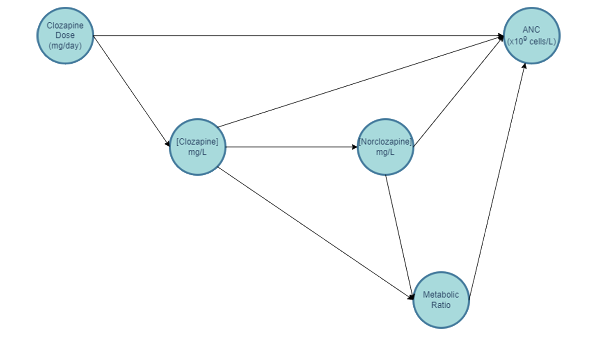

<style> 


body {
  max-width: 1920px;
  margin-left: 0;
  margin-right: 0;
}


#header { 
  /* Permalink - use to edit and share this gradient: https://colorzilla.com/gradient-editor/#e3adff+0,2a9bd8+48,0d705e+90 */
  background: #e3adff; /* Old browsers */
  background: -moz-linear-gradient(left,  #e3adff 0%, #2a9bd8 48%, #0d705e 90%); /* FF3.6-15 */
  background: -webkit-linear-gradient(left,  #e3adff 0%,#2a9bd8 48%,#0d705e 90%); /* Chrome10-25,Safari5.1-6 */
  background: linear-gradient(to right,  #e3adff 0%,#2a9bd8 48%,#0d705e 90%); /* W3C, IE10+, FF16+, Chrome26+, Opera12+, Safari7+ */
  filter: progid:DXImageTransform.Microsoft.gradient( startColorstr='#e3adff', endColorstr='#0d705e',GradientType=1 ); /* IE6-9 */
  color: #EFEFEF;
  height: 400px;
  padding: 15px;
  }

.main-container {
  max-width: 1200px;
  margin-left: auto;
  margin-right: auto;
  }

div.blue { background-color:#EFEFEF; border-radius: 20px; padding: 20px;}

</style>


```{r set up, echo = F, warning= FALSE}

knitr::opts_chunk$set(warning = FALSE, message = FALSE, echo = TRUE, fig.align = "center", dev = "png", dev.args=list(bg="transparent")) 
options(knitr.kable.NA = '')
options(scipen = 0)
options(digits = 3)


library(beepr)

options(error = function(){    # Beep on error
  beepr::beep(sound = 10)
  Sys.sleep(time = 1)
  }
 )

.Last <- function() {          # Beep on exiting session
  beepr::beep(sound = 5)
  Sys.sleep(time = 1)
}


detach_package <- function(pkg, character.only = FALSE)
{
  if(!character.only)
  {
    pkg <- deparse(substitute(pkg))
  }
  search_item <- paste("package", pkg, sep = ":")
  while(search_item %in% search())
  {
    detach(search_item, unload = TRUE, character.only = TRUE)
  }
}

set.seed(666)
```

<br>
<br>

```{r load packages, include=FALSE}
library(readr)
library(tidyverse)
library(dplyr)
library(lubridate)
library(kableExtra)
library(psych)
library(lme4)
library(sjPlot)
library(lmerTest)
library(readxl)
library(mediation)
library(lavaan)
library(broom.mixed)
library(jtools)
```


```{r get data - FBC, include = FALSE}

setwd(dir = "D:/siobh/Documents/Uni/PhD/Y1/Clozapine Project/Git/clozapine-project/")

# load in fbc data
CLOZUK3.fbc <- read_delim("FBC/CLOZUK3_FBCdata_140721.txt",delim="\t")

# deal w/ dates 
CLOZUK3.fbc <- CLOZUK3.fbc %>% mutate(CLOZUK3.fbc,
                                      sampledate=dmy(sampledate),
                                      sampletime=hms(sampletime),
                                      sampleyear=year(sampledate))
# take a look at the data
CLOZUK3.fbc %>% group_by(SEX) %>% summarise("Sample Size"=n_distinct(LUIN))

CLOZUK3.fbc <- subset(CLOZUK3.fbc, LUIN !='30276595' ) # ID present in CLOZUK2

# calculate age at assay
CLOZUK3.fbc$age_at_assay <- CLOZUK3.fbc$sampleyear - CLOZUK3.fbc$YOB

# Are there any individuals below 18 years of age?
u18 <- unique(CLOZUK3.fbc$LUIN[CLOZUK3.fbc$age_at_assay < 18]) # 6 I think, 1 16 yo and 5 17 yo.

# remove them from analysis
CLOZUK3.fbc <- filter(CLOZUK3.fbc, !(LUIN %in% u18))

# Is any individual listed as having multiple ages or sexes?
check_sex <- CLOZUK3.fbc%>%group_by(LUIN)%>%summarise(sexes=length(unique(SEX)))
mismatch_sex <- check_sex$LUIN[check_sex$sexes >= 2]
CLOZUK3.fbc%>%group_by(LUIN)%>%summarise(sexes=length(unique(SEX)))%>%filter(sexes==2)

# everyone's sex matches
check_yob <- CLOZUK3.fbc%>%group_by(LUIN)%>%summarise(yobs=length(unique(YOB)))
mismatch_yob <- check_yob$LUIN[check_yob$yobs >= 2] 
CLOZUK3.fbc%>%group_by(LUIN)%>%summarise(yobs=length(unique(YOB)))%>%filter(yobs==2)
# everyone's age also seems to match

# does anyone have multiple assays on same day
check <- CLOZUK3.fbc[c(1,4)]
only_once <- check[!(duplicated(check) | duplicated(check, fromLast = TRUE)), ]

# remove these individuals
CLOZUK3.nodup <- left_join(only_once, CLOZUK3.fbc, by = c("LUIN" = "LUIN", "sampledate" = "sampledate"))

# How many assays are missing fundamental variables? (LUIN, sampledate, sampletime)
colSums(is.na(CLOZUK3.fbc))

# everyone has an ID (LUIN)
# 760 instances of missing sample date
# 4383 instances of missing time

# drop rows with missing date and time information
CLOZUK3.nona <- CLOZUK3.nodup[complete.cases(CLOZUK3.nodup[,c("sampledate","sampletime")]),]

```

```{r get data - PK, include = FALSE}
setwd(dir = "D:/siobh/Documents/Uni/PhD/Y1/Clozapine Project/Git/clozapine-project/")


# load in PK data (.Rdata file produce by D. Kappel for the Kappel et al., 2023 paper)
load("PK/CLOZUK3_PKdata_clean_03.11.2022.Rdata")

CLOZUK3.PK <- CLOZUK3_cleanup

CLOZUK3.PK <- subset(CLOZUK3.PK, LUIN !='30276595' ) # ID present in CLOZUK2 so removed. 

CLOZUK3.PK <- CLOZUK3.PK %>% mutate(CLOZUK3.PK, # reformat dates
                                      sampledate=ymd(sampledate),
                                      sampletime=hms(sampletime),
                                      sampleyear=year(sampledate),
                                      dosedate=dmy(dosedate),
                                      dosetime=hms(dosetime))

# take a look at the data
CLOZUK3.PK %>% group_by(SEX) %>% summarise("Sample Size"=n_distinct(LUIN))

# Are there any individuals below 18 years of age? no!
unique(CLOZUK3.PK$LUIN[CLOZUK3.PK$YOS < 18]) 

# Is any individual listed as having multiple ages or sexes?
check_sex <- CLOZUK3.PK%>%group_by(LUIN)%>%summarise(sexes=length(unique(SEX)))
mismatch_sex <- check_sex$LUIN[check_sex$sexes >= 2]
CLOZUK3.PK%>%group_by(LUIN)%>%summarise(sexes=length(unique(SEX)))%>%filter(sexes==2)

# everyone's sex matches
check_yob <- CLOZUK3.PK%>%group_by(LUIN)%>%summarise(yobs=length(unique(YOB)))
mismatch_yob <- check_yob$LUIN[check_yob$yobs >= 2] 
CLOZUK3.PK%>%group_by(LUIN)%>%summarise(yobs=length(unique(YOB)))%>%filter(yobs==2)

# How many assays are missing fundamental variables? (LUIN, sampledate, sampletime)
colSums(is.na(CLOZUK3.PK))
# no missing data :-)

table(CLOZUK3.PK$high_clozapine_level)
table(CLOZUK3.PK$low_daily_clozapine_dose)
table(CLOZUK3.PK$bad_metabolic_ratio)

CLOZUK3.PK$LUIN <- as.numeric(CLOZUK3.PK$LUIN)

# remove temporary variables
rm(check)
rm(check_sex)
rm(check_yob)
rm(only_once)
rm(CLOZUK3_cleanup)
rm(mismatch_sex)
rm(mismatch_yob)
```

```{r get data - SNPs, include = FALSE}
setwd(dir = "D:/siobh/Documents/Uni/PhD/Y1/Clozapine Project/Git/clozapine-project/")

# load in genetic data

dn_rs2814778 <- read_delim("Genloc/CLOZUK3.rs2814778.raw",delim="\t") # duffy null
snps <- read_delim("Genloc/CLOZUK3.Willcocks2021_snps.raw",delim="\t")

# flip allele counts so they reflect the minor allele in line with Willcocks et al., (2021)
snps$rs2472297_T = NA
snps$rs2472297_T[snps$rs2472297_C == 2] <- 0
snps$rs2472297_T[snps$rs2472297_C == 0] <- 2
snps$rs2472297_T[snps$rs2472297_C == 1] <- 1

snps$rs61750900_T = NA
snps$rs61750900_T[snps$rs61750900_G == 2] <- 0
snps$rs61750900_T[snps$rs61750900_G == 0] <- 2
snps$rs61750900_T[snps$rs61750900_G == 1] <- 1

snps$rs2011425_G = NA
snps$rs2011425_G[snps$rs2011425_T == 2] <- 0
snps$rs2011425_G[snps$rs2011425_T == 0] <- 2
snps$rs2011425_G[snps$rs2011425_T == 1] <- 1

snps$rs1126545_T = NA
snps$rs1126545_T[snps$rs1126545_C == 2] <- 0
snps$rs1126545_T[snps$rs1126545_C == 0] <- 2
snps$rs1126545_T[snps$rs1126545_C == 1] <- 1

dn_rs2814778$rs2814778_C = NA
dn_rs2814778$rs2814778_C[dn_rs2814778$rs2814778_T == 2] <- 0
dn_rs2814778$rs2814778_C[dn_rs2814778$rs2814778_T == 0] <- 2
dn_rs2814778$rs2814778_C[dn_rs2814778$rs2814778_T == 1] <- 1

# now the duffy nulls are coded by 2 (C) and non duffy nulls are 0 (C) or 1(C).
# create new binary variable indicating presence / absence of duffy-null genotype

table(dn_rs2814778$rs2814778_C) 
dn_rs2814778$duffynull = NA
dn_rs2814778$duffynull[dn_rs2814778$rs2814778_C == 2] <- "1" # yes dn
dn_rs2814778$duffynull[dn_rs2814778$rs2814778_C < 1] <- "0" # no dn
table(dn_rs2814778$duffynull) 

# merge genetic info 
dn <- dn_rs2814778[,c("FID", "rs2814778_C", "duffynull")]
names(dn)[names(dn) == 'FID'] <- 'LUIN'

CLOZUK3.gen <- left_join(snps, dn, by = "LUIN")

CLOZUK3.gen <- subset(CLOZUK3.gen, LUIN !='30276595' )

CLOZUK3.gen <- dplyr::select(CLOZUK3.gen, c('LUIN', 'rs2472297_T', 'rs61750900_T', 'rs2011425_G', 'rs1126545_T', "rs2814778_C",'duffynull'))

# remove temporary variables
rm(snps)
rm(dn)
rm(dn_rs2814778)
```

```{r get data - PRS, include = FALSE}
setwd(dir = "D:/siobh/Documents/Uni/PhD/Y1/Clozapine Project/Git/clozapine-project/")
# load in PRS for clozapine and norclozapine metabolism
# PRS generated by A. Pardinas and reported on in Pardiñas et al. 2023
library(here)
CLOZUK3.clozapine <- read_table(here("Genloc","CLOZUK3.clozapine.all_score")) %>%
                     set_names(tidy_names(str_replace(names(.),"Pt_","clozapine_"),syntactic = T)) %>%
                     dplyr::select(IID, clozapine_5e.08) # select genome wide significant level

colnames(CLOZUK3.clozapine) <- c("LUIN", "c_PRS") # rename columns

CLOZUK3.norclozapine <- read_table(here("Genloc","CLOZUK3.norclozapine.all_score")) %>%                        set_names(tidy_names(str_replace(names(.),"Pt_","norclozapine_"),syntactic = T)) %>%
                        dplyr::select(IID, norclozapine_5e.08) # select genome wide significant level

colnames(CLOZUK3.norclozapine) <- c("LUIN", "n_PRS") #rename columns

```


```{r get data - pgx, include = FALSE}
setwd(dir = "D:/siobh/Documents/Uni/PhD/Y1/Clozapine Project/Git/clozapine-project/")

# load pypgx output for cyp1a2
CLOZUK3.1a2 <- read_delim("PGx/output/results/cyp1a2.tsv",delim="\t") %>%
  dplyr::select(1:5)
colnames(CLOZUK3.1a2) <- c("LUIN", "Genotype", "Phenotype", "Haplotype1", "Haplotype2") # retain relevant columns

# create columns for a1 and clean haplotype
CLOZUK3.1a2$allele1 = NA
CLOZUK3.1a2$score1 = NA
CLOZUK3.1a2$Haplotype1<-gsub(";","",as.character(CLOZUK3.1a2$Haplotype1))

# assign metabolism phenotypes and activty scores for a1
CLOZUK3.1a2$allele1[CLOZUK3.1a2$Haplotype1 =="*1A"] <- "Normal Function"
CLOZUK3.1a2$score1[CLOZUK3.1a2$Haplotype1 =="*1A"] <- 1

CLOZUK3.1a2$allele1[CLOZUK3.1a2$Haplotype1=="*1F"] <- "Increased Function"
CLOZUK3.1a2$score1[CLOZUK3.1a2$Haplotype1=="*1F"] <- 1.5

CLOZUK3.1a2$allele1[CLOZUK3.1a2$Haplotype1=="*1C"] <- "Decreased Function"
CLOZUK3.1a2$score1[CLOZUK3.1a2$Haplotype1=="*1C"] <- 0.5

CLOZUK3.1a2$allele1[CLOZUK3.1a2$Haplotype1=="*1C*1F"] <- "Normal Function"
CLOZUK3.1a2$score1[CLOZUK3.1a2$Haplotype1=="*1C*1F"] <- 1

# create columns for a2 and clean haplotype

CLOZUK3.1a2$allele2 = NA
CLOZUK3.1a2$score2 = NA
CLOZUK3.1a2$Haplotype2<-gsub(";","",as.character(CLOZUK3.1a2$Haplotype2))

# assign metabolism phenotypes and activity scores for a2

CLOZUK3.1a2$allele2[CLOZUK3.1a2$Haplotype2 =="*1A"] <- "Normal Function"
CLOZUK3.1a2$score2[CLOZUK3.1a2$Haplotype2 =="*1A"] <- 1

CLOZUK3.1a2$allele2[CLOZUK3.1a2$Haplotype2=="*1F"] <- "Increased Function"
CLOZUK3.1a2$score2[CLOZUK3.1a2$Haplotype2=="*1F"] <- 1.5

CLOZUK3.1a2$allele2[CLOZUK3.1a2$Haplotype2=="*1C"] <- "Decreased Function"
CLOZUK3.1a2$score2[CLOZUK3.1a2$Haplotype2=="*1C"] <- 0.5

CLOZUK3.1a2$allele2[CLOZUK3.1a2$Haplotype2=="*1C*1F"] <- "Normal Function"
CLOZUK3.1a2$score2[CLOZUK3.1a2$Haplotype2=="*1C*1F"] <- 1

# give total activity scores and metabolism phenotype for diplotype 

CLOZUK3.1a2$est_score = CLOZUK3.1a2$score1 + CLOZUK3.1a2$score2
CLOZUK3.1a2$est_pheno = NA
CLOZUK3.1a2$est_pheno[CLOZUK3.1a2$est_score == 2] <- "Normal metaboliser"
CLOZUK3.1a2$est_pheno[CLOZUK3.1a2$est_score == 2.5] <- "Rapid metaboliser"
CLOZUK3.1a2$est_pheno[CLOZUK3.1a2$est_score == 3] <- "Ultrarapid metaboliser"
```


```{r merge data, include=FALSE}

# merge FBC and PK data based on assays collected on the same date.

CLOZUK3.int <- inner_join(CLOZUK3.nona, CLOZUK3.PK, by = c("LUIN" = "LUIN", "sampledate" = "sampledate", "SEX" = "SEX", "YOB" = "YOB", "sampleyear" = "sampleyear", "age_at_assay" = "age"))

# filter by criteria
CLOZUK3.fbc.pk <- CLOZUK3.int %>%  filter(neut_num >= 2 & neut_num <= 7.5) %>% # neutrophils within 'healthy' range
  filter(bad_metabolic_ratio != 1) %>% # metabolic ratio between 0.5 and 3 (so does not suggest non-adherance)
  filter(low_daily_clozapine_dose != 1) %>% # daily clozapine dose above 100 mg (so not suggesting titration)
  subset(LUIN !='30276595' ) # ensure CLOZUK2 participant not included

# save(CLOZUK3.fbc.pk, file = "CLOZUK3.fbc.pk.RData") # save created dataframe


#merge prs with snps
CLOZUK3.prs <- inner_join(CLOZUK3.clozapine, CLOZUK3.norclozapine, by = "LUIN")
CLOZUK3.prs.1a2 <- left_join(CLOZUK3.prs, CLOZUK3.1a2, by = "LUIN")
CLOZUK3.prs.1a2.gen <- inner_join(CLOZUK3.prs.1a2, CLOZUK3.gen, by = "LUIN")

# all w/ gen
CLOZUK3.fbc.pk.gen <- inner_join(CLOZUK3.fbc.pk, CLOZUK3.prs.1a2.gen, by = "LUIN") %>%
  subset(LUIN !='30276595' )


# save(CLOZUK3.fbc.pk.gen, file = "CLOZUK3.fbc.pk.gen.RData") # save created dataframe


#rm(CLOZUK3.int)
#rm(CLOZUK3.fbc)
#rm(CLOZUK3.gen)
#rm(CLOZUK3.PK)
#rm(only_once)
#rm(CLOZUK3.nodup)
#rm(CLOZUK3.nona)
#rm(u18)
```


```{r load data}
# load data from earlier
setwd(dir = "D:/siobh/Documents/Uni/PhD/Y1/Clozapine Project/Git/clozapine-project/")

load("CLOZUK3.fbc.pk.Rdata")
load("CLOZUK3.fbc.pk.gen.Rdata")

# create age^2 variable
CLOZUK3.fbc.pk <- CLOZUK3.fbc.pk %>%
  mutate(std_age2 = as.vector(scale(age_at_assay,center = T, scale = F))^2) 

CLOZUK3.fbc.pk.gen <- CLOZUK3.fbc.pk.gen %>%
  mutate(std_age2 = as.vector(scale(age_at_assay,center = T, scale = F))^2) 

# get the lowest dose per participant (creating a cross-sectional dataset)
CLOZUK3.fbc.pk.min <- CLOZUK3.fbc.pk %>% 
  arrange(neut_num) %>% 
  distinct(LUIN, .keep_all = TRUE)

CLOZUK3.fbc.pk.gen.min <- CLOZUK3.fbc.pk.gen %>% 
  arrange(neut_num) %>% 
  distinct(LUIN, .keep_all = TRUE)


#standardise ur predictors (MIN)
CLOZUK3.fbc.pk.min.std <- datawizard::standardise(x = CLOZUK3.fbc.pk.min, select = c("dailydose", "age_at_assay", "std_age2", "TDS", "clozapine", "norclozapine", "ratio"))

CLOZUK3.fbc.pk.gen.min.std <- datawizard::standardise(x = CLOZUK3.fbc.pk.gen.min, select = c("dailydose", "age_at_assay", "std_age2", "TDS", "clozapine", "norclozapine", "c_PRS", "n_PRS", "est_score", "rs2472297_T", "rs61750900_T", "rs2011425_G", "rs1126545_T", "duffynull"))

#standardise ur predictors (LT/full data)

CLOZUK3.fbc.pk.std <- datawizard::standardise(x = CLOZUK3.fbc.pk, select = c("dailydose", "age_at_assay", "std_age2", "TDS", "clozapine", "norclozapine"))

CLOZUK3.fbc.pk.gen.std <- datawizard::standardise(x = CLOZUK3.fbc.pk.gen, select = c("dailydose", "age_at_assay", "std_age2", "TDS", "clozapine", "norclozapine", "c_PRS", "n_PRS", "est_score", "rs2472297_T", "rs61750900_T", "rs2011425_G", "rs1126545_T"))

```


# Mediation and Longitudinal Analysis to interpret the association between clozapine pharmacokinetics, pharmacogenomics, and absolute neutrophil count.  {.tabset}
<br>
**Siobhan K. Lock, Sophie E. Legge, Djenifer B. Kappel, Isabella R. Willcocks, Marinka Helthuis, John Jansen, James T. R. Walters, Michael J. Owen, Michael C. O’Donovan, <a href = "mailto: PardinasA@cardiff.ac.uk"> Antonio F Pardiñas </a>**

<br>

Clozapine is effective at reducing symptoms of treatment-resistant schizophrenia, but it can also induce several adverse outcomes including neutropenia and agranulocytosis. We used linear mixed-effect models and structural equation modelling to determine whether pharmacokinetic and genetic variables influence absolute neutrophil count in a longitudinal UK-based sample of clozapine users not currently experiencing neutropenia (N = 811). Increased daily clozapine dose was associated with elevated neutrophil count, amounting to a 133 cells/mm3 rise per standard deviation increase in clozapine dose. One-third of the total effect of clozapine dose was mediated by plasma clozapine and norclozapine levels, which themselves demonstrated opposing, independent associations with absolute neutrophil count. Finally, CYP1A2 pharmacogenomic activity score was associated with absolute neutrophil count, supporting lower neutrophil levels in CYP1A2 poor metabolisers during clozapine use. This information may facilitate identifying at-risk patients and then introducing preventative interventions or individualised pharmacovigilance procedures to help mitigate these adverse haematological reactions.


<br>
<br>
<br>


## <strong> Introduction </strong>


### Introduction

Antipsychotics are the primary pharmacological treatments for people with schizophrenia. Response to these drugs is highly variable, and approximately one-third of patients respond insufficiently after several prescriptions [1]. Formally, the term “treatment-resistant schizophrenia” applies to individuals who do not respond to at least two different antipsychotics taken at a therapeutic dose, for an appropriate length of time, and after having ruled out non-compliance [2,3]. Clozapine is the sole evidence-based pharmacotherapy for treatment-resistant schizophrenia, but some clinicians are hesitant to prescribe it due to a range of potential adverse drug reactions (ADRs). The best known of these involve a decline in absolute neutrophil count (ANC) that leads to neutropenia and ultimately agranulocytosis [4]. Agranulocytosis is a rare, severe, and potentially lethal clozapine-induced ADR that is currently unpredictable [5]. However, a less severe decline in ANC may also be problematic; it has been suggested that this can result in partial suppression of the immune system even before formal criteria for neutropenia are met, increasing vulnerability to infectious diseases [6].  

The mechanisms underlying clozapine-induced neutrophil loss are unknown, but it is thought to arise through processes involving clozapine metabolites. The CYP family of enzymes, notably CYP1A2, CYP2D6, and CYP3A4, are heavily involved with the biotransformation of clozapine through its metabolic pathway [7], leading to norclozapine and clozapine-N-oxide as key products. However, the drug can also be oxidised to a nitrenium ion, a nitrogenous intermediate characterised by its high reactivity and ability to bind with cells [8]. The conversion of clozapine to the nitrenium ion is mediated by neutrophil action. Activated neutrophils combat infection by producing an antimicrobial agent, hypochlorous acid, via the enzyme myeloperoxidase. Both hypochlorous acid and myeloperoxidase may also react with clozapine to form the intermediate nitrenium ion [9,10]. It is thought that this reactive intermediate may harm neutrophils through two primary mechanisms: haptenation, in which the nitrenium ion binds irreversibly to neutrophil cell surface proteins, or through overactivation of the glutathione system which may be recruited to form conjugates with the nitrenium ion and detoxify it. Indeed, it is known that both these mechanisms can lead to neutrophil apoptosis [11–13].

Regular blood monitoring is a requirement of clozapine prescription both in the UK and in many other countries to reduce the risks of progression from low neutrophil count to formal agranulocytosis [14]. Nevertheless, despite the superiority of clozapine for managing treatment-resistant schizophrenia in comparison to standard first-line antipsychotics, concerns about ADR risk and monitoring requirements are primary contributors to this drug being underutilised worldwide [15]. For this reason, identifying factors that are predictive of low neutrophil counts in an otherwise healthy sample of clozapine users could help clinicians to improve clozapine use while supporting patient safety and wellbeing. For example, if clozapine users susceptible to increased risk for infections could be identified, potential harm might be mitigated by prioritising them for seasonal vaccinations or making changes to their blood monitoring regime. 

Past research [16–18] explored associations between ANC and daily clozapine dose as well as plasma concentrations of clozapine and norclozapine. Generally, higher plasma clozapine concentration has been found to be associated with lower ANC, whereas higher plasma norclozapine concentration has been reported to be associated with higher neutrophil counts. However, as highlighted in a recent review [19], there is inconsistency in the literature regarding both the direction and magnitude of effects observed. While this could be in part due to differences in statistical methodology and the use of small samples, it could equally reflect the idiosyncrasy of the ADR leading to ANC decline, alongside the challenges of disentangling the impact of clozapine and its related variables from genetic, demographic, or lifestyle factors that may also influence neutrophil counts.

The present research aims to replicate and extend these previous studies by exploring predictors of ANC in a large, UK-based sample of clozapine users with TRS in whom longitudinal measures were available for both pharmacokinetic variables and full blood counts.  Linear mixed-effect models (LMMs) were used to explore associations between pharmacokinetic and pharmacogenomic variables and ANC, while accounting for between- and within-individual variability. Following this, a Structural Equation Modelling (SEM) framework was used to further disentangle the contributions of clozapine dose, from plasma clozapine and plasma norclozapine levels. Genetic predictors relating to clozapine and norclozapine metabolism, as well as baseline variation in ANC were also investigated to determine whether they influenced neutrophil counts in our sample.

<br>
<br>
<br>
<br>

## <strong> Methods </strong> 
### Methods

#### Sample collection / Participants
We used Full Blood Counts (FBC) and pharmacokinetic assay data from the CLOZUK3 sample [20], the most recent wave of the CLOZUK study [21]. All participants had a diagnosis of treatment-resistant schizophrenia and were prescribed clozapine. Samples were anonymously collected in the UK from the Zaponex Treatment Access System (ZTAS), a clozapine monitoring framework managed by Leyden Delta B.V. (Nijmegen, Netherlands). Sample collection and data extraction procedures for CLOZUK have been detailed previously [21,22]. The CLOZUK study received UK National Research Ethics Service approval (reference 10/WSE02/15), in accordance with the requirements of the UK Human Tissue Act 2004.

<br>

#### Inclusion / Exclusion Criteria
CLOZUK3 contains longitudinal assay data from participants older than 18 years of age who had not been previously included in prior waves of CLOZUK. We excluded data from assays with missing FBC or pharmacokinetic information or with clerical errors (e.g., several assays taken at the same date and time yielding different results) from further analyses. To retain only apparently healthy individuals, the FBC data were curated by removing any assay showing an ANC outside of the normal reference range (2000 – 7500 cells/mm3). Additionally, and as in previous research [20], we removed pharmacokinetic assays (i) where the gap between clozapine intake and blood sampling was outside a 6-24 hour window; (ii) where clozapine and norclozapine plasma concentrations were below instrument detection levels (< 0.05 mg/L); (iii) showing a low daily clozapine dose (< 100mg, potentially indicative of drug titration) or (iv) where the metabolic ratio suggested non-adherence (< 0.5 or > 3.0). 

<br>

#### Genetic Data
A subset of individuals (N = 523) in the sample had linked genetic data, based on genotypes from an Illumina Infinium Global Sequencing Array-24 (Illumina Inc, USA). Details regarding the curation and imputation of this genetic data have been described elsewhere [20] and summarised in the **Supplementary Note**. Pharmacogenomic star alleles (i.e., genetic variants or combinations of variants constituting pharmacogenomic markers) for CYP1A2 were called using PyPGx v0.20.0 [23] on the imputed array data. Enzyme activity scores inferred from these star alleles were included in LMMs to determine whether genetic predictors of CYP1A2 activity were associated with ANC. Other pharmacogenomic SNPs (Table 1) identified in a GWAS of clozapine metabolism [24] and included in a previous analysis exploring predictors of ANC [18] were also investigated. 

Polygenic  Scores (PGS) for clozapine and norclozapine metabolism were calculated via PRSice2 v2.35 [25] as part of a previous study [22]. These were included in secondary analyses. We also explored the impact of the Duffy-null genotype (rs2814778; C/C homozygote) as this has been  associated with decreased ANC in clozapine users of African, Asian, and Middle Eastern ancestries [26]. Finally, the Human Leukocyte Antigen (HLA) system has long been understood as a crucial component of the immune system, with past work linking this genetic locus to agranulocytosis in clozapine users [27]. Therefore, we imputed HLA types using HIBAG v1.34.1 [28] and incorporated these into LMMs to explore their impact on ANC. Detailed descriptions of CYP1A2 pharmacogenomic allele calling and HLA genotype imputation are found in the **Supplementary note**. 


```{r table 1, fig.cap="Table 1. SNPs included in regression analyses exploring the impact of pharmacogenomic variation on clozapine metabolism and neutrophil levels. SNP = Single Nucleotide Polymorphism; CHR = Chromosome; Alt = Alternative (or Minor) allele."}

## Create Table 1

genes <- data.frame(SNP  = c('rs2011425', 'rs61750900', 'rs1126545', 'rs2472297', 'rs2814778'),
                    CHR = c('2', '4', '10', '15', '1' ),
                    Gene = c("UGT1A family", 'UGT2B10', 'CYP2C18', 'CYP1A1-CYP1A2', 'ACKR1' ),
                    Alt = c('G', 'T', 'T',  'T', 'C'),
                    Association = c("Alternative allele linked with decreased plasma norclozapine levels [24].", "Alternative allele linked with decreased plasma norclozapine levels [24]", "Alternative allele linked with increased metabolic ratio (24).", "Alternative allele linked with decreased plasma clozapine levels [24]. ", "Alternative allele homozygosity (Duffy-Null genotype) linked with non-pathological baseline ANC [26]." )
                    )

kable(genes, caption = "Table 1 . SNPs included in regression analyses exploring the impact of pharmacogenomic variation neutrophil levels. SNP = Single Nucleotide Polymorphism; CHR = Chromosome; Alt = Alternative (or Minor) allele.", full_width = F, font_size = 16,
             digits = 2) %>% kable_classic
```


<br>

#### Statistical Analysis

A Directed Acyclic Graph (DAG) was first drawn to consider the possible causal structure of the clozapine dose – ANC relationship [29]. As previously recommended [30],  we explicitly report the rationale for included DAG nodes and relationships in Supplementary Table 3. 

Data analyses were performed in R  v4.1.1 using R Studio 2023.06.1+524 [31]. The longitudinal dataset was analysed using LMMs in lme4 with ANC as the outcome variable. A baseline model, in line with previous work [18], included three pharmacokinetic variables related to clozapine and its metabolism (i.e., daily clozapine dose, plasma clozapine concentration, and plasma norclozapine concentration) alongside covariates for age, age2, sex, and the time between the dose intake and blood sampling (TDS). Participant ID was included in these models as a random effect term. All predictor variables were standardised as described in the **Supplementary Note**, before fitting the regression model. Further analyses included pharmacogenomic variables (i.e., CYP1A2 activity scores, and the genotypes of pharmacogenomic SNPs outlined in Table 1). 

Secondary analyses extended the LMMs by testing for associations between the additional genetic predictors (i.e., PGS for clozapine and norclozapine metabolism, the Duffy-null genotype, and HLA genotypes) with neutrophil counts.


Due to the difficulty of implementing and interpreting causal analyses on longitudinal datasets with irregular time points [32], mediation models were fit using the lowest value of ANC reported for each individual as the outcome variable. SEM was conducted using lavaan [33] including clozapine and norclozapine plasma concentrations as mediating variables, daily clozapine dose as the exposure, and lowest ANC as the outcome. Residualised versions of these variables were included in the model, as described in the **Supplementary Note**. Predictor variable residuals were standardised before inclusion in the model.  

Further sensitivity analyses tested the robustness of these mediation models, assessing both the impact of using residualised variables and using cross-sectional, as opposed to longitudinal data. Single-mediator analyses were also implemented in the mediation R package [34]. While this approach can estimate direct and indirect effects in longitudinal datasets it can only accommodate a single mediator variable. Therefore, it was not appropriate for the primary analysis of the multiple mediation model that we defined and evaluated using SEM on cross-sectional data in lavaan. Finally, we attempted to formally replicate the analyses described in previous studies [17,18] by implementing linear models, as reported in the **Supplementary Note**. 

<br>
<br>
<br>
<br>

## <strong> Main Results </strong> 
### Main Results 
```{r time on treatment, include = FALSE}
# estimate the length of time people have been on clozapine treatment for. 

library(arsenal)

# find earliest and latest assay date, then find the difference between them.
earliest.assay <-  CLOZUK3.fbc.pk[order(CLOZUK3.fbc.pk$sampledate),] %>% 
  distinct(LUIN, .keep_all = TRUE)

comparedf(earliest.assay, earliest.assay)

latest.assay <-  CLOZUK3.fbc.pk[order(CLOZUK3.fbc.pk$sampledate, decreasing = TRUE),] %>% 
  distinct(LUIN, .keep_all = TRUE)

test <- left_join(earliest.assay[1:2],latest.assay[1:2], by = 'LUIN')

test$diff <- test$sampledate.y - test$sampledate.x

test$weeks <- as.numeric(test$diff)/7

test$over1[test$weeks >= 52] <- "Yes"
test$over1[test$weeks < 52] <- "No"

tmp <- as.data.frame(table(test$over1))

a <- (tmp[2.2]/(tmp[1,2] + tmp[2,2])) * 100
```

The final curated CLOZUK3 longitudinal dataset included 811 participants, with a total of 2,362 FBC and pharmacokinetic assays taken on the same day. Participants had a mean (SD) age of 40.1 (12.2) years; 28.9% were female (N = 234) and 71.1% were male (N = 577). Full descriptive statistics of the sample at the point of lowest ANC are given in Table 2. While the first occurrence of each individual on our ZTAS dataset is not necessarily the date they started clozapine, we note that about a third of the CLOZUK3 individuals with valid data (`r round(a[2,], digits = 1)`%; `r tmp[2,2]`/`r tmp[1,2]`)  had records spanning at least a year  of clozapine treatment.

The DAG (Supplementary Figure 2) displays the possible causal paths between ANC (the outcome), daily clozapine dose (the exposure variable), and plasma concentrations of clozapine and norclozapine (potential mediators between dose and ANC). 

```{r Table 2, fig.cap="Table 2. Summary of CLOZUK3 variables used in mediation analysis. Descriptive statistics presented for a ‘cross-sectional’ version of CLOZUK3 where the assay with the lowest value of ANC per person is retained.  TDS = Time between Dose and Sample; ANC = Absolute Neutrophil Count."}

# get descriptive statistics for key variables
a <- describeBy(x = dplyr::select(CLOZUK3.fbc.pk.min, c("clozapine", "norclozapine", "dailydose", "TDS", "neut_num", "age_at_assay")), fast = TRUE, group = CLOZUK3.fbc.pk.min$SEX)

# split by sex
aF <- a$FEMALE
aM <- a$MALE

# key stats
Variable <- c('[Clozapine] (mg/L)', '[Norclozapine] (mg/L)', 'Daily dose (mg)', "TDS (hours)", "ANC (x10^9/L)", "Age")
Mean_M <- round(aM$mean, 3)
Mean_F <- round(aF$mean, 3)
SD_M <- round(aM$sd, 3)
SD_F <- round(aF$sd, 3)
Min_M <- round(aM$min, 3)
Min_F <- round(aF$min, 3)
Max_M <- round(aM$max, 3)
Max_F <- round(aF$max, 3)

Male <- cbind(Variable, Mean_M, SD_M, Min_M, Max_M)
Female <- cbind(Mean_F, SD_F, Min_F, Max_F)

table <- cbind(Male, Female)

kable(table, col.names = c("Variable", "Mean","SD","Min","Max", "Mean","SD","Min","Max"), caption = "Table 2. Summary of CLOZUK3 variables used in mediation analysis. Descriptive statistics presented for a ‘cross-sectional’ version of CLOZUK3 where only the entry associated with the lowest value of ANC per person is retained. TDS = Time between Dose and Sample; ANC = Absolute Neutrophil Count; [Clozapine] = Clozapine plasma concentration; [Norclozapine] = Norclozapine plasma concentration.  ") %>%
  kable_styling("none", full_width = T,
                position = "left", font_size = 16) %>%
  add_header_above(c(" " = 1, "Male" = 4, "Female" = 4)) %>% 
  kable_classic 

```


<br>
<br>

#### <small> Significant associations between pharmacokinetic and pharmacogenomic variables with ANC </small>

``` {r model labels, include = FALSE}
# labels for use in tab_model to create regression tables

all_labels <- c('Intercept' = "Intercept",
              'dailydose' = "Daily dose",
              'clozapine' = "Clozapine",
              'norclozapine' = "Norclozapine",
              'est_score' = "CYP1A2 Activity Score",
              'est_phenoRapid metaboliser' = 'Rapid metaboliser Phenotype',
              'est_phenoUltrarapid metaboliser' = 'Ultrarapid metaboliser Phenotype',
              'est_phenoPoor metaboliser' = 'Poor metaboliser Phenotype',
              'est_phenoIntermediate metaboliser' = 'Intermediate metaboliser Phenotype',                             
              'PhenoPoor metaboliser' = 'Poor metaboliser Phenotype',
              'PhenoIntermediate metaboliser' = 'Intermediate metaboliser Phenotype',
              'TDS' = "TDS",
              "SEXMALE" = 'Sex (Male)',
              "age_at_assay" = "Age",
              "std_age2" = "Age squared",
              "duffynull1" = "Duffy-Null (Present)",
              "rs2472297_T" = "rs2472297_T",
              "rs61750900_T" = "rs61750900_T",
              "rs2011425_G" = "rs2011425_G",
              "rs1126545_T" = "rs1126545_T",
              "c_PRS" = "Clozapine Metabolism PGS",
              "n_PRS" = "Norclozapine Metabolism PGS")

labels_rep <- c('Intercept' = "Intercept",
                 'dailydose' = "Daily dose",
              'clozapine' = "Clozapine",
              'norclozapine' = "Norclozapine",
              "SEXMALE" = 'Sex (Male)',
              "age_at_assay" = "Age",
              "std_age2" = "Age squared",
              "TDS" = "TDS",
              "ratio" = "Metabolic Ratio",
              "rs2472297_T" = "rs2472297_T",
              "rs61750900_T" = "rs61750900_T",
              "rs2011425_G" = "rs2011425_G",
              "rs1126545_T" = "rs1126545_T")
```


```{r main mixed model}

# linear mixed effect regression models on longitudinal clozuk3 data
anc_dcnt <- lmer(neut_num~dailydose+clozapine+norclozapine+TDS+SEX+age_at_assay+std_age2 + (1|LUIN), data=CLOZUK3.fbc.pk.std) # base model 

coefs1 <- data.frame(coef(summary(anc_dcnt)))

# including genetic predictors too
anc_dcnt_1a2_snp_as <- lmer(neut_num~dailydose+clozapine+norclozapine+est_score+rs2472297_T+rs61750900_T+rs2011425_G+rs1126545_T+TDS+SEX+age_at_assay+std_age2 + (1|LUIN), data=CLOZUK3.fbc.pk.gen.std) # base model + PGx (SNPs and CYP1A2 Activity Score)

coefs1b <- data.frame(coef(summary(anc_dcnt_1a2_snp_as))) 

```

All pharmacokinetic variables were significantly associated with ANC (Table 3). ANC was inversely associated with clozapine plasma concentration (β = `r round(coefs1[3,1], digits = 3)`, *p* = `r round(coefs1[3,5], digits = 4)` and positively associated with norclozapine plasma concentration (β = `r round(coefs1[4,1], digits = 3)`, *p* = `r round(coefs1[4,5], digits = 5)`). In the original FBC scales, a reduction in ANC of 166 cells/mm3 was observed for every standard deviation increase in plasma clozapine concentration. Likewise, each standard deviation increase in plasma norclozapine concentration was accompanied by a 219 cells/mm3 increase in ANC. We note that daily clozapine dose was also associated with ANC in this model (β = `r round(coefs1[2,1], digits = 3)`, *p* = `r round(coefs1[2,5], digits = 5)`), corresponding to an estimated rise of 133 cells/mm3 per standard deviation increase in the daily dose.

The pharmacokinetic variables dose, clozapine plasma concentration, and norclozapine plasma concentration remained significantly associated with ANC after incorporating pharmacogenomic predictors in the model for the subset of individuals with genetic data (Table 3). We found no evidence for association between ANC and any of the pharmacogenomic SNPs, PGS for clozapine and norclozapine, or variation in the HLA region (**Supplementary Note**). 

We saw a significant, positive association between CYP1A2 activity score and ANC, in which increased CYP1A2 function (i.e., rapid CYP1A2 metabolism) was associated with increased neutrophil counts (β = `r round(coefs1b[5,1], digits = 3)`, *p* = `r round(coefs1b[5,5], digits = 4)`).As described in the **Supplementary Note**, this association was independent of rs2472297, a known regulator of CYP1A2 activity and a genome-wide significant SNP in clozapine pharmacokinetic GWAS [24].  

Finally, the presence of the Duffy-Null genotype, observed in just under 5% of the CLOZUK3 sample, was significantly associated with reduced ANC in our sample (β = -0.770; p = 0.002).


```{r Table 3}
# create results table
tab_model(anc_dcnt, anc_dcnt_1a2_snp_as, show.est = TRUE, show.se = TRUE, show.ci = FALSE,
                     show.p = F, collapse.se =  TRUE, show.intercept = FALSE, emph.p = TRUE, digits = 3, digits.re = 3,
                     #order.terms = c(1, 2, 7, 3, 4, 5 ,6),
                     string.pred = "Predictor", string.est = "Estimate (SE)",
                     dv.labels = c("Base Model (Clozapine Dose + Levels)", "Base Model + PGx Predictors"),
                     pred.labels = all_labels,
                     CSS = list(css.table = '+font-family: Roboto; width: 100%;', css.depvarhead = '+font-style: normal; font-weight: normal; text-align = centre',
                                css.thead = 'border-top: blank; text-align = centre; padding: 0.5cm;', css.tdata = 'padding: 0.25cm; text-align = centre;',
                                css.randomparts = 'border-top:1px solid;', css.firsttablerow = 'border-bottom: blank',
                                css.firstsumrow = 'border-top: 1px solid', css.footnote = 'text-align: left;', 
                                css.summary = "padding-top:0.2cm; padding-bottom:0.2cm;"), 
                     title = "Table 3. Results of two Linear Mixed-Effect Models exploring predictors of Absolute Neutrophil Count (ANC). Standardised regression coefficients are reported alongside standard error and p values estimated using the lmerTest package. PGx = Pharmacogenomic; TDS = Time between Dose and Sample; [Clozapine] = Clozapine plasma concentration; [Norclozapine] = Norclozapine plasma concentration; LUIN = Participant Identifier used in CLOZUK3; σ2 = Residual Variance; ICC = Intraclass Correlation Coefficient; t00 = Random Intercept Variance; N LUIN = Number of participants.",
                     p.style = "stars"
)
```

<br>
<br>

#### <small> Plasma Clozapine and Norclozapine levels mediate the Dose – ANC association. </small>

```{r create residuals}
# create residualised versions of parent variables for inclusion in mediation analysis with SEM.
# this allows covariates to be controlled for without including too many variables in the analysis and complicating the model.
# the residualised variables were created by regressing each variable against the covariates sex, age, age^2, and time between dose and sample (TDS).

CLOZUK3.fbc.pk.min$log_dose = NA
CLOZUK3.fbc.pk.min$log_dose = log(CLOZUK3.fbc.pk.min$dailydose)

reg_dose_u <- lm(log_dose ~ TDS+SEX+age_at_assay+std_age2, data=CLOZUK3.fbc.pk.min)$residuals
reg_cloz_g <- glm(clozapine ~ TDS+SEX+age_at_assay+std_age2, data=CLOZUK3.fbc.pk.min, family = Gamma(link = log))$residuals
reg_nor_g <- glm(norclozapine ~ TDS+SEX+age_at_assay+std_age2, data=CLOZUK3.fbc.pk.min, family = Gamma(link = log))$residuals
reg_anc_u <- lm(neut_num ~ TDS+SEX+age_at_assay+std_age2, data=CLOZUK3.fbc.pk.min)$residuals

Dose <- reg_dose_u
Clozapine <- reg_cloz_g
ANC <- reg_anc_u
Norclozapine <- reg_nor_g

# creating new dataframe containing these residualised variables.
Data <- data.frame(Dose = Dose, ANC = ANC, Clozapine = Clozapine, Norclozapine = Norclozapine)

# Standardise variables prior to sem so equivalent to past regression analyses.
Data <- datawizard::standardise(x = Data, select = c("Dose", "Clozapine", "Norclozapine"))
Data_og <- Data

```


```{r SEM Main, dev = "png", dev.args=list(bg="transparent")}
library(lavaan)

# creating mediation model with ANC as outcome, dose as exposure, clozapine as M1, and norclozapine as M2. 

multipleMediation <- '
ANC ~ b1 * Clozapine + b2 * Norclozapine + c * Dose
Clozapine ~ a1 * Dose
Norclozapine ~ d21 * Clozapine
indirect1 := a1 * b1
indirect2 := a1 * d21 * b2
total := c + (a1 * b1) + (a1 * d21 * b2)
Clozapine ~~ Norclozapine
'

# fit model with SEM in lavaan
fit3 <- sem(model = multipleMediation, data = Data)

```

The primary model (Figure 1) showed evidence of a significant direct effect of daily clozapine dose on ANC (β = `r round(summary(fit3)$pe[3,6], digits = 3)`, *p* = `r round(summary(fit3)$pe[3,9], digits = 4)`). The indirect path via both clozapine and norclozapine plasma concentration was also significant (β = `r round(summary(fit3)$pe[12,6], digits = 3)`, *p* = `r round(summary(fit3)$pe[12,9], digits = 4)`). However, no indirect effect was observed when plasma clozapine concentration was considered as the sole mediator (β = `r round(summary(fit3)$pe[11,6], digits = 3)`, *p* = `r round(summary(fit3)$pe[11,9], digits = 3)`). Secondary analyses revealed that CYP1A2 activity scores appeared to account for part of these associations **(Supplementary Note)**. However, as only some of the CLOZUK3 sample was genotyped (523/811), these models would have reduced statistical power in relation to our main analyses and their results should be considered with caution. 

Sensitivity analyses were performed using non-residualised variables in the model, and also by testing single mediators in the longitudinal dataset. These were all consistent with the results of the primary analyses, suggesting that our models were not compromised through the covariates considered for residualisation, or the cross-sectional nature of our multiple mediation tests **(Supplementary Note)**.   


```{r Fig 1, dev = "png", dev.args=list(bg="transparent"), fig.cap="Figure 1.  Path diagram showing association between Clozapine Dose and Lowest Absolute Neutrophil Count with Plasma Clozapine concentration and Plasma Norclozapine concentration as mediators. Plot edges are labelled with standardised regression coefficients. Variables included in Structural Equation Model are residualised versions of parent measures. Associations between model variables are shown in blue, whereas the overall direct and indirect paths are shown in black. M = Mediator. * p<0.05   ** p<0.01   *** p<0.001"}

```

<br>
<br>
<br>
<br>

## <strong> Discussion </strong>

### Discussion

#### Key Findings
The results of the present study provide evidence for associations between both pharmacokinetic and genetic variables with neutrophil count in the CLOZUK3 sample. Daily clozapine dose was positively associated with ANC, and approximately a third of its overall impact was mediated by plasma clozapine and norclozapine levels. We also observed opposing effects of plasma clozapine and norclozapine concentrations on ANC, with plasma clozapine levels inversely associated, and plasma norclozapine levels positively associated with neutrophil counts. Finally, we found evidence that both CYP1A2 activity score and the Duffy-null genotype were associated with ANC.

The direct, positive association between clozapine dose and ANC across our analyses is both novel and unexpected, given that past research has found clozapine dose to be a poor predictor of ANC [18,35]. Furthermore, the direction of the effect is inconsistent with expectations, given that clozapine is believed to induce neutropenia or agranulocytosis [36]. This positive relationship could reflect an immune response to clozapine resulting in elevated neutrophil counts, as reported in rats [37] and humans [38]. Further work has shown that an increase in immature neutrophils may occur as part of this immune response [39], which could result in raised ANC. Alternatively, the positive association may represent reverse causation, through clinicians altering clozapine prescriptions in response to the full blood count results in ways that are not explicitly endorsed by treatment guidelines. For example, some clinicians might aim to counteract a patient’s low neutrophil levels by reducing daily clozapine dose in hopes of avoiding discontinuation. Alternatively, they might become reluctant to increase clozapine dose due to fear of prompting further neutrophil loss. 

The associations between plasma clozapine and norclozapine levels with ANC are consistent with past research [16–18]. This work cannot firmly establish which aspect of clozapine use engenders neutrophil loss as we have not tested the full range of secondary and tertiary metabolites of this drug (such as N-oxide or N-glucuronides), some of which are known to have reactive properties [40]. However, taken together these results suggest that individuals with high clozapine levels may be prone to displaying low ANC, and that the plasma norclozapine concentration is unlikely to reflect the toxic component of this process.

The present study also explored the impact of a well-established pharmacogenomic variable, CYP1A2 enzyme activity as inferred from classic star allele calling. We observed a positive association between the CYP1A2 activity score and ANC, in which increased enzyme activity is associated with greater neutrophil counts or, conversely, poor metabolism is associated with lower ANC. This is consistent with current knowledge about clozapine’s metabolic pathway. Both CYP1A2 and CYP3A4 are involved in the metabolism of clozapine, either producing norclozapine or to a lesser extent, clozapine-N-oxide [24]. Therefore, increased CYP1A2 activity should result in the faster conversion of clozapine to norclozapine, reducing the potentially toxic impact of other metabolites (including clozapine itself) on neutrophil counts. Thus, we provide preliminary evidence that genetically-inferred enzyme activity may have utility for predicting neutrophil counts in a non-neutropenic, clozapine-using population. Future research should be performed across different samples to ascertain the robustness of these results, and following this, could be extended to explore other enzymes involved in clozapine metabolism. It would also be of interest to determine whether similar associations occur in patients with low neutrophil counts indicative of neutropenia and agranulocytosis. 

In contrast to previous work [18], none of the included pharmacogenomic SNPs were associated with ANC. While we caution this could be partly due to the limited size of the sample with genetic data (N = 523), it does reinforce the need for more genomic studies to better understand the possible impact of these variants on neutrophil counts in clozapine users. Furthermore, neither the PGS for clozapine and norclozapine metabolism nor the assessed HLA genotypes were significantly associated with ANC. However, before correction for multiple comparisons several HLA alleles (i.e., *DRB1 16:01*, *DRB1 04:04*, *DRB1 01:03*) were nominally significant. While increased frequency of *HLA-DRB1 16:01* has been previously associated with clozapine-induced agranulocytosis cases [41], it has not yet been linked to neutrophil levels in a non-neutropenic population. The other nominally associated alleles have not been implicated in clozapine-induced neutrophil loss but do provide direction for further work investigating the impact of this locus on neutrophil levels in clozapine users. 

Finally, as expected from previous work [26], a genetic predictor associated with lower non-pathological baseline neutrophil counts, the Duffy-Null genotype, was negatively associated with ANC. This is consistent with observations that the genotype is associated with reduced non-pathological neutrophil counts [26]. This genotype is most common in individuals of African ancestries but may also be present in those of Middle Eastern and Asian ancestries as it confers resistance to malaria [42]. However, our work confirms that the influence of this genotype on ANC is also apparent in a sample of people with primarily European ancestries.  This supports the notion that testing patients for this genotype might be more helpful in interpreting their blood monitoring assays than simply considering ethnicity as a driver of differences in ANC [43]. Such genetic testing could increase clinician confidence when prescribing clozapine to people of ancestries where this genotype is common and thus help to combat  disparities in clozapine use and prescription and widen access to this medication [44]. 

<br>

#### Strengths and Weaknesses

In the context of research on the pharmacogenomics of treatment-resistant schizophrenia, CLOZUK3 is a relatively large sample linked to an extensive longitudinal blood monitoring dataset. It is therefore better powered than most previous studies to assess the relationships between clozapine dose and metabolites on ANC. Data availability also allowed us to merge and analyse FBC and pharmacokinetic assays taken on the same day, providing a precise relationship between neutrophil counts and plasma clozapine and norclozapine levels. To our knowledge, this is also the first work to establish associations between pharmacogenomics-inferred CYP1A2 activity with neutrophil counts in clozapine users. 

A limitation of the present work is that the CLOZUK3 sample was not fully genotyped. Nevertheless, the key pharmacokinetic associations observed in the LMM remain when explored in the subset of the genomically informative sample (Supplementary Note). Furthermore, the participants in the CLOZUK3 dataset were primarily of European ancestry limiting the extent to which the findings can be generalised to other populations. Our findings therefore need to be tested in non-European individuals, as exemplified by the strength of known ancestry-specific genetic effects on ANC [26]. 

We were unable to account for the effects of concomitant medication (e.g., oral contraceptives, some antidepressants) or lifestyle factors (e.g., caffeine consumption, cigarette smoking) that can modify enzyme activity and thus impact clozapine metabolism [45–47]. Moreover, there is some evidence that cigarette and caffeine consumption can be associated with white blood cell counts [48–50], and information about these variables was similarly unavailable. Therefore, our study needs replication in an independent sample where the potential of substance use to either influence clozapine metabolism via phenoconversion or act as a confounder in our models can be explicitly tested.  


<br>

#### Implications

Clozapine use is associated with decreased all-cause mortality compared to other commonly used antipsychotic drugs [51]; however unexpected deaths by various causes remain a rare and currently unpredictable feature of the medication [52]. While ANC is not necessarily related to mortality itself, a progressive depletion of immune cells has been argued to be a primary contributor to the susceptibility to infectious disease exhibited by clozapine users [53,54]. The present work found several associations between pharmacokinetic and genetic variables with ANC in a UK-based sample of clozapine users with no detectable immune-related ADRs. Our results could have clinical applicability from the perspective of treatment management, supporting the view that clozapine dose might become a modifiable risk factor in cases with abnormal neutrophil counts. While agranulocytosis and severe neutropenia are considered dose-independent, subclinical variation in ANC might respond to dose alterations. Clozapine metabolism is also a factor to consider as plasma clozapine and norclozapine levels were also significantly associated with ANC in our sample. However, large inter- and intra-individual differences in levels at fixed doses might make it complicated to influence these variables in practice [55], though they still could find applicability for the identification of patients at risk of extreme ANCs. 

This work adds to a body of research aiming towards a complete understanding of the factors that influence ANC in clozapine users, which could have value in improving access to this gold-standard medication. Currently, there is reluctance amongst some clinicians to prescribe clozapine to patients with schizophrenia. This is primarily due to the risk of neutropenia and agranulocytosis, and the accompanying need for therapeutic blood monitoring to ensure patient safety. While effective at reducing deaths from clozapine-induced agranulocytosis in the UK [56], haematological monitoring is time-consuming both from the perspective of the patient, and the clinician. Appropriately interpreting the effects of pharmacokinetic and genetic variables that influence neutrophil loss might allow the design of stratification strategies for clozapine users based on their likelihood of immune-related ADRs, with appropriate adjustments of prescription and monitoring. This could also inform preventative interventions targeting those most likely to experience neutrophil loss, and subsequent immune decline, which may help to prevent serious illness over the duration of clozapine use. Some examples of this might include encouraging at-risk patients to take up offers of seasonal vaccinations, particularly given evidence of reduced vaccine uptake in people with psychiatric disorders [57]; testing markers of inflammation and adjusting treatment, or introducing further mitigations accordingly. Knowledge of these variables could act as an additional layer of information to guide clinical decision-making and ultimately help to widen access to clozapine via a two-pronged approach: enhancing safety for those at highest risk while reducing obstacles to treatment use for those at lowest risk.

<br>

#### Conclusions

Here, we show daily clozapine dose was positively associated with ANC, with clozapine pharmacokinetics (indexed by clozapine and norclozapine plasma levels) accounting for a third of the total effect. Our analysis of multiple pharmacokinetic and pharmacogenomic variables supports and expands on the results from past research, which for decades has suggested an opposing relationship between ANC and plasma clozapine and norclozapine levels. We build on this to show that these effects exist in a sample in which about a third of the individuals were taking clozapine for over a year, commonly considered to be at a lower risk of immune-related ADRs.

The pharmacokinetic analysis was supplemented by genetic covariates, notably a CYP1A2 activity score inferred from pharmacogenomic star alleles. CYP1A2 activity was positively associated with ANC; however, no associations were seen between neutrophil counts with pharmacogenomic SNPs previously associated with clozapine metabolism. Additional work in larger, more genetically diverse samples is required to clarify the role of pharmacogenomic variation in clozapine metabolism, and its capacity to influence neutrophil levels in clozapine users. In all, this work advances our understanding of the impacts of clozapine use on neutrophil counts, which in the future may help to improve access to clozapine via the development of targeted interventions and personalised drug monitoring schedules based on individual risk factors.


<br>
<br>
<br>
<br>

## <strong> References </strong>
### References 

<br>

1.	Kane, J. M. et al. Clinical Guidance on the Identification and Management of Treatment-Resistant Schizophrenia. J Clin Psychiatry 80, 2783 (2019).

2.	Howes, O. D. et al. Treatment-Resistant Schizophrenia: Treatment Response and Resistance in Psychosis (TRRIP) Working Group Consensus Guidelines on Diagnosis and Terminology. AJP 174, 216–229 (2017).

3.	Potkin, S. G. et al. The neurobiology of treatment-resistant schizophrenia: paths to antipsychotic resistance and a roadmap for future research. npj Schizophr 6, 1–10 (2020).

4.	Wiciński, M. & Węclewicz, M. M. Clozapine-induced agranulocytosis/granulocytopenia: mechanisms and monitoring. Current Opinion in Hematology 25, 22–28 (2018).

5.	Taylor, D., Vallianatou, K., Whiskey, E., Dzahini, O. & MacCabe, J. Distinctive pattern of neutrophil count change in clozapine-associated, life-threatening agranulocytosis. Schizophr 8, 21 (2022).

6.	Ponsford, M. J. et al. Clinical and laboratory characteristics of clozapine-treated patients with schizophrenia referred to a national immunodeficiency clinic reveals a B-cell signature resembling common variable immunodeficiency (CVID). Journal of Clinical Pathology 73, 587–592 (2020).

7.	Thorn, C. F., Müller, D. J., Altman, R. B. & Klein, T. E. PharmGKB Summary: Clozapine Pathway, Pharmacokinetics. Pharmacogenet Genomics 28, 214–222 (2018).

8.	Rajagopal, S. Clozapine, agranulocytosis, and benign ethnic neutropenia. Postgraduate Medical Journal 81, 545–546 (2005).

9.	Mütze, S. et al. Myeloperoxidase-derived hypochlorous acid antagonizes the oxidative stress-mediated activation of iron regulatory protein 1. J Biol Chem 278, 40542–40549 (2003).

10.	Aratani, Y. Myeloperoxidase: Its role for host defense, inflammation, and neutrophil function. Archives of Biochemistry and Biophysics 640, 47–52 (2018).

11.	Uetrecht, J., Zahid, N., Tehim, A., Mim Fu, J. & Rakhit, S. Structural features associated with reactive metabolite formation in clozapine analogues. Chemico-Biological Interactions 104, 117–129 (1997).

12.	Franco, R. & Cidlowski, J. A. Apoptosis and glutathione: beyond an antioxidant. Cell Death Differ 16, 1303–1314 (2009).

13.	Ramli, F. F., Ali, A., Syed Hashim, S. A., Kamisah, Y. & Ibrahim, N. Reduction in Absolute Neutrophil Counts in Patient on Clozapine Infected with COVID-19. International Journal of Environmental Research and Public Health 18, 11289 (2021).

14.	Nielsen, J. et al. Worldwide Differences in Regulations of Clozapine Use. CNS Drugs 30, 149–161 (2016).

15.	Oloyede, E. et al. What are the barriers and facilitators of clozapine use in early psychosis? A survey of UK early intervention clinicians. Schizophr 9, 1–7 (2023).

16.	Smith, R. L. et al. Correlation Between Serum Concentrations of N-Desmethylclozapine and Granulocyte Levels in Patients with Schizophrenia: A Retrospective Observational Study. CNS Drugs 31, 991–997 (2017).

17.	Vaquero-Baez, M. et al. Clozapine and desmethylclozapine: correlation with neutrophils and leucocytes counting in Mexican patients with schizophrenia | BMC Psychiatry | Full Text. BMC Psychiatry 19, (2019).

18.	Willcocks, I. R. et al. Clozapine Metabolism is Associated With Absolute Neutrophil Count in Individuals With Treatment-Resistant Schizophrenia. Front Pharmacol 12, 658734 (2021).

19.	Tan, M. S. A. et al. A systematic review and meta-analysis of the association between clozapine and norclozapine serum levels and peripheral adverse drug reactions. Psychopharmacology 238, 615–637 (2021).

20.	Kappel, D. B. et al. Genomic Stratification of Clozapine Prescription Patterns Using Schizophrenia Polygenic Scores. Biological Psychiatry 93, 149–156 (2023).

21.	Pardiñas, A. F. et al. Common schizophrenia alleles are enriched in mutation-intolerant genes and in regions under strong background selection. Nat Genet 50, 381–389 (2018).

22.	Pardiñas, A. F. et al. Pharmacokinetics and pharmacogenomics of clozapine in an ancestrally diverse sample: a longitudinal analysis and genome-wide association study using UK clinical monitoring data. The Lancet Psychiatry 10, 209–219 (2023).

23.	Lee, S., Shin, J.-Y., Kwon, N.-J., Kim, C. & Seo, J.-S. ClinPharmSeq: A targeted sequencing panel for clinical pharmacogenetics implementation. PLOS ONE 17, e0272129 (2022).

24.	Pardiñas, A. F. et al. Pharmacogenomic Variants and Drug Interactions Identified Through the Genetic Analysis of Clozapine Metabolism. AJP 176, 477–486 (2019).

25.	Choi, S. W. & O’Reilly, P. F. PRSice-2: Polygenic Risk Score software for biobank-scale data. GigaScience 8, giz082 (2019).

26.	Legge, S. E. et al. A genome-wide association study in individuals of African ancestry reveals the importance of the Duffy-null genotype in the assessment of clozapine-related neutropenia. Mol Psychiatry 24, 328–337 (2019).

27.	Goldstein, J. I. et al. Clozapine-induced agranulocytosis is associated with rare HLA-DQB1 and HLA-B alleles. Nat Commun 5, 4757 (2014).

28.	Zheng, X. et al. HIBAG—HLA genotype imputation with attribute bagging. Pharmacogenomics J 14, 192–200 (2014).

29.	Rohrer, J. M. Thinking Clearly About Correlations and Causation: Graphical Causal Models for Observational Data. Advances in Methods and Practices in Psychological Science 1, 27–42 (2018).

30.	Ferguson, K. D. et al. Evidence synthesis for constructing directed acyclic graphs (ESC-DAGs): a novel and systematic method for building directed acyclic graphs. International Journal of Epidemiology 49, 322–329 (2020).

31.	R Core Team. R: A Language and Environment for Statistical Computing. (R Foundation for Statistical Computing, 2021).

32.	Zeng, S., Rosenbaum, S., Alberts, S. C., Archie, E. A. & Li, F. Causal mediation analysis for sparse and irregular longitudinal data. The Annals of Applied Statistics 15, 747–767 (2021).

33.	Rosseel, Y. lavaan: An R Package for Structural Equation Modeling. Journal of Statistical Software 48, 1–36 (2012).

34.	Tingley, D., Yamamoto, T., Hirose, K., Keele, L. & Imai, K. mediation: R Package for Causal Mediation Analysis. Journal of Statistical Software 59, 1–38 (2014).

35.	Oyewumi, L. K., Cernovsky, Z. Z., Freeman, D. J. & Streiner, D. L. Relation of Blood Counts during Clozapine Treatment to Serum Concentrations of Clozapine and Nor-Clozapine. Can J Psychiatry 47, 257–261 (2002).

36.	Mijovic, A. & MacCabe, J. H. Clozapine-induced agranulocytosis. Ann Hematol 99, 2477–2482 (2020).

37.	Lobach, A. R. & Uetrecht, J. Clozapine promotes the proliferation of granulocyte progenitors in the bone marrow leading to increased granulopoiesis and neutrophilia in rats. Chem Res Toxicol 27, 1109–1119 (2014).

38.	Pollmächer, T., Fenzel, T., Mullington, J. & Hinze-Selch, D. The Influence of Clozapine Treatment on Plasma Granulocyte Colony-Stimulating (G-CSF) Levels. Pharmacopsychiatry 30, 118–121 (1997).

39.	Ng, W., Kennar, R. & Uetrecht, J. Effect of clozapine and olanzapine on neutrophil kinetics: implications for drug-induced agranulocytosis. Chem Res Toxicol 27, 1104–1108 (2014).

40.	Geib, T., Thulasingam, M., Haeggström, J. Z. & Sleno, L. Investigation of Clozapine and Olanzapine Reactive Metabolite Formation and Protein Binding by Liquid Chromatography-Tandem Mass Spectrometry. Chem. Res. Toxicol. 33, 2420–2431 (2020).

41.	Yunis, J. J. et al. HLA associations in clozapine-induced agranulocytosis. Blood 86, 1177–1183 (1995).

42.	Atallah-Yunes, S. A., Ready, A. & Newburger, P. E. Benign ethnic neutropenia. Blood Reviews 37, 100586 (2019).

43.	Andreou, A., Jayaram, J., Walker, A., Tek, C. & Williams, J. C. Re-examining the utility and validity of benign ethnic neutropenia: A narrative literature review. Schizophrenia Research (2022) doi:10.1016/j.schres.2022.02.009.

44.	Williams, J. C., Harowitz, J., Glover, J., Tek, C. & Srihari, V. Systematic review of racial disparities in clozapine prescribing. Schizophrenia Research 224, 11–18 (2020).

45.	Hägg, S., Spigset, O., Mjörndal, T. & Dahlqvist, R. Effect of caffeine on clozapine pharmacokinetics in healthy volunteers. British Journal of Clinical Pharmacology 49, 59–63 (2000).

46.	Lesche, D., Mostafa, S., Everall, I., Pantelis, C. & Bousman, C. A. Impact of CYP1A2, CYP2C19, and CYP2D6 genotype- and phenoconversion-predicted enzyme activity on clozapine exposure and symptom severity. Pharmacogenomics J 20, 192–201 (2020).

47.	Wagner, E., McMahon, L., Falkai, P., Hasan, A. & Siskind, D. Impact of smoking behavior on clozapine blood levels – a systematic review and meta-analysis. Acta Psychiatrica Scandinavica 142, 456–466 (2020).

48.	Ramanaviciene, A., Acaite, J., Ramanavicius, A. & Ramanavicius, A. Chronic caffeine intake affects lysozyme activity and immune cells in mice. Journal of Pharmacy and Pharmacology 56, 671–676 (2004).

49.	Higuchi, T. et al. Current cigarette smoking is a reversible cause of elevated white blood cell count: Cross-sectional and longitudinal studies. Preventive Medicine Reports 4, 417–422 (2016).

50.	Zeng, L. et al. Cigarette smoking, coffee consumption, alcohol intake, and clozapine metabolism: A Mendelian randomization study. Frontiers in Psychiatry 13, (2022).

51.	Tiihonen, J. et al. 11-year follow-up of mortality in patients with schizophrenia: a population-based cohort study (FIN11 study). Lancet 374, 620–627 (2009).

52.	Rose, E. et al. Causes of death in clozapine-treated patients in a catchment area: a 10-year retrospective case-control study. European Neuropsychopharmacology 36, 160–166 (2020).

53.	Ponsford, M. et al. Clozapine is associated with secondary antibody deficiency. Br J Psychiatry 214, 1–7 (2018).

54.	Griffiths, K. et al. Changes in immunoglobulin levels during clozapine treatment in schizophrenia. 2022.05.18.22275238 Preprint at https://doi.org/10.1101/2022.05.18.22275238 (2022).

55.	Skokou, M. et al. Adverse Drug Reactions in Relation to Clozapine Plasma Levels: A Systematic Review. Pharmaceuticals (Basel) 15, 817 (2022).

56.	Oloyede, E. et al. There Is Life After the UK Clozapine Central Non-Rechallenge Database. Schizophr Bull 47, 1088–1098 (2021).

57.	Bonkat, N., Fellendorf, F. T., Dalkner, N. & Reininghaus, E. Z. Severe mental disorders and vaccinations – a systematic review. The World Journal of Biological Psychiatry 23, 501–516 (2022).

<br>
<br>
<br>
<br>

## <strong> Supplementary Notes: Genetic Variables </strong> 
### Supplementary Notes: Genetic Variables
#### Quality Control of Genetic Data 

A subset of the CLOZUK3 sample was genotyped using the Illumina Infinium Global Screening-24 (Illumina Inc., USA) at Icahn School of Medicine at Mount Sinai (New York City, USA). The “GenotypeQCtoHRC” module of the DRAGON-data pipeline was used to process the genotype data [1]. This includes quality control of calls, removing individuals with genotyping rates <0.95, and SNPs with call rates <0.95, minor allele frequency <0.01, and with Hardy-Weinberg Equilibrium mid-p < 10-6. Imputation and statistical phasing were carried out via the Michigan Imputation Server and minimac4 using the Haplotype Reference Consortium (HRC) panel [2,3]. Further quality control was performed on the imputed genotypes, described in previous work [4]. Genetic data, including Polygenic Scores (PGS) for clozapine and norclozapine metabolism, key pharmacogenomic SNPs, and CYP1A2 activity scores, were merged with the combined CLOZUK3 dataset containing FBC and PK information resulting in a dataset of 523 individuals and 1,586 assays.

<br>
<br>


#### Exploring the effects of CYP1A2 Pharmacogenomic Variation on Neutrophil Counts in Clozapine Users

CYP1A2 plays a key role in clozapine metabolism, therefore it is likely that effects of CYP1A2 pharmacogenomic variability might be observed on neutrophil counts. Pharmacogenomic star alleles for CYP1A2 were called using PyPGx v0.20.0 [5] in Python v3.9.2 [6]. The imputed genotyping data for CLOZUK3 was passed through the run-chip-pipeline command to derive PGx star alleles for this pharmacogene. 

As CPIC-validated information regarding CYP1A2 metabolism phenotypes and activity scores is currently not available, each haplotype was assigned an activity score in line with past work [7,8] and described in Supplementary Table 1. These were summed to produce an overall activity score per participant, in which higher scores are reflective of increased enzyme function. Several participants were called with CYP1A2*1F/1C alleles in the same haplotype. These alleles have opposing functions, therefore in line with past work [9], we have treated this haplotype as a normal function allele. Pharmacogenomic variation in CYP3A4 was not explored despite its key role in clozapine metabolism on account of the rarity of pharmacogenomic star alleles conferring non-normal function [10], and likely difficulties that would arise when trying to fit models using such small sample sizes. Likewise, CYP2D6 variation was not explored as many of the increased function CYP2D6 pharmacogenomic alleles arise from structural copy number variation that cannot be reliably identified through genotyping arrays [11]. 

```{r ST1}
#import supplementary table 1 from excel file. 

st1 <- readxl::read_xlsx(path = "Supplementary Tables.xlsx", sheet = 1, col_names = TRUE)
cap <- st1[7,1]
st1 <- head(st1, -3)

st1$`EUR Frequency 1` <- as.numeric(st1$`EUR Frequency 1`)
st1$`EUR ALFA Allele Frequency 2`<- as.numeric(st1$`EUR ALFA Allele Frequency 2`)

colnames(st1) <- c("CYP1A2 PGx Star Allele", "Activity Score", "Frequency (CLOZUK3)", "EUR Frequency [12]", "EUR ALFA Frequency [13]")

kable(st1,
      caption = cap, digits = 3) %>%
      kable_styling("none", full_width = T, position = "left", font_size = 16) %>%
      kable_classic()

```

<br>
<br>

The distribution of activity scores is shown in Supplementary Figure 1 and observed allele frequencies compared to previous research in Supplementary Table 1 [12, 13]. The estimated activity scores were included in a linear mixed-effect model alongside medication variables (i.e., daily dose, plasma clozapine and norclozapine concentration), pharmacogenomic SNPs, and other covariates (i.e., age, age2, sex, TDS) to determine their impact on ANC. 

Finally, two further models were fit to compare the effect size of CYP1A2 activity score with, and without including the intergenic CYP1A1-CYP1A2 SNP, rs2472297, in the model. There is evidence that this SNP both regulates CYP1A2 activity [14] and is in weak linkage disequilibrium with the *1F allele. Therefore, it was added as a covariate in a second model to determine whether its inclusion impacts any association between measures of CYP1A2 activity with ANC in our sample. 


<br>

```{r SF1, fig.height=7, fig.width=8, fig.align='center',fig.cap="Supplementary Figure 1. Distribution of pharmacogenomic allele derived CYP1A2 activity scores observed in the CLOZUK3 sample"}

# make plot 

xlev <- c("Poor metaboliser", "Intermediate metaboliser", "Normal metaboliser", 
            "Rapid metaboliser", "Ultrarapid metaboliser", NA)
CLOZUK3.1a2$Pheno <- factor(CLOZUK3.1a2$est_pheno, levels = xlev)


ylev <- c( 2, 2.5, 3)
CLOZUK3.1a2$activity_score <- factor(CLOZUK3.1a2$est_score, levels = ylev)

CLOZUK3.fbc.pk.min.1a2 <- left_join(CLOZUK3.fbc.pk.min, CLOZUK3.1a2, by = "LUIN")
CLOZUK3.fbc.pk.min.1a2 <- na.omit(CLOZUK3.fbc.pk.min.1a2)

ggplot(CLOZUK3.fbc.pk.min.1a2, aes(x = activity_score )) +
  geom_bar(mapping = aes(fill = activity_score)) +
  geom_text(stat='count', aes(label=..count..), vjust=-1) +
  labs(title = "Activity Scores for CYP1A2 for CLOZUK3 Sample") +
  xlab("Activity Score") +
  ylab("Number of Participants") +
  scale_fill_manual(values = c("steelblue", "seagreen2", "mediumpurple1")) +
  theme_minimal() +
  theme(axis.text.x = element_text(angle = 45, vjust = 1, hjust = 1)) +
  guides(fill = FALSE)


```

<br>
<br>

#### Assessing the Impact of HLA Genotypes on Neutrophil Counts

Past research has observed associations between HLA genotypes with risk for clozapine-induced agranulocytosis [15–17]. Therefore, we explored whether these alleles were associated with ANC in the CLOZUK3 sample. Pre-imputation array data was restricted to chromosome 6 using PLINK v1.9 [18,19]. HIBAG v1.34.1 [20] was used to derive HLA alleles, alongside the pre-built InfiniumGlobal-European-HLA4-hg19 prediction model, which best fits the CLOZUK3 data concerning both the genotyping platform and the sample ancestry. This allowed imputation of available HLA genes (-A, -B, -C, -DPB1, -DQA1, -DQB1, -DRB1) to four-digit alleles. 

After imputation, alleles with a MAF > 1% were retained for further analysis (Supplementary Table 2), and linear mixed-effect models were used to explore their impact on ANC. Following Levin et al. (2015), genotypes were weighted by posterior imputation probabilities to derive their estimated allele dosage. These were merged with the FBC/PK dataset so that HLA genotypes were associated with the longitudinal assay data (N = 540; 1,627 assays). Each HLA allele was included as a covariate alongside daily clozapine dose, plasma clozapine and norclozapine concentrations, TDS, sex, age, and age2. Covariates were standardised and regressed against ANC, with participant ID included as a random intercept term. A total of 116 alleles across 7 HLA genes were included in the regression analyses. Correction for multiple comparisons was performed using the False Discovery Rate (FDR) and Bonferroni correction.


```{r ST2}
#import supplementary table 2 from excel file.

st2 <- readxl::read_xlsx(path = "Supplementary Tables.xlsx", sheet = 2, col_names = TRUE)
cap <- st2[nrow(st2),1]
st2 <- head(st2, -2)

kable(st2,
      caption = cap) %>%
      kable_styling("none", full_width = T, position = "left", font_size = 16) %>%
      kable_classic()
```

<br>
<br>
<br>
<br>

## <strong> Supplementary Notes: Statistical Methodology </strong> 
### Supplementary Notes: Statistical Methodology

#### Exclusion of the Metabolic Ratio Variable
Previous work demonstrated that including the clozapine/norclozapine ratio (“metabolic ratio”) as a covariate in a regression model of ANC considerably attenuated the effect sizes of both clozapine and norclozapine plasma concentrations [22].  However, incorporating ratio variables in regression models has been criticised on the basis that they may result in deceptive statistical artifacts [23]. Equally, it is possible that the metabolic ratio acts as a collider variable (Supplementary Figure 2; Supplementary Table 3). Controlling for collider variables through their inclusion as covariates, may also introduce spurious associations as described in the causal inference literature [24].  Therefore, the decision was made to exclude metabolic ratio from the present analyses.


```{r SF 2, fig.align='center', out.width="1200px", fig.cap="Supplementary Figure 2.  Variables included in DAG showing the possible causal associations between clozapine dose and absolute neutrophil count. Pink circles represent the exposure (Daily Clozapine Dose) and outcome (Absolute Neutrophil). Light green circles represent measured variables, whereas dark green diamonds represent latent variables. Dark grey arrows represent paths between observed variables, whereas light grey arrows represent any path in which one (or both) of the variables involved are unobserved. Black paths represent effects of interest in the main regression and mediation analyses (solid = direct effect; dotted = indirect effect via mediator 1; dashed = indirect effect via mediators 1 & 2; dot-dash = path shared by both indirect effects). TRS = Treatment Resistant Schizophrenia; PGS = Polygenic Score; PGx = Pharmacogenomic; TDS= Time between Dose and Sample.", dev = "png", dev.args=list(bg="transparent")}
knitr::include_graphics("SFig2.png")
```

<br>
<br>

```{r ST3, fig.width=10}

#import supplementary table 3 from excel file. 
st3 <- readxl::read_xlsx(path = "Supplementary Tables.xlsx", sheet = 3, col_names = TRUE)
cap <- "Supplementary Table 3. Variables Included in DAG showing the causal associations between clozapine dose and absolute neutrophil count in a sample of clozapine users not currently experiencing neutropenia.  Table 3A shows the included nodes and their properties. Table 3B shows the paths included and their rationale."
st3 <- head(st3, -2)

# split table so its more legible

st3a <- st3[1:3] %>% na.exclude()
st3b <- st3[4:8] %>% na.exclude()

kable(st3a,
      caption = cap) %>%
      kable_styling("none", full_width = T, position = "left", font_size = 16) %>%
      kable_classic()

kable(st3b,
      caption = cap) %>%
      kable_styling("none", full_width = T, position = "left", font_size = 16) %>%
      kable_classic()
```

<br>
<br>

#### R Packages
The full CLOZUK3 dataset was used for linear mixed-effect regression models and single-mediator analyses, benefitting from multiple FBC/pharmacokinetic measurements per patient over time. lme4 and lmerTest were used to fit the LMMs [25,26]. The mediation package [27] was used to perform single-mediation analyses in the longitudinal data. 

The CLOZUK3 dataset was transformed into cross-sectional data by taking the lowest observation of ANC for each participant. This reduced dataset was used for multiple-, and single-mediator analyses using Structural Equation Modelling (SEM) in lavaan [28], and in replication analyses (i.e., Spearman’s correlations, Linear Models) of previous research [22,29]. Before inclusion in all regression and structural equation models, covariates were standardised (mean-centred and scaled) using the datawizard R package [30]. 

<br>
<br>

#### Deriving Residuals for use in Structural Equation Modelling
To account for covariates in the mediation analysis, residualised variables were incorporated during SEM. Each variable was fit as an outcome in separate regression analyses, with the covariates, age, age2, sex, and TDS. ANC was included as the outcome in a linear model. Daily clozapine dose was log-transformed and included as an outcome variable in a linear model. Plasma Clozapine and Norclozapine levels were included in a generalised linear model using a gamma distribution and log link function. Linear models were fit using the *lm()* function, and generalised linear models were fit using the *glm()* function.  The residuals of the predictors were standardised and then used in place of their parent measure across all mediation analyses unless otherwise specified. In a further model, the impact of CYP1A2 activity score was accounted for by including it alongside age, age2, sex, and TDS in the regression models to produce the residualised variables.

<br>
<br>
<br>
<br>
 
## <strong> Supplementary Notes: Secondary Analysis </strong>
### Supplementary Notes: Secondary Analysis

#### Extending the Linear Mixed Effect Model with  Genetic Covariates

```{r additional genetic lmm}
# additional lmm analysis with genetic covariates

anc_dcnt_1a2_asss <- lmer(neut_num~dailydose+clozapine+norclozapine+est_score+TDS+SEX+age_at_assay+std_age2 + (1|LUIN), data=CLOZUK3.fbc.pk.gen.std) # activity score + no SNPs

anc_dcnt_1a2_ass <- lmer(neut_num~dailydose+clozapine+norclozapine+est_score+rs2472297_T+TDS+SEX+age_at_assay+std_age2 + (1|LUIN), data=CLOZUK3.fbc.pk.gen.std) # activity score + SNP

anc_dcntdn <- lmer(neut_num~dailydose+clozapine+norclozapine+TDS++SEX+age_at_assay+std_age2+duffynull + (1|LUIN), data=CLOZUK3.fbc.pk.gen.std)  # duffy null added as covariate

anc_dcntprs <- lmer(neut_num~dailydose+clozapine+norclozapine+TDS+SEX+age_at_assay+std_age2+c_PRS+n_PRS+SEX+age_at_assay+std_age2 + (1|LUIN), data=CLOZUK3.fbc.pk.gen.std) # PRS for clozapine metabolism and norclozapine metabolism added as covariate.


coefs_nosnp <- data.frame(coef(summary(anc_dcnt_1a2_asss))) 
coefs_snp <- data.frame(coef(summary(anc_dcnt_1a2_ass))) 
coefs2 <- data.frame(coef(summary(anc_dcntdn))) 
coefs3 <- data.frame(coef(summary(anc_dcntprs)))

```

To assess the impact, if any, of rs2472297 on the association between CYP1A2 activity score with ANC (Supplementary Table 4), two linear mixed-effect models were fit with and without the SNP as an additional covariate in the model. CYP1A2 activity score was significantly associated with ANC (β = `r round(coefs_nosnp[5,1], digits = 3)`; *p* = `r round(coefs_nosnp[5,5], digits = 3)`). When the SNP was included as a covariate, there was negligible change in the effect size of CYP1A2 activity score (β = `r round(coefs_snp[5,1], digits = 3)`; *p* = `r round(coefs_snp[5,5], digits = 3)`), and as in the previous pharmacogenomic analysis (Table 3, Main Text), rs2472297 was not associated with ANC in this model (β = `r round(coefs_snp[6,1], digits = 3)`; *p* = `r round(coefs_snp[6,5], digits = 3)`). This indicates that the observed association between CYP1A2 activity score and ANC is likely not conflated with rs2472297. 


```{r ST4}
#create table - cyp1a2 activity score with and without rs2472297
tab_model(anc_dcnt_1a2_asss, anc_dcnt_1a2_ass,  show.est = TRUE, show.se = TRUE, show.ci = FALSE,
                     show.p = F, collapse.se =  TRUE, show.intercept = FALSE, emph.p = TRUE, digits = 3, digits.re = 3,
                     #order.terms = c(1, 2, 7, 3, 4, 5 ,6),
                     string.pred = "Predictor", string.est = "Estimate (SE)",
                     pred.labels = all_labels,
                     dv.labels = c("Activity Score Alone", "Including rs2472297"),
                     CSS = list(css.table = '+font-family: Roboto; width: 100%;', css.depvarhead = '+font-style: normal; font-weight: normal; text-align = centre',
                                css.thead = 'border-top: blank; text-align = centre; padding: 0.5cm;', css.tdata = 'padding: 0.25cm; text-align = centre;',
                                css.randomparts = 'border-top:1px solid;', css.firsttablerow = 'border-bottom: blank',
                                css.firstsumrow = 'border-top: 1px solid', css.footnote = 'text-align: left;', 
                                css.summary = "padding-top:0.2cm; padding-bottom:0.2cm;"), 
                     title = "Supplementary Table 4. Results of two linear mixed effect models including genetic predictors of Absolute Neutrophil Count. Standardised regression coefficients reported alongside standard error and estimated p valued based on normal distribution. TDS = Time between Dose and Sample; ANC = Absolute Neutrophil Count; PGx = Pharmacogenomic; PRS = Polygenic Risk Scores; LUIN = Participant Identifier used in CLOZUK3; ICC = Intraclass Correlation Coefficient.",
                     p.style = "stars"
)

```

<br>
<br>

There was no evidence of associations between Polygenic Scores for neither clozapine association (β = `r round(coefs3[9,1], digits = 3)`; *p* = `r round(coefs3[9,5], digits = 3)`) or norclozapine metabolism association (β = `r round(coefs3[10,1], digits = 3)`; *p* = `r round(coefs3[10,5], digits = 3)`) with ANC. However, a strong negative association (β = `r round(coefs2[9,1], digits = 3)`; *p* = `r round(coefs2[9,5], digits = 3)`) between the Duffy-Null genotype and ANC was observed in the CLOZUK3 sample. The presence of the Duffy-Null genotype was linked with a decline in neutrophils of approximately 770 cells/mm3 in comparison to non-carriers. Full estimates from these additional genetic models are included in Supplementary Table 5.

```{r ST5}
# create table - duffy null and PRS
tab_model(anc_dcntdn, anc_dcntprs,  show.est = TRUE, show.se = TRUE, show.ci = FALSE,
                     show.p = F, collapse.se =  TRUE, show.intercept = FALSE, emph.p = TRUE, digits = 3, digits.re = 3,
                     #order.terms = c(1, 2, 7, 3, 4, 5 ,6),
                     string.pred = "Predictor", string.est = "Estimate (SE)",
                     pred.labels = all_labels,
                     dv.labels = c("Model + DN", "Model + PRS"),
                     CSS = list(css.table = '+font-family: Roboto; width: 100%;', css.depvarhead = '+font-style: normal; font-weight: normal; text-align = centre',
                                css.thead = 'border-top: blank; text-align = centre; padding: 0.5cm;', css.tdata = 'padding: 0.25cm; text-align = centre;',
                                css.randomparts = 'border-top:1px solid;', css.firsttablerow = 'border-bottom: blank',
                                css.firstsumrow = 'border-top: 1px solid', css.footnote = 'text-align: left;', 
                                css.summary = "padding-top:0.2cm; padding-bottom:0.2cm;"), 
                     title = "Supplementary Table 5. Results of two linear mixed effect models including genetic predictors of Absolute Neutrophil Count. Standardised regression coefficients reported alongside standard error and estimated p valued based on normal distribution. TDS = Time between Dose and Sample; ANC = Absolute Neutrophil Count; PGx = Pharmacogenomic; PGS = Polygenic Score; LUIN = Participant Identifier used in CLOZUK3; ICC = Intraclass Correlation Coefficient.",
                     p.style = "stars"
)
```

<br>
<br>

HLA genotypes were similarly included in linear mixed-effect models to explore whether variation in the HLA region influenced neutrophil levels in clozapine users. An overview of these findings is shown in Supplementary Table 6. After controlling for multiple comparisons, no HLA alleles were significantly associated with ANC in the CLOZUK3 sample; this suggests little influence of the HLA region on neutrophil counts in these participants. Prior to this correction, 3 HLA alleles demonstrated nominally significant associations. These included *HLA-DRB1 16:01* (β = 0.087; *p* = 0.001) and *HLA-DRB1 04:04* (β = 0.073; *p* = 0.011), which were positively associated with ANC, alongside *HLA-DRB1 01:03* (β = -0.068; *p* = 0.016), which was inversely associated with ANC. 


```{r ST6}
st6 <- readxl::read_xlsx(path = "Supplementary Tables.xlsx", sheet = 6, col_names = TRUE)
cap <- st6[nrow(st6),1]
st6 <- head(st6, -3)


DT::datatable(st6)


```

**Supplementary Table 6. Condensed results of Linear Mixed Models exploring predictors of Absolute Neutrophil Count (ANC) in the CLOZUK3 sample. HLA genotype was included as a predictor alongside pharmacokinetic variables (i.e., daily clozapine dose, plasma clozapine and norclozapine concentration) and  other covariates (i.e., TDS, sex, age, age2). Standardised regression coefficients for the effect of HLA genotype from each analysis alone are reported alongside standard error and p values estimated using lmerTest package. Bonferroni & FDR-adjusted p values are also reported. HLA = Human Leukocyte Antigen; FDR = False Discovery Rate.**

<br>
<br>

#### Controlling for CYP1A2 Activity in the Mediation Analysis


```{r genetic mediation analyses, include=FALSE}

# create residuals in the same way as before but this time including cyp1a2 activity score a covariate.
CLOZUK3.fbc.pk.gen.min$log_dose = NA
CLOZUK3.fbc.pk.gen.min$log_dose = log(CLOZUK3.fbc.pk.gen.min$dailydose)

reg_dose_u <- lm(log_dose ~ TDS+SEX+age_at_assay+std_age2+est_score, data=CLOZUK3.fbc.pk.gen.min)$residuals
reg_cloz_g <- glm(clozapine ~ TDS+SEX+age_at_assay+std_age2+est_score, data=CLOZUK3.fbc.pk.gen.min, family = Gamma(link = log))$residuals
reg_nor_g <- glm(norclozapine ~ TDS+SEX+age_at_assay+std_age2+est_score, data=CLOZUK3.fbc.pk.gen.min, family = Gamma(link = log))$residuals
reg_anc_u <- lm(neut_num ~ TDS+SEX+age_at_assay+std_age2+est_score, data=CLOZUK3.fbc.pk.gen.min)$residuals

# get variables and make dataframe
Dose <- reg_dose_u
Clozapine <- reg_cloz_g
ANC <- reg_anc_u
Norclozapine <- reg_nor_g
Data <- data.frame(Dose = Dose, ANC = ANC, Clozapine = Clozapine, Norclozapine = Norclozapine)


# standardise prior to sem so equivalent to past ones
Data_pgx <- datawizard::standardise(x = Data, select = c("Dose", "Clozapine", "Norclozapine"))

# mediation analysis where included variables have had CYP1A2 activity score residualised out. 
multipleMediation <- '
ANC ~ b1 * Clozapine + b2 * Norclozapine + c * Dose
Clozapine ~ a1 * Dose
Norclozapine ~ d21 * Clozapine
indirect1 := a1 * b1
indirect2 := a1 * d21 * b2
total := c + (a1 * b1) + (a1 * d21 * b2)
Clozapine ~~ Norclozapine
'


fit3_pgx <- sem(model = multipleMediation, data = Data_pgx)
   


# original mediation analysis (CYP1A2 uncontrolled) but on subset of the sample for whom we have genetic data available. 
Data_gen_only <- Data_og[Data_og$LUIN %in% Data_pgx$LUIN,]

multipleMediation <- '
ANC ~ b1 * Clozapine + b2 * Norclozapine + c * Dose
Clozapine ~ a1 * Dose
Norclozapine ~ d21 * Clozapine
indirect1 := a1 * b1
indirect2 := a1 * d21 * b2
total := c + (a1 * b1) + (a1 * d21 * b2)
Clozapine ~~ Norclozapine
'


fit3_red <- sem(model = multipleMediation, data = Data)
   
```


Linear mixed-effect models revealed a significant association between CYP1A2 activity score and ANC in the CLOZUK3 sample. Thus, to account for the impact of this pharmacogenomic variation on clozapine metabolism, and potentially neutrophil levels, the activity score was residualised out of the included variables, as previously described. In this instance, both the association between dose and ANC (β = `r round(summary(fit3_pgx)$pe[3,6], digits = 3)`, *p* = `r round(summary(fit3_pgx)$pe[3,9], digits = 3)`), and the indirect effect via clozapine and norclozapine were weakened (β = `r round(summary(fit3_pgx)$pe[12,6], digits = 3)`,  *p* = `r round(summary(fit3_pgx)$pe[12,9], digits = 3)`). While this attenuation of effects may be due to the inclusion of the CYP1A2 activity score, it could also arise because of the reduced sample size with complete genetic information. Therefore, the primary model was repeated on this subset of the CLOZUK3 sample, to determine how this smaller sample size affected the model output. This resulted in inflated estimates for the previously significant direct (β = `r round(summary(fit3_red)$pe[3,6], digits = 3)`, *p* = `r round(summary(fit3_red)$pe[3,9], digits = 3)`) and indirect effects (β = `r round(summary(fit3_red)$pe[12,6], digits = 3)`, *p* = `r round(summary(fit3_red)$pe[12,9], digits = 3)`). A comparison of the three models (Supplementary Figure 3) showed that using a reduced sample size results in larger confidence intervals indicative of a loss of statistical power. Interestingly, controlling for CYP1A2 activity score reduces this uncertainty, bringing the intervals in line with those seen in the primary model, albeit with slightly smaller effect sizes. 

<br>

```{r SF3, echo = F, fig.cap= "Supplementary Figure 3. Forest plot comparing effect estimates between the three Structural Equation Models. ‘Full data’ refers to the first model containing the full CLOZUK3 sample. ‘Genetic Only’ refers to the same model as in Full data, but performed on the subset of the sample for whom genetic data is available. The final model, ‘CYP1A2-controlled’, was performed on the genetic only sample but controls for CYP1A2 activity scores when creating the residualised variables. Effect estimates are standardised, and error bars show 95% confidence intervals."}

# get key info from sem (estimate, ci lower, and ci upper)
all_sem <- parameterestimates(fit3)[,c(1,3,5,9,10)]
pgx_sem <- parameterestimates(fit3_pgx)[,c(1,3,5,9,10)]
gen_sem <- parameterestimates(fit3_red)[,c(1,3,5,9,10)]


all_plot <- all_sem[c(3,11:13),3:5]
all_plot$Effect <- c("Direct","Indirect 1 (Clozapine Alone)", "Indirect 2 (Clozapine & Norclozapine)",  "Total")
all_plot$Model <- c("Full Data", "Full Data", "Full Data", "Full Data")
gen_plot <- gen_sem[c(3,11:13),3:5]
gen_plot$Effect <- c("Direct","Indirect 1 (Clozapine Alone)", "Indirect 2 (Clozapine & Norclozapine)", "Total")
gen_plot$Model <- c("Genetic Only", "Genetic Only", "Genetic Only", "Genetic Only")
pgx_plot <- pgx_sem[c(3,11:13),3:5]
pgx_plot$Effect <- c("Direct","Indirect 1 (Clozapine Alone)", "Indirect 2 (Clozapine & Norclozapine)", "Total")
pgx_plot$Model <- c("CYP1A2-controlled", "CYP1A2-controlled", "CYP1A2-controlled", "CYP1A2-controlled")

plot_cis <- rbind(all_plot, gen_plot, pgx_plot)
  
#plot_cis$Effect <- factor(plot_cis$Effect, levels=rev(sort(plot_cis$Effect)))

barCOLS = c("seagreen2", "mediumpurple1","steelblue")

# create plot

ggplot(data = plot_cis, aes(x=Effect, y=est, ymin=ci.lower, ymax=ci.upper,col=Model,fill=Model)) + 
#specify position here
  #geom_linerange(linewidth=5, position=position_dodge(width = 0.5)) +
  geom_hline(yintercept=0, lty=2) +
#specify position here too
  geom_point(size=3, shape=21, colour="white", stroke = 0.5, position=position_dodge(width = -0.5)) +
  geom_errorbar(aes(width=0.5), position=position_dodge(width = -0.5)) +
  scale_fill_manual(values=barCOLS)+
  scale_color_manual(values=barCOLS)+
  scale_y_continuous(name="Estimate", limits = c(-0.5, 0.7)) +
    labs(title='Effect Size by Sample') +
  scale_x_discrete(limits = c("Total", "Indirect 2 (Clozapine & Norclozapine)", "Indirect 1 (Clozapine Alone)", "Direct" )) +
  #geom_text(aes(label = label), nudge_x = 0.15, show.legend = FALSE) +
  coord_flip() +
  theme(legend.position = "bottom") +
  theme_minimal()
```

<br>
<br>

#### Non-Residualised SEM for Mediation Analysis

```{r non-residualised mediation in lavaan}
# make up data for sem
Dose <- CLOZUK3.fbc.pk.min.std$dailydose
Clozapine <- CLOZUK3.fbc.pk.min.std$clozapine
ANC <- CLOZUK3.fbc.pk.min.std$neut_num
Norclozapine <- CLOZUK3.fbc.pk.min.std$norclozapine
MR <- CLOZUK3.fbc.pk.min.std$ratio

Data_std <- data.frame(Dose = Dose, ANC = ANC, Clozapine = Clozapine, Norclozapine = Norclozapine, MR = MR)

multipleMediation <- '
ANC ~ b1 * Clozapine + b2 * Norclozapine + c * Dose
Clozapine ~ a1 * Dose
Norclozapine ~ d21 * Clozapine
indirect1 := a1 * b1
indirect2 := a1 * d21 * b2
total := c + (a1 * b1) + (a1 * d21 * b2)
Clozapine ~~ Norclozapine
'
# sem on non-residualised, standardised variables.
fit3_nonres <- sem(model = multipleMediation, data = Data_std)

```

SEM was also used on non-residualised versions of the variables (Supplementary Figure 4) to ensure that controlling for covariates in this way didn’t create spurious results. As in the residualised model, there was a significant positive effect of daily clozapine dose on lowest ANC (β = `r round(summary(fit3_nonres)$pe[3,6], digits = 3)`, *p* = `r round(summary(fit3_nonres)$pe[3,9], digits = 3)`). Equally, there was a significant indirect effect via both clozapine and norclozapine plasma concentrations (β= `r round(summary(fit3_nonres)$pe[12,6], digits = 3)`, *p* = `r round(summary(fit3_nonres)$pe[12,9], digits = 3)`) with no evidence for mediation by plasma clozapine concentration alone (β = `r round(summary(fit3_nonres)$pe[11,6], digits = 3)`, *p* = `r round(summary(fit3_nonres)$pe[11,9], digits = 3)`).


```{r SF4, dev = "png", dev.args=list(bg="transparent"), fig.cap="Supplementary Figure 4. Path diagram showing association between Dose and Lowest ANC with Clozapine and Norclozapine as mediators. Plot edges are labelled with standardised regression coefficients. Variables included in SEM are the parent, non-residualised variables. SEM = Structural Equation Modelling. * p<0.05   ** p<0.01   *** p<0.001"}
knitr::include_graphics("SFig4.png")
```


<br>
<br>

#### Single Variable Mediation Analysis

```{r M1 Clozapine}
# comparison of mediation analysis in lavaan and mediation using one mediator (clozapine).
simpleMediation <- '
    ANC ~ b * Clozapine + c * Dose
    Clozapine ~ a * Dose
    indirect := a * b
    total    := c + (a * b)
'

fit1 <- sem(model = simpleMediation, data = Data_og)

detach_package(lmerTest) #lmerTest interferes with the mediation package so needs to be removed before hand.

library(mediation)
m_med1 <- lmer(clozapine~dailydose+TDS+SEX+age_at_assay+std_age2 + (1|LUIN), data=CLOZUK3.fbc.pk.std) 
m_dv1 <- lmer(neut_num~dailydose+clozapine+TDS+SEX+age_at_assay+std_age2 + (1|LUIN), data=CLOZUK3.fbc.pk.std) 
m_acme1 <- mediation::mediate(m_med1, m_dv1, sim = 1000, treat="dailydose", mediator="clozapine")


#this function extracts the key information from the output of mediation into a nice data frame. as obtained from:  https://stackoverflow.com/questions/41582486/how-to-convert-r-mediation-summary-to-data-frame

extract_mediation_summary <- function (x) { 

  clp <- 100 * x$conf.level
  isLinear.y <- ((class(x$model.y)[1] %in% c("lm", "rq")) || 
                   (inherits(x$model.y, "glm") && x$model.y$family$family == 
                      "gaussian" && x$model.y$family$link == "identity") || 
                   (inherits(x$model.y, "survreg") && x$model.y$dist == 
                      "gaussian"))

  printone <- !x$INT && isLinear.y

  if (printone) {

    smat <- c(x$d1, x$d1.ci, x$d1.p)
    smat <- rbind(smat, c(x$z0, x$z0.ci, x$z0.p))
    smat <- rbind(smat, c(x$tau.coef, x$tau.ci, x$tau.p))
    smat <- rbind(smat, c(x$n0, x$n0.ci, x$n0.p))

    rownames(smat) <- c("ACME", "ADE", "Total Effect", "Prop. Mediated")

  } else {
    smat <- c(x$d0, x$d0.ci, x$d0.p)
    smat <- rbind(smat, c(x$d1, x$d1.ci, x$d1.p))
    smat <- rbind(smat, c(x$z0, x$z0.ci, x$z0.p))
    smat <- rbind(smat, c(x$z1, x$z1.ci, x$z1.p))
    smat <- rbind(smat, c(x$tau.coef, x$tau.ci, x$tau.p))
    smat <- rbind(smat, c(x$n0, x$n0.ci, x$n0.p))
    smat <- rbind(smat, c(x$n1, x$n1.ci, x$n1.p))
    smat <- rbind(smat, c(x$d.avg, x$d.avg.ci, x$d.avg.p))
    smat <- rbind(smat, c(x$z.avg, x$z.avg.ci, x$z.avg.p))
    smat <- rbind(smat, c(x$n.avg, x$n.avg.ci, x$n.avg.p))

    rownames(smat) <- c("ACME (control)", "ACME (treated)", 
                        "ADE (control)", "ADE (treated)", "Total Effect", 
                        "Prop. Mediated (control)", "Prop. Mediated (treated)", 
                        "ACME (average)", "ADE (average)", "Prop. Mediated (average)")

  }

  colnames(smat) <- c("Estimate", paste(clp, "% CI Lower", sep = ""), 
                      paste(clp, "% CI Upper", sep = ""), "p-value")
  smat

}

out_1med <- extract_mediation_summary(summary(m_acme1))
out_1med <- as.data.frame(out_1med[c(8,9,5,10),]) %>%
  rownames_to_column(var = "Output")

simpleMediation <- '
    ANC ~ b * Norclozapine + c * Dose
    Norclozapine ~ a * Dose
    indirect := a * b
    total    := c + (a * b)
'

fit2 <- sem(model = simpleMediation, data = Data_og)

m_med4 <- lmer(norclozapine~dailydose+TDS+SEX+age_at_assay+std_age2 + (1|LUIN), data=CLOZUK3.fbc.pk.std) 
m_dv4 <- lmer(neut_num~dailydose+norclozapine+TDS+SEX+age_at_assay+std_age2 + (1|LUIN), data=CLOZUK3.fbc.pk.std) 
m_acme4 <- mediation::mediate(m_med4, m_dv4, sim = 1000, treat="dailydose", mediator="norclozapine")


out_4med <- extract_mediation_summary(summary(m_acme4))
out_4med <- as.data.frame(out_4med[c(8,9,5,10),]) %>%
  rownames_to_column(var = "Output")


```

SEM was performed with residualised plasma clozapine concentration as the lone mediator between dose and lowest ANC (Supplementary Table 7). As before, a significant effect of dose on lowest ANC was observed (β = `r round(summary(fit1)$pe[2,6], digits = 3)`, *p* = `r round(summary(fit1)$pe[2,9], digits = 5)`), with no support for clozapine as a mediating variable (β = `r round(summary(fit1)$pe[7,6], digits = 3)`, *p* = `r round(summary(fit1)$pe[7,9], digits = 3)`). A secondary, causal mediation analysis was performed using the full CLOZUK3 dataset. These results are consistent with the findings derived from using SEM, showing a significant direct effect of daily clozapine dose (ADE = `r round(out_1med[2,2], digits = 3)`, *p* = <2e-16)  and no indirect effect transmitted via clozapine plasma concentration (ADE = `r round(out_1med[1,2], digits = 3)`, *p* = `r round(out_1med[1,5], digits = 3)`) .


```{r ST7}

#get supplementary table 7 caption
st7 <- readxl::read_xlsx(path = "Supplementary Tables.xlsx", sheet = 7, col_names = TRUE, skip = 1)
cap <- st7[nrow(st7),1]

# get output from lavann (l) and mediation (m)
l_cloz <- parameterestimates(fit1)[c(7,2,8),]
l_cloz$effect <- c("Indirect", "Direct", "Total")
l_cloz <- dplyr::select(l_cloz, c("effect", "est", "ci.lower", "ci.upper", "pvalue"))
colnames(l_cloz) <- c("Output", "Estimate", "Lower 95% CI", "Upper 95% CI", "p-value")

m_cloz <- out_1med

kable(list(l_cloz, m_cloz), row.names = FALSE,
      caption = cap, digits = 3) %>%
      kable_styling("none", full_width = T, position = "left", font_size = 16) %>%
      add_header_above(c("in Lavaan()" = 1, "in Mediation()" = 1)) %>%
      kable_classic()
```

<br>


A complementary single-mediator SEM was performed with norclozapine as the sole mediating variable. A significant direct effect of daily clozapine dose on lowest ANC is observed (β = `r round(summary(fit2)$pe[2,6], digits = 3)`, *p* = `r round(summary(fit2)$pe[2,9], digits = 5)`).   Additionally, there is some evidence for a mediating effect when we consider norclozapine plasma concentration alone (β = `r round(summary(fit2)$pe[7,6], digits = 3)`, *p* = `r round(summary(fit2)$pe[7,9], digits = 4)`). When this analysis was replicated using the longitudinal sample, a significant direct effect was observed again (ADE = `r round(out_4med[2,2], digits = 3)`, *p* = <2e-16). Furthermore, a significant indirect effect via norclozapine was also observed (ACME= `r round(out_4med[1,2], digits = 3)`, *p* = `r round(out_4med[1,5], digits = 3)`), shown in Supplementary Table 8. 

```{r ST8}

#get supplementary table 8 caption

st8 <- readxl::read_xlsx(path = "Supplementary Tables.xlsx", sheet = 8, col_names = TRUE, skip = 1)
cap <- st8[nrow(st8),1]

# get output from lavaan (l) and mediation (m)
l_nor <- parameterestimates(fit2)[c(7,2,8),]
l_nor$effect <- c("Indirect", "Direct", "Total")
l_nor <- dplyr::select(l_nor, c("effect", "est",  "ci.lower", "ci.upper", "pvalue"))
colnames(l_nor) <- c("Output", "Estimate", "Lower 95% CI", "Upper 95% CI", "p-value")

m_nor <- out_4med

kable(list(l_nor, m_nor), row.names = FALSE,
      caption = cap, digits = 3) %>%
      kable_styling("none", full_width = T, position = "left", font_size = 16) %>%
      add_header_above(c("in Lavaan()" = 1, "in Mediation()" = 1)) %>%
      kable_classic()
```

<br>
<br>


#### Replicating Past Studies with Linear Models

```{r Willcocks et al., 2021 CLOZUK2 Updated}
setwd(dir = "D:/siobh/Documents/Uni/PhD/Y1/Clozapine Project/Git/clozapine-project/Willcocks2021/")

# Regression ####
masterfile <- read_excel("clozuk.xlsx")
masterfile$dailydose <- as.numeric(masterfile$dailydose) # Format daily dose 
masterfile$daily_dose_c <- as.numeric(masterfile$dailydose_c) # Format standardised daily dose 
masterfile <- masterfile %>%
  dplyr::rename(
    gender = GENDER,
    tds = TDS,
    lowest_anc = LOWEST_ANC,
    lowest_anc_c = LOWEST_ANC_c,
    time_on_treatment = TIMEONTREATMENT,
    time_on_treatment_c = TIMEONTREATMENT_c
  ) # Curate variable names 

masterfile <- masterfile[!duplicated(masterfile$LUIN),] # remove duplicates 

masterfile <- masterfile %>% dplyr::select(c("LUIN", "dailydose", "lowest_anc", "clozapine", "norclozapine", "gender", "age", "agesquared", "tds", "daydiff", "time_on_treatment"))

colnames(masterfile) <- c("LUIN", "dailydose", "neut_num", "clozapine", "norclozapine", "SEX", "age_at_assay", "std_age2", "TDS", "daydiff", "timeontreatment")

# Compute Unstandardised model (The one in the paper)
lm1 <- lm(neut_num ~ clozapine + norclozapine + dailydose + SEX + age_at_assay + std_age2 + TDS + daydiff + timeontreatment , data = masterfile)

# create standardised version of the predictors
masterfiles <- datawizard::standardise(x = masterfile, select = c("dailydose", "age_at_assay", "std_age2", "TDS", "clozapine", "norclozapine", "SEX", "daydiff", "timeontreatment"))

# model for plot (Supplementary Figure 5) using standardised input
lm5 <- lm(neut_num ~ clozapine + norclozapine + dailydose + SEX + age_at_assay + std_age2 + TDS + daydiff + timeontreatment , data = masterfiles)
```


``` {r Lowest ANC Corr & LM, echo = FALSE}

# replicating willcocks et al., 2021 and Vaquero-Baez et al., 2019 analyses with linear models

# correlations
cor1 <- cor.test(x = CLOZUK3.fbc.pk.min$clozapine, y = CLOZUK3.fbc.pk.min$neut_num, method = "spearman")
cor2 <- cor.test(x = CLOZUK3.fbc.pk.min$norclozapine, y = CLOZUK3.fbc.pk.min$neut_num, method = "spearman")
cor3 <- cor.test(x = CLOZUK3.fbc.pk.min$dailydose, y = CLOZUK3.fbc.pk.min$neut_num, method = "spearman")

# make correlation results dataframe
corres <- data.frame(Predictor  = c('[Clozapine] mg/L', '[Norclozapine] mg/L', 'Daily dose (mg/day)'),
                    rho = c(cor1$estimate, cor2$estimate, cor3$estimate),
                    p_value = c(cor1$p.value, cor2$p.value, cor3$p.value))

# models
model1 <- lm(neut_num~dailydose+clozapine+norclozapine+TDS+SEX+age_at_assay+std_age2,data=CLOZUK3.fbc.pk.min.std) # excluded time on treatment


model2 <- lm(neut_num~dailydose+clozapine+norclozapine+TDS+SEX+age_at_assay+std_age2+ratio,data=CLOZUK3.fbc.pk.min.std) # excluded time on treatment


model3 <- lm(neut_num~dailydose+clozapine+norclozapine+TDS+SEX+age_at_assay+std_age2+ratio+rs2472297_T+rs61750900_T+rs2011425_G+rs1126545_T,data=CLOZUK3.fbc.pk.gen.min.std)

```


Three linear models were fit in-line with Willcocks et al., (2021), excluding the covariates Time on Treatment (absent in CLOZUK3) and Days between Assays (as FBC and pharmacokinetic assays were performed on the same day for all our data points), with results reported in Supplementary Table 9. A forest plot comparing standardised regression coefficients obtained from the CLOZUK3 and CLOZUK2 samples is shown in Supplementary Figure 5.

In the first model, daily dose (β = `r round(summary(model1)$coefficients[2,1], digits = 3)`, *p* = `r round(summary(model1)$coefficients[2,4], digits = 3)`) and norclozapine level (β = `r round(summary(model1)$coefficients[4,1], digits = 4)`, *p* = `r round(summary(model1)$coefficients[4,4], digits = 3)`) were both positively associated with ANC. Although not significant, clozapine was negatively associated with ANC (β = `r round(summary(model1)$coefficients[3,1], digits = 3)`, *p* = `r round(summary(model1)$coefficients[3,4], digits = 3)`).  The addition of metabolic ratio in the second model, reduced effect sizes for both clozapine plasma concentration (β = `r round(summary(model2)$coefficients[3,1], digits = 3)`, *p* = `r round(summary(model2)$coefficients[3,4], digits = 3)`) and norclozapine plasma concentration (β = `r round(summary(model2)$coefficients[4,1], digits = 3)`, *p* = `r round(summary(model2)$coefficients[4,4], digits = 3)`). Daily clozapine dose was unaffected by this (β = `r round(summary(model2)$coefficients[2,1], digits = 3)`, *p* = `r round(summary(model2)$coefficients[2,4], digits = 3)`), and the metabolic ratio itself was not significantly associated with ANC (β = `r round(summary(model2)$coefficients[9,1], digits = 3)`, *p* = `r round(summary(model2)$coefficients[9,4], digits = 3)`). In the final model, no pharmacogenomic SNPs were associated with ANC. Furthermore, the previous association between daily dose and ANC became smaller and non-significant (β = `r round(summary(model3)$coefficients[2,1], digits = 3)`, *p* = `r round(summary(model3)$coefficients[2,4], digits = 3)`).


```{r ST9}

tab_model(model1, model2, model3, show.est = TRUE, show.se = TRUE, show.ci = FALSE,
          show.p = F, collapse.se =  TRUE, show.intercept = FALSE, emph.p = TRUE,
          digits = 3, digits.re = 3,
          string.pred = "Predictor", string.est = "Estimate (SE)",
          pred.labels = labels_rep,
          dv.labels = c("Base Model", "Including Metabolic Ratio", "Including Relevant SNPs"),
          CSS = list(css.table = '+font-family: Roboto; width: 100%;', css.depvarhead = '+font-style: normal; font-weight: normal; text-align = centre',
                     css.thead = 'border-top: blank; text-align = centre; padding: 0.5cm;', css.tdata = 'padding: 0.25cm; text-align = centre;',
                     css.randomparts = 'border-top:1px solid;', css.firsttablerow = 'border-bottom: blank',
                     css.firstsumrow = 'border-top: 1px solid', css.footnote = 'text-align: left;', 
                     css.summary = "padding-top:0.2cm; padding-bottom:0.2cm;"),
          title = "Supplementary Table 9. Replication Analysis: Predictors of Lowest Absolute Neutrophil Count. Unstandardised regression coefficients are reported alongside standard error and p value. TDS = Time between Dose and Sample; ANC = Absolute Neutrophil Count.",
          p.style = "stars"
)


```

<br>
<br>


```{r SF5, include = TRUE, echo = FALSE, fig.cap="Supplementary Figure 5. Forest plot comparing standardised regression coefficients from equivalent models between CLOZUK2 (Willcocks et al., 2021) and CLOZUK3 (present work) datasets. The CLOZUK2 and CLOZUK3 (replication) models explore the association between covariates and lowest value of ANC in cross-sectional samples. The CLOZUK3 (lmm) model utilises the available longitudinal data, incorporating a random effect variable for participant ID. Error bars show 95% Confidence Intervals. ANC = Absolute Neutrophil Count; TDS = Time Between Dose and Sample; lmm = Linear Mixed-Effect Model."}

model1s <- lm(neut_num~clozapine+norclozapine+dailydose+SEX+age_at_assay+std_age2+TDS,data=CLOZUK3.fbc.pk.min.std)

plot_summs(lm5, model1s, anc_dcnt, legend.title = "Data", point.shape = c("circle", "triangle", "diamond") , model.names = c("CLOZUK2 (Willcocks et al., 2021)", "CLOZUK3 (replication)", "CLOZUK3 (lmm)"), colors = c( "mediumpurple1", "seagreen2", "lightslateblue"), coefs = c("Daily Dose (mg)" = "dailydose", "[Clozapine]" = "clozapine", "[Norclozapine]" = "norclozapine", "Sex (Male)" = "SEXMALE", "Age" = "age_at_assay", "Age Squared" = "stdage_2","TDS" = "TDS", "Days between Assays" = "daydiff",  "Time on Clozapine" = "timeontreatment")) +
 ggtitle("Comparison of Base Models across CLOZUK Cohorts")
```

<br>
<br>
<br>
<br>

## <strong> Supplementary References </strong>
### Supplementary References 

<br>

1.	Lynham, A. J. et al. DRAGON-Data: a platform and protocol for integrating genomic and phenotypic data across large psychiatric cohorts. BJPsych Open 9, e32 (2023).

2.	Das, S. et al. Next-generation genotype imputation service and methods. Nat Genet 48, 1284–1287 (2016).

3.	McCarthy, S. et al. A reference panel of 64,976 haplotypes for genotype imputation. Nat Genet 48, 1279–1283 (2016).

4.	Pardiñas, A. F. et al. Pharmacokinetics and pharmacogenomics of clozapine in an ancestrally diverse sample: a longitudinal analysis and genome-wide association study using UK clinical monitoring data. The Lancet Psychiatry 10, 209–219 (2023).

5.	Lee, S., Shin, J.-Y., Kwon, N.-J., Kim, C. & Seo, J.-S. ClinPharmSeq: A targeted sequencing panel for clinical pharmacogenetics implementation. PLOS ONE 17, e0272129 (2022).

6.	Van Rossum, G. & Drake, F. L. Python 3  Reference Manual. (2009).

7.	Saiz-Rodríguez, M. et al. Polymorphisms in CYP1A2, CYP2C9 and ABCB1 affect agomelatine pharmacokinetics. J Psychopharmacol 33, 522–531 (2019).

8.	Lesche, D., Mostafa, S., Everall, I., Pantelis, C. & Bousman, C. A. Impact of CYP1A2, CYP2C19, and CYP2D6 genotype- and phenoconversion-predicted enzyme activity on clozapine exposure and symptom severity. Pharmacogenomics J 20, 192–201 (2020).

9.	Tian, D., Natesan, S., White, J. R. & Paine, M. F. Effects of Common CYP1A2 Genotypes and Other Key Factors on Intraindividual Variation in the Caffeine Metabolic Ratio: An Exploratory Analysis. Clin Transl Sci 12, 39–46 (2019).

10.	Werk, A. N. & Cascorbi, I. Functional Gene Variants of CYP3A4. Clinical Pharmacology & Therapeutics 96, 340–348 (2014).

11.	Reisberg, S. et al. Translating genotype data of 44,000 biobank participants into clinical pharmacogenetic recommendations: challenges and solutions. Genetics in Medicine 21, 1345–1354 (2019).

12.	Neyshaburinezhad, N., Ghasim, H., Rouini, M., Daali, Y. & Ardakani, Y. H. Frequency of Important CYP450 Enzyme Gene Polymorphisms in the Iranian Population in Comparison with Other Major Populations: A Comprehensive Review of the Human Data. Journal of Personalized Medicine 11, 804 (2021).

13.	Phan, L. et al. ALFA: allele frequency aggregator. National Center for Biotechnology Information, US National Library of Medicine 10, (2020).

14.	Pardiñas, A. F. et al. Pharmacogenomic Variants and Drug Interactions Identified Through the Genetic Analysis of Clozapine Metabolism. AJP 176, 477–486 (2019).

15.	Goldstein, J. I. et al. Clozapine-induced agranulocytosis is associated with rare HLA-DQB1 and HLA-B alleles. Nat Commun 5, 4757 (2014).

16.	Konte, B. et al. HLA-DQB1 6672G>C (rs113332494) is associated with clozapine-induced neutropenia and agranulocytosis in individuals of European ancestry. Transl Psychiatry 11, 214 (2021).

17.	Ninomiya, K., Saito, T., Ikeda, M., Iwata, N. & Girardin, F. R. Pharmacogenomic-guided clozapine administration based on HLA-DQB1, HLA-B and SLCO1B3-SLCO1B7 variants: an effectiveness and cost-effectiveness analysis. Frontiers in Pharmacology 13, (2022).

18.	Purcell, S. et al. PLINK: A Tool Set for Whole-Genome Association and Population-Based Linkage Analyses. The American Journal of Human Genetics 81, 559–575 (2007).

19.	Chang, C. C. et al. Second-generation PLINK: rising to the challenge of larger and richer datasets. GigaSci 4, 7 (2015).

20.	Zheng, X. et al. HIBAG—HLA genotype imputation with attribute bagging. Pharmacogenomics J 14, 192–200 (2014).

21.	Levin, A. M. et al. Association of HLA-DRB1 with Sarcoidosis Susceptibility and Progression in African Americans. Am J Respir Cell Mol Biol 53, 206–216 (2015).

22.	Willcocks, I. R. et al. Clozapine Metabolism is Associated With Absolute Neutrophil Count in Individuals With Treatment-Resistant Schizophrenia. Front Pharmacol 12, 658734 (2021).

23.	Kronmal, R. A. Spurious Correlation and the Fallacy of the Ratio Standard Revisited. Journal of the Royal Statistical Society. Series A (Statistics in Society) 156, 379–392 (1993).

24.	Rohrer, J. M. Thinking Clearly About Correlations and Causation: Graphical Causal Models for Observational Data. Advances in Methods and Practices in Psychological Science 1, 27–42 (2018).

25.	Bates, D., Mächler, M., Bolker, B. & Walker, S. Fitting Linear Mixed-Effects Models Using lme4. Journal of Statistical Software 67, 1–48 (2015).

26.	Kuznetsova, A., Brockhoff, P. B. & Christensen, R. H. B. lmerTest Package: Tests in Linear Mixed Effects Models. Journal of Statistical Software 82, 1–26 (2017).

27.	Tingley, D., Yamamoto, T., Hirose, K., Keele, L. & Imai, K. mediation: R Package for Causal Mediation Analysis. Journal of Statistical Software 59, 1–38 (2014).

28.	Rosseel, Y. lavaan: An R Package for Structural Equation Modeling. Journal of Statistical Software 48, 1–36 (2012).

29.	Vaquero-Baez, M. et al. Clozapine and desmethylclozapine: correlation with neutrophils and leucocytes counting in Mexican patients with schizophrenia | BMC Psychiatry | Full Text. BMC Psychiatry 19, (2019).

30.	Patil, I. et al. datawizard: An R Package for Easy Data Preparation and Statistical Transformations. Journal of Open Source Software 7, 4684 (2022).


<br>
<br>
<br>
<br>

## <strong> Session Info </strong>
### Session Info
```{r session info}
sessionInfo()
```

